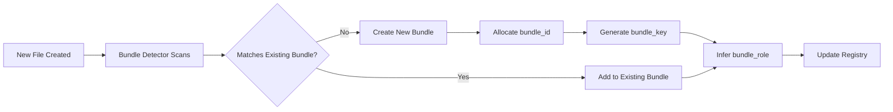

# Bundle ID Definition

**file_id**: 2026012822440001  
**date**: 2026-01-28T22:44:00Z  
**source**: `01999000042260124527_COMPLETE_SSOT.json`, governance registry

---

## What is a Bundle?

A **bundle** is a **logical grouping of related files** that work together to accomplish a specific governance, enforcement, or functional purpose. Think of it as a "package" or "module" where each file plays a specific role.

### Real-World Analogy
Like a software package with:
- **Documentation** (README.md)
- **Source code** (main.py)
- **Tests** (test_main.py)
- **Schema** (config.schema.json)

All these files are separate but belong together as one bundle.

---

## Bundle ID (`bundle_id`)

### Definition
A **16-digit sequential identifier** that uniquely identifies a bundle.

### Format
```
Pattern: ^[0-9]{16}$
Length:  16 digits
Example: 1000000000000002
```

### Characteristics
- **Separate namespace** from `file_id` (which is 20 digits)
- **Sequential allocation** starting at `1000000000000000`
- **Stable**: Once assigned, never changes
- **Shared**: All files in the same bundle have the same `bundle_id`

---

## Bundle Components

Every bundle has these identifying fields:

### 1. `bundle_id` (16 digits)
**Numeric identifier for the bundle**
- Example: `1000000000000026`
- Allocated sequentially by bundle detector
- Same value for all files in bundle

### 2. `bundle_key` (human-readable name)
**Stable, uppercase name for the bundle**
- Example: `DOCUMENTATION_BUNDLE`, `GATE_AGGREGATE`, `ID_REGISTRY`
- Normalized from anchor filename
- Used for human readability and cross-references

### 3. `bundle_role` (file's role within bundle)
**What this specific file does in the bundle**
- Enum values: `SCHEMA`, `VALIDATOR`, `EXECUTOR`, `RUNNER`, `BRIDGE`, `TEST`, `DOC`, `REPORT`, `TOOL`, `FAILURE_MODE`, `EVIDENCE_SCHEMA`
- Inferred from `artifact_kind`, `layer`, and file path patterns
- Each file in bundle has different role

### 4. `bundle_version` (optional)
**Version identifier for the entire bundle**
- Example: `v2.5.3`, `1.0.0-alpha`
- Optional, not always populated
- All files in bundle share same version

### 5. `anchor_file_id` (reference to primary file)
**Points to the "main" file of the bundle (usually the schema or SSOT)**
- References a `file_id` (20 digits)
- Typically the schema or primary definition file
- Used to find the bundle's root document

---

## Example Bundles from Registry

### Example 1: Documentation Bundle
```json
{
  "bundle_id": "1000000000000026",
  "bundle_key": "DOCUMENTATION_BUNDLE",
  "files": [
    {
      "file_id": "00199900004226012456",
      "relative_path": "DOC-REPORT-EXECUTION-SUMMARY-0199900004226012456__EXECUTION_SUMMARY.md",
      "bundle_role": "REPORT"
    },
    {
      "file_id": "00199900004226012457",
      "relative_path": "DOC-REPORT-FILE-MANIFEST-0199900004226012457__FILE_MANIFEST.md",
      "bundle_role": "REPORT"
    },
    {
      "file_id": "00199900004226012461",
      "relative_path": "DOC-GUIDE-GEU-IMPLEMENTATION-COMPLETE-0199900004226012461__GEU_IMPLEMENTATION_COMPLETE.md",
      "bundle_role": "DOC"
    }
    // ... 3 more files
  ]
}
```

**Purpose**: Groups all documentation and report files together

### Example 2: Schema Bundle
```json
{
  "bundle_id": "1000000000000000",
  "bundle_key": "GEU_EDGE_0199900004226012478__GEU_EDGE_SCHEMA",
  "files": [
    {
      "file_id": "00199900004226012478",
      "relative_path": "DOC-SCHEMA-GEU-EDGE-0199900004226012478__geu_edge.schema.json",
      "bundle_role": "SCHEMA",
      "anchor_file_id": "00199900004226012478"
    }
  ]
}
```

**Purpose**: Single schema file (bundle can have just one file)

### Example 3: Complete Enforcement Bundle (Hypothetical)
```json
{
  "bundle_id": "1000000000000050",
  "bundle_key": "GATE_FILE_NAMING",
  "bundle_version": "v1.0.0",
  "files": [
    {
      "file_id": "00199900004226012600",
      "relative_path": "schemas/file_naming.schema.json",
      "bundle_role": "SCHEMA",
      "anchor_file_id": "00199900004226012600"
    },
    {
      "file_id": "00199900004226012601",
      "relative_path": "validators/validate_file_names.py",
      "bundle_role": "VALIDATOR"
    },
    {
      "file_id": "00199900004226012602",
      "relative_path": "runners/gate_file_naming_runner.py",
      "bundle_role": "RUNNER"
    },
    {
      "file_id": "00199900004226012603",
      "relative_path": "tests/test_file_naming_validator.py",
      "bundle_role": "TEST"
    },
    {
      "file_id": "00199900004226012604",
      "relative_path": "failure_modes/file_naming_failure.json",
      "bundle_role": "FAILURE_MODE"
    }
  ]
}
```

**Purpose**: Complete governance enforcement bundle with all required components

---

## How Bundles Are Detected

### Phase 2: Bundle Detection
**Script**: `enhanced_bundle_detector.py`

**Detection Strategies**:
1. **Schema-based**: Find files with `artifact_kind == 'SCHEMA'`, create bundle per schema
2. **Name-based clustering**: Group files with same base name (e.g., all files with "gate_aggregate" in name)
3. **Layer-based clustering**: Group by architectural layer (GOVERNANCE, EXECUTION, etc.)
4. **Documentation clustering**: Group all MARKDOWN_DOC files together

**Allocation Formula**:
```python
# Sequential counter starting at 1000000000000000
next_bundle_id = 1000000000000000 + bundle_counter
bundle_counter += 1
```

---

## Why Bundle ID vs File ID?

### `file_id` (20 digits)
- **Identifies individual file**
- Example: `01999000042260124527`
- Timestamp-based prefix (17 digits) + suffix (3 digits)
- **1 file = 1 file_id**
- Never shared between files

### `bundle_id` (16 digits)
- **Identifies group of related files**
- Example: `1000000000000026`
- Sequential allocation
- **Many files share 1 bundle_id**
- Used for grouping and completeness checking

### Relationship
```
bundle_id (1:N) file_id
     ↓            ↓
One bundle contains many files
```

---

## Use Cases

### 1. Completeness Checking
**Question**: "Does the GATE_FILE_NAMING bundle have all required roles?"

```sql
SELECT bundle_key, bundle_role 
FROM files 
WHERE bundle_id = '1000000000000050'
```

**Expected roles** (for schema_based GEU):
- SCHEMA ✓
- VALIDATOR ✓
- RUNNER ✓
- FAILURE_MODE ✓
- EVIDENCE (missing ❌)
- TEST ✓

**Result**: Bundle incomplete, missing EVIDENCE role

### 2. Version Management
**Question**: "Which files belong to v1.0.0 of GATE_AGGREGATE?"

```sql
SELECT file_id, relative_path, bundle_role
FROM files
WHERE bundle_key = 'GATE_AGGREGATE' 
  AND bundle_version = 'v1.0.0'
```

### 3. Dependency Navigation
**Question**: "Starting from schema, find its validator and runner"

```python
# Find schema (anchor)
schema = get_file_by_role(bundle_id, role='SCHEMA')

# Find validator in same bundle
validator = get_file_by_role(bundle_id, role='VALIDATOR')

# Find runner in same bundle
runner = get_file_by_role(bundle_id, role='RUNNER')
```

### 4. Impact Analysis
**Question**: "If I change the schema, what else is affected?"

```python
schema_file_id = '00199900004226012600'
schema_bundle_id = get_bundle_id(schema_file_id)

affected_files = get_all_files_in_bundle(schema_bundle_id)
# Returns: validator, runner, tests, failure_modes, etc.
```

---

## Bundle Lifecycle



### Steps
1. **File created**: New file added to repository
2. **Bundle detection**: `enhanced_bundle_detector.py` scans
3. **Matching logic**: Check if file belongs to existing bundle
   - Same base name?
   - Same schema reference?
   - Same layer/domain?
4. **Assignment**:
   - **Existing bundle**: Reuse `bundle_id`, assign new `bundle_role`
   - **New bundle**: Allocate new `bundle_id`, create `bundle_key`
5. **Registry update**: Write to `governance_registry_unified.json`

---

## Validation Rules

### Rule 1: Bundle ID Format
```json
{
  "rule": "BUNDLE_ID_FORMAT",
  "check": "bundle_id matches ^[0-9]{16}$",
  "severity": "error"
}
```

### Rule 2: Unique Roles Per Bundle
```json
{
  "rule": "UNIQUE_BUNDLE_ROLES",
  "check": "Each bundle_role appears at most once per bundle_id",
  "severity": "error",
  "exception": "DOC and REPORT roles may have multiple files"
}
```

### Rule 3: Anchor Exists
```json
{
  "rule": "ANCHOR_FILE_EXISTS",
  "check": "If anchor_file_id is set, it must reference valid file_id in same bundle",
  "severity": "error"
}
```

### Rule 4: Required Roles (Schema-Based Bundles)
```json
{
  "rule": "SCHEMA_BASED_COMPLETENESS",
  "check": "Schema-based bundles must have: SCHEMA, VALIDATOR, RUNNER, FAILURE_MODE, EVIDENCE, TEST",
  "severity": "warning"
}
```

---

## Storage in Column Dictionary v4.1.1

### `bundle_id`
```json
{
  "value_schema": {
    "type": ["string", "null"],
    "pattern": "^[0-9]{16}$",
    "description": "16-digit numeric identifier for bundle grouping"
  },
  "scope": {
    "record_kinds_in": ["ENTITY"],
    "entity_kinds_in": ["FILE"]
  },
  "presence": {
    "policy": "OPTIONAL"
  },
  "derivation": {
    "mode": "SYSTEM",
    "sources": [{"kind": "ENV", "ref": "bundle_allocator.next_id"}],
    "process": {"engine": "NONE", "spec": {}},
    "evidence": {
      "evidence_keys": ["bundle_allocation.event_id"],
      "artifacts": ["EVIDENCE_BUNDLE_ALLOCATION_LOG"]
    }
  },
  "provenance": {
    "sources": [{
      "file_id": "01999000042260124527",
      "path": "01999000042260124527_COMPLETE_SSOT.json",
      "anchor": "bundle_fields.bundle_id"
    }]
  }
}
```

---

## Summary

**Bundle ID** is a **16-digit identifier** that groups **related files** (schema, validator, runner, tests, etc.) into a **logical unit** for:
- **Completeness checking** (do we have all required roles?)
- **Version tracking** (which files belong to v1.0.0?)
- **Dependency navigation** (find all files in this enforcement bundle)
- **Impact analysis** (what's affected if I change the schema?)

**Key Point**: `bundle_id` groups files, `file_id` identifies individual files. Separate namespaces, different purposes.

---

## References

- **COMPLETE_SSOT.json**: `01999000042260124527_COMPLETE_SSOT.json` (lines 835-846)
- **Governance Registry**: `REGISTRY/01999000042260124503_governance_registry_unified.json`
- **Column Dictionary**: `2026012816000001_COLUMN_DICTIONARY.json` (v4.1.1)
- **Bundle Detector**: `enhanced_bundle_detector.py` (phase 2 pipeline)
