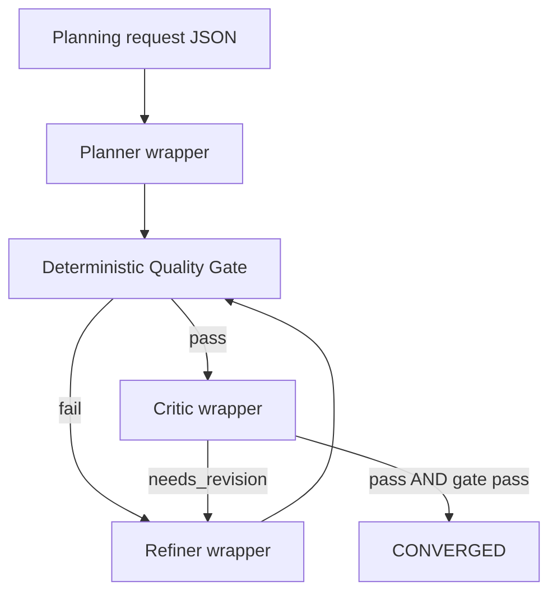

# Implementation plan to reach 100% functionality for the CLI plan→evaluate→refine loop

## Executive summary
The attached files describe a working CLI loop (Planner → deterministic Quality Gate → Critic → Refiner, repeat until convergence) with schema-enforced planning/refinement and artifact-preserving evidence output. fileciteturn0file0L5-L10 fileciteturn0file1L110-L126  
They also explicitly admit the loop is not “100%” robust yet: **no rate-limit backoff**, **no cost tracking**, **no parallelism**, and **transient failures fail the whole run**. fileciteturn0file4L337-L355  

“100% functionality” (per your requested scope) therefore requires: (a) hardening the existing PowerShell orchestrator with deterministic retry/backoff + machine-readable run summaries, (b) universal ArtifactEnvelope + lineage verification, (c) a LangGraph control-plane option with checkpointing + explicit routing, (d) a deterministic inbox watcher + scheduled-task installer, (e) must-pass acceptance tests (golden / fail-heal-pass / fail-escalate), and (f) post-convergence wiring into NPP CLI execution. fileciteturn0file4L250-L270 fileciteturn0file2L410-L446 fileciteturn0file2L988-L1016 fileciteturn0file2L1050-L1078  

## Repository-grounded findings and remaining work
The runtime contract is consistent across the docs: the loop converges only when the **Quality Gate passes** and the **Critic verdict is “pass”**, otherwise it iterates until max attempts. fileciteturn0file1L110-L126  

The explicit “remaining work” is not hidden in TODO markers; it’s spelled out as “Next Steps,” “Troubleshooting,” “Known Limitations,” and “Future/Integration Points”:
- Monitoring and operational hardening (track convergence, token usage, alerting) is called out as a next step. fileciteturn0file1L168-L203 fileciteturn0file0L186-L189  
- Rate limits are a known pain point, with a direct instruction to add backoff/retry. fileciteturn0file1L201-L203 fileciteturn0file4L339-L355  
- LangGraph integration is repeatedly described as optional/future but specified in detail as a control-plane (routing/checkpointing) above deterministic CLIs. fileciteturn0file4L250-L264 fileciteturn0file2L571-L585  
- Post-convergence wiring into NPP CLI (`plan_cli.py execute …` then `plan_cli.py run-gates …`) is explicitly future work. fileciteturn0file4L266-L270  
- The “0-touch” watcher and scheduled task are specified as required automation for the full control-plane system. fileciteturn0file2L988-L1016  
- The acceptance definition of “done” is evidence-based: `.acms_runs/{run_id}` must contain envelopes, checkpoints, transition log, and sealed evidence + run summary; routing must be bounded/deterministic; and watcher-driven inbox processing must work. fileciteturn0file2L1063-L1077  

### Artifact errors and root-cause fixes
These are concrete correctness issues in the attached artifacts (not guesses):
- **Inconsistent file-count reporting**: the same document says “Files Created (11 Total)” while enumerating items 1–14, and later states “Files Created: 14.” Root cause is doc drift during edits; fix by correcting the header/count and/or renaming the section to avoid hard-coded totals. fileciteturn0file4L78-L101 fileciteturn0file4L427-L430  
- **A referenced integration-test input is unspecified**: the integration test block uses `..\inputs\minimal_request.json`, but this file is not defined anywhere in the attached set. Root cause is an incomplete test fixture set; fix by actually adding `inputs/minimal_request.json` (schema-valid) or updating the test instructions to use an existing file. fileciteturn0file4L286-L297  
- **Docs reference a LangGraph architecture filename not present in the attachments** (“LangGraph Integration Architecture.md”). Root cause is naming mismatch between the canonical spec and exported/attached filenames; fix by aligning repo filenames or updating references consistently. fileciteturn0file0L182-L185 fileciteturn0file1L175-L178 fileciteturn0file4L264-L264  

## Task backlog with solutions, code changes, tests, and acceptance
The table below is the dependency spine; full per-task details (problem → solution → file-level changes → tests → acceptance) are encoded in **implementation_plan.json** later in this report.

| Task | Priority | Effort | Depends on |
| --- | --- | --- | --- |
| TASK-DOCS-CONSISTENCY | P2 | S | — |
| TASK-RUN-SUMMARY-AND-LOG-MANIFEST | P1 | S | — |
| TASK-ROBUST-RETRY-BACKOFF | P0 | M | TASK-DOCS-CONSISTENCY |
| TASK-ENVELOPE-AND-LIV-FOR-CLI-LOOP | P0 | L | TASK-RUN-SUMMARY-AND-LOG-MANIFEST |
| TASK-COST-AND-TELEMETRY | P1 | M | TASK-RUN-SUMMARY-AND-LOG-MANIFEST |
| TASK-TOOL-MAPPING-CONFIG | P1 | M | TASK-RUN-SUMMARY-AND-LOG-MANIFEST |
| TASK-LANGGRAPH-ORCHESTRATOR | P1 | L | TASK-ENVELOPE-AND-LIV-FOR-CLI-LOOP, TASK-TOOL-MAPPING-CONFIG |
| TASK-DETERMINISTIC-WATCHER | P1 | M | TASK-LANGGRAPH-ORCHESTRATOR, TASK-RUN-SUMMARY-AND-LOG-MANIFEST |
| TASK-ACCEPTANCE-TESTS | P0 | M | TASK-LANGGRAPH-ORCHESTRATOR, TASK-DETERMINISTIC-WATCHER |
| TASK-NPP-POST-CONVERGENCE-MIGRATION | P1 | M | TASK-ACCEPTANCE-TESTS |

The load-bearing tasks are the ones directly called out as missing functionality: deterministic backoff/retry, cost/telemetry, and full automation/evidence for the LangGraph + watcher system. fileciteturn0file4L337-L355 fileciteturn0file2L1050-L1078  

### Loop phase graph

This reflects the documented convergence rule (Gate pass + Critic pass) and the documented tool roles. fileciteturn0file1L110-L126 fileciteturn0file4L41-L60  

## LangGraph control-plane integration design
The attached LangGraph integration spec is explicit about the contract: **control-plane only** (routes/retries/checkpoints), while **all enforcement stays in deterministic CLIs**, with an “artifact message bus” (write JSON artifacts; state stores only `{path, sha256, schema_version}`). fileciteturn0file2L410-L446  

### Wrapper-to-node mapping and checkpointing
A minimal mapping for this repo’s loop is already described: `planner_node` → planner wrapper, `gate_node` → deterministic gate, `critic_node` → critic wrapper, `refiner_node` → refiner wrapper, with conditional edges and checkpointing (SQLite suggested in one place; checkpoint directory specified in the control-plane spec). fileciteturn0file4L250-L263 fileciteturn0file2L389-L399  

### Evidence envelope contract and lineage verification
The required transport is **ArtifactEnvelope**, and consumers must perform **Lineage Integrity Verification (LIV)** (recompute sha256 of derived inputs; fail closed on mismatch; emit IO-validation evidence). fileciteturn0file2L410-L446  

### Template/spec updates required for “full system” alignment
The spec mandates editing the delivery template to add a `langgraph_execution` block and per-phase envelope requirements, plus updating the planning integration spec to require ArtifactEnvelope + LIV + structured diffs for routing. fileciteturn0file2L1019-L1046  

## Deterministic watcher and scheduled-task automation
The “0-touch” design is: watch an INBOX folder, invoke the orchestrator headlessly, then route the plan to archive or failed while preserving evidence. fileciteturn0file2L555-L566  

The repo-level implementation requirement expands this into two deliverables: a watcher script and a scheduled-task installer that writes a deterministic install log artifact. fileciteturn0file2L991-L1016  

### Watcher flow
```mermaid
flowchart TD
  A[File appears in INBOX_PLANS] --> B[Atomic enqueue to .queue: tmp then rename]
  B --> C[FIFO loop: sort queue filenames]
  C --> D[Invoke orchestrator (headless)]
  D --> E{run_summary indicates success?}
  E -->|yes| F[Move plan to ARCHIVE_PLANS/run_id]
  E -->|no| G[Move plan to FAILED_PLANS/run_id]
  F --> H[Preserve evidence (never delete/overwrite)]
  G --> H
```
The high-level inbox→orchestrator→archive/failed behavior and the scheduled task install requirement are primary in the attached spec. fileciteturn0file2L555-L566 fileciteturn0file2L991-L1016  
(Atomic queue semantics and detailed watcher contract are additionally captured in the attached Multi-CLI integration export.) fileciteturn0file3L1-L50  

## Acceptance tests and exact expected outputs
The spec defines three must-pass tests and hard acceptance criteria for “done.” fileciteturn0file2L1050-L1077  

### Golden run
Test command (exact entrypoint is **UNSPECIFIED** in the attached repo files; implement as part of TASK-LANGGRAPH-ORCHESTRATOR): run the headless orchestrator on a known-good planning request; then assert that `.acms_runs/{run_id}` contains envelopes, checkpoint(s), transition log, and sealed evidence + run summary. fileciteturn0file2L1066-L1073  

Expected outputs (minimum):
- `.acms_runs/{run_id}/state/checkpoints/…`
- `.acms_runs/{run_id}/state/transition_log.jsonl`
- `.acms_runs/{run_id}/artifacts/envelopes/…`
- `.acms_runs/{run_id}/evidence/seals/run_summary.json` and seal bundle/manifest fileciteturn0file2L1068-L1073  

### Fail-heal-pass
Inject a deterministic gate failure once (fault injection mechanism is **UNSPECIFIED** in the attached artifacts), confirm bounded heal loop triggers, re-run gate, and ends in success with sealed evidence. The “bounded and deterministic routing” requirement is explicit. fileciteturn0file2L1055-L1074  

### Fail-escalate
Inject a deterministic repeated failure so max attempts are exhausted; confirm escalation/termination still produces sealed evidence with a failure run summary. fileciteturn0file2L1057-L1073  

## Migration plan to wire post-convergence into NPP CLI execution
Once the loop converges, the files specify the intended integration: call the existing NPP CLI to execute the converged plan and then run the gate suite, relying on existing evidence sealing infrastructure. fileciteturn0file4L266-L270  

A rigorous migration requires three deterministic upgrades (encoded as TASK-NPP-POST-CONVERGENCE-MIGRATION in the JSON plan):
- Add a **post-convergence stage** behind an explicit flag (default off), so the planning loop remains usable independently.
- Capture stdout/stderr and artifacts from `plan_cli.py execute` and `plan_cli.py run-gates` into envelopes and the run summary.
- Keep the gate list **data-driven** (not hard-coded) to avoid drift in gate counts/topology as noted in the attached integration export. fileciteturn0file4L266-L270 fileciteturn0file3L1-L50  

## implementation_plan.json
```json
{
  "schema_id": "acms.implementation_plan.v1",
  "schema_version": "1.0.0",
  "plan_name": "CLI plan\u2192evaluate\u2192refine loop to 100% functionality",
  "generated_at_local": "2026-02-14T00:00:00-06:00",
  "timezone": "America/Chicago",
  "scope": {
    "inputs_analyzed": [
      {
        "ref_id": "turn0file0",
        "path": "QUICKSTART.md"
      },
      {
        "ref_id": "turn0file1",
        "path": "README.md"
      },
      {
        "ref_id": "turn0file4",
        "path": "IMPLEMENTATION_SUMMARY.md"
      },
      {
        "ref_id": "turn0file3",
        "path": "ChatGPT-Multi CLI Integration Summary.json"
      },
      {
        "ref_id": "turn0file2",
        "path": "ChatGPT-LangGraph System Integration.md"
      }
    ],
    "non_included_but_referenced": [
      {
        "path": "ai_service_wrappers/planner.py",
        "status": "UNSPECIFIED (referenced, not attached)"
      },
      {
        "path": "ai_service_wrappers/critic.py",
        "status": "UNSPECIFIED (referenced, not attached)"
      },
      {
        "path": "ai_service_wrappers/refiner.py",
        "status": "UNSPECIFIED (referenced, not attached)"
      },
      {
        "path": "ai_service_wrappers/plan_quality_gate.py",
        "status": "UNSPECIFIED (referenced, not attached)"
      },
      {
        "path": "ai_service_wrappers/run_loop.ps1",
        "status": "UNSPECIFIED (referenced, not attached)"
      },
      {
        "path": "schemas_langgraph/*.schema.json",
        "status": "UNSPECIFIED (referenced, not attached)"
      },
      {
        "path": "Errors in ChatGPT research.txt",
        "status": "UNSPECIFIED (referenced, not attached)"
      }
    ],
    "definition_of_100_percent_functionality": [
      "The CLI loop is robust under rate limits/transient failures (bounded retry+backoff) and produces machine-checkable evidence for every iteration.",
      "Monitoring artifacts exist (run summary, per-tool call logs, optional token/cost metrics).",
      "Optional: The same loop can run under a LangGraph control-plane with checkpointing and artifact-envelope message bus.",
      "Optional: A deterministic watcher can trigger runs 0-touch and archive inputs based on run outcome.",
      "Optional: After convergence, the system can invoke NPP CLI execution and gates deterministically."
    ]
  },
  "global_preconditions": [
    {
      "id": "PRE-ENV",
      "description": "Required environment variables are available.",
      "requirements": [
        {
          "name": "CODEX_API_KEY",
          "required_for": [
            "planner",
            "refiner"
          ],
          "notes": "OpenAI API key for Codex CLI"
        },
        {
          "name": "GH_TOKEN|GITHUB_TOKEN",
          "required_for": [
            "critic"
          ],
          "notes": "GitHub token with Copilot Requests permission"
        }
      ]
    },
    {
      "id": "PRE-TOOLS",
      "description": "Required CLIs and Python deps are installed and discoverable on PATH.",
      "requirements": [
        {
          "name": "codex",
          "version": "UNSPECIFIED",
          "verify_command": "codex --version"
        },
        {
          "name": "copilot",
          "version": "UNSPECIFIED",
          "verify_command": "copilot --version"
        },
        {
          "name": "python",
          "version": ">=3.12 (UNSPECIFIED)",
          "verify_command": "python --version"
        },
        {
          "name": "jsonschema",
          "version": "4.*",
          "verify_command": "python -c \"import jsonschema; print(jsonschema.__version__)\""
        }
      ]
    }
  ],
  "expected_run_artifacts": {
    "cli_loop": {
      "run_root_template": ".state/evidence/plan_loop_runs/{run_id}",
      "iteration_dir_template": ".state/evidence/plan_loop_runs/{run_id}/{iteration}",
      "required_files_per_iteration": [
        "draft_plan.json",
        "gate_report.json",
        "critique_report.json (when gate passes)",
        "logs/*"
      ],
      "additional_required_after_tasks": [
        "run_summary.json",
        "tool_call_manifest.jsonl",
        "artifact_envelopes/*.json",
        "io_validation.json (LIV evidence)"
      ]
    },
    "langgraph_orchestrator": {
      "run_root_template": ".acms_runs/{run_id}",
      "required_subdirs": [
        "state/checkpoints",
        "artifacts/envelopes",
        "artifacts/phase",
        "artifacts/gates",
        "artifacts/heal",
        "evidence/phase",
        "evidence/seals",
        "logs"
      ],
      "required_files": [
        "state/transition_log.jsonl",
        "evidence/seals/run_summary.json",
        "evidence/seals/seal_manifest.json"
      ]
    }
  },
  "tasks": [
    {
      "id": "TASK-DOCS-CONSISTENCY",
      "priority": "P2",
      "effort": "S",
      "title": "Make docs and test instructions self-consistent and runnable",
      "depends_on": [],
      "problem": {
        "summary": "Documentation contains inconsistencies and at least one referenced test input that is not defined in the attached artifacts.",
        "evidence": [
          {
            "file": "IMPLEMENTATION_SUMMARY.md",
            "issue": "States 'Files Created (11 Total)' but enumerates 14 items and later states 'Files Created: 14'."
          },
          {
            "file": "IMPLEMENTATION_SUMMARY.md",
            "issue": "Integration test references '..\\\\inputs\\\\minimal_request.json' but the inputs directory contents are not specified in attachments."
          },
          {
            "file": "README.md / QUICKSTART.md",
            "issue": "References 'LangGraph Integration Architecture.md' which is not among the attached files (attached file name differs)."
          }
        ],
        "impact": "New users cannot reliably execute the documented test suite; drift undermines auditability and causes repeated 'false failures'."
      },
      "solution": {
        "summary": "Treat docs as executable spec: fix counts, align file names, and add/ship the missing example inputs that tests reference.",
        "approach": [
          "Edit IMPLEMENTATION_SUMMARY.md to correct counts and rename the prerequisite section to 'Required (verify via preflight)' instead of 'Installed'.",
          "Either add the referenced docs/files to the repo or update references to the canonical file names present in-repo.",
          "Create a minimal failing planning request (or update the test instructions to point to an existing file) so the 'max attempts reached' test is runnable."
        ]
      },
      "required_code_changes": [
        {
          "path": "IMPLEMENTATION_SUMMARY.md",
          "action": "MODIFY",
          "details": "Fix file count inconsistency; clarify environment-specific prerequisite assertions; verify referenced paths exist."
        },
        {
          "path": "README.md",
          "action": "MODIFY",
          "details": "Align LangGraph doc reference name; ensure relative paths match the stated working directory."
        },
        {
          "path": "QUICKSTART.md",
          "action": "MODIFY",
          "details": "Align LangGraph doc reference name; optionally add a warning about cost monitoring and rate limits."
        },
        {
          "path": "inputs/minimal_request.json",
          "action": "CREATE",
          "details": "A schema-valid request that reliably fails convergence or forces revision (UNSPECIFIED mechanism)."
        }
      ],
      "tests": [
        {
          "id": "TEST-DOCS-LINKS",
          "command": "python -c \"import pathlib; assert pathlib.Path('README.md').exists(); assert pathlib.Path('IMPLEMENTATION_SUMMARY.md').exists()\"",
          "expected": "Exit 0"
        },
        {
          "id": "TEST-MINIMAL-REQUEST-EXISTS",
          "command": "python -c \"import pathlib; assert pathlib.Path('inputs/minimal_request.json').exists()\"",
          "expected": "Exit 0"
        }
      ],
      "acceptance_criteria": [
        "All referenced example inputs and docs exist or references are updated to existing files.",
        "The 'Integration Tests (Full Loop)' commands in IMPLEMENTATION_SUMMARY.md can be run verbatim from the documented working directory without path edits."
      ]
    },
    {
      "id": "TASK-ROBUST-RETRY-BACKOFF",
      "priority": "P0",
      "effort": "M",
      "title": "Add deterministic retry/backoff for rate limits and transient failures",
      "depends_on": [
        "TASK-DOCS-CONSISTENCY"
      ],
      "problem": {
        "summary": "Current implementation explicitly lacks exponential backoff and fails the run on transient network/timeouts; rate limits are acknowledged as a problem.",
        "evidence": [
          {
            "file": "IMPLEMENTATION_SUMMARY.md",
            "issue": "Known limitations: no rate limit backoff; minimal error recovery; suggested future is retry/backoff."
          },
          {
            "file": "README.md",
            "issue": "Troubleshooting: rate limits require backoff/retry in orchestrator."
          }
        ],
        "impact": "Runs become brittle at scale and under shared-rate-limit conditions; repeated failures increase cost and time."
      },
      "solution": {
        "summary": "Implement a bounded, deterministic retry wrapper with exponential backoff + jitter and explicit retry classification.",
        "approach": [
          "In the orchestrator, wrap each external tool call (Planner/Critic/Refiner) in Invoke-WithRetry that retries only on whitelisted retryable conditions.",
          "Include a deterministic jitter function seeded from run_id + tool_name + attempt to avoid nondeterministic sleep while reducing thundering herd.",
          "Make retryable conditions explicit: HTTP 429, timeouts, transient network errors, and (optionally) 'critic returned markdown' JSON-extraction retry."
        ]
      },
      "required_code_changes": [
        {
          "path": "ai_service_wrappers/run_loop.ps1",
          "action": "MODIFY",
          "details": "Add parameters: -MaxTransientRetries, -BackoffBaseSeconds, -BackoffMaxSeconds, -RetryableExitCodes; implement Invoke-WithRetry and ensure logs show each retry with cause."
        },
        {
          "path": "ai_service_wrappers/critic.py",
          "action": "MODIFY",
          "details": "Expose a machine-readable failure classification on JSON-extraction failure (e.g., write critique_report.json with status=FAIL and retryable=true OR exit with a distinct retryable code). (Exact mechanism UNSPECIFIED.)"
        },
        {
          "path": "ai_service_wrappers/planner.py",
          "action": "MODIFY",
          "details": "Ensure rate-limit or timeout errors propagate a retryable classification to orchestrator (exit code or structured error artifact). (UNSPECIFIED.)"
        },
        {
          "path": "ai_service_wrappers/refiner.py",
          "action": "MODIFY",
          "details": "Same classification/exit-code behavior as planner for transient failures. (UNSPECIFIED.)"
        }
      ],
      "tests": [
        {
          "id": "TEST-RETRY-429",
          "command": "powershell -File .\\ai_service_wrappers\\run_loop.ps1 -RequestPath .\\inputs\\example_planning_request.json -MaxAttempts 1 -MaxTransientRetries 2 (simulate 429 via env var or stub; UNSPECIFIED)",
          "expected": "Orchestrator logs show retries and either succeeds or fails after bounded retries; evidence preserved."
        }
      ],
      "acceptance_criteria": [
        "When a tool call yields a retryable condition, the orchestrator retries up to MaxTransientRetries with backoff and logs each attempt deterministically.",
        "Non-retryable failures still fail closed immediately with the documented exit codes.",
        "All retries preserve prior artifacts (no overwrite) and append logs."
      ]
    },
    {
      "id": "TASK-RUN-SUMMARY-AND-LOG-MANIFEST",
      "priority": "P1",
      "effort": "S",
      "title": "Emit machine-readable run_summary.json and tool_call_manifest.jsonl",
      "depends_on": [],
      "problem": {
        "summary": "Docs focus on per-iteration artifacts, but monitoring/automation requirements need a single canonical outcome artifact.",
        "evidence": [
          {
            "file": "README.md",
            "issue": "Next steps call for monitoring, alerting on repeated failures."
          },
          {
            "file": "ChatGPT-LangGraph System Integration.md",
            "issue": "Acceptance criteria for orchestrator emphasize run summary and transition logs under .acms_runs/{run_id}."
          }
        ],
        "impact": "Integrators and watchers cannot reliably decide success/failure without parsing console output or multiple files."
      },
      "solution": {
        "summary": "Define a stable run summary schema and write it at the end of every run (success or failure). Also log every tool invocation as JSONL for later analysis.",
        "approach": [
          "For PowerShell loop: write .state/.../{run_id}/run_summary.json with final status, iteration count, final plan path, exit_code, and retry statistics.",
          "Add tool_call_manifest.jsonl capturing: tool_name, command, args (redacted), start/end timestamps, exit_code, retry_count, stdout/stderr log paths."
        ]
      },
      "required_code_changes": [
        {
          "path": "ai_service_wrappers/run_loop.ps1",
          "action": "MODIFY",
          "details": "Always write run_summary.json and tool_call_manifest.jsonl; ensure run_summary includes final_plan_path on convergence and last_failure on failure."
        },
        {
          "path": "schemas_langgraph/run_summary.schema.json",
          "action": "CREATE",
          "details": "UNSPECIFIED location; define JSON Schema for run_summary.json for validation."
        }
      ],
      "tests": [
        {
          "id": "TEST-RUN-SUMMARY-EXISTS",
          "command": "powershell -File .\\ai_service_wrappers\\run_loop.ps1 -RequestPath .\\inputs\\example_planning_request.json -MaxAttempts 1; (then) python -c \"import json,glob; p=glob.glob('.state/**/run_summary.json',recursive=True)[-1]; json.load(open(p))\"",
          "expected": "run_summary.json exists and parses as JSON."
        }
      ],
      "acceptance_criteria": [
        "Every run produces run_summary.json and tool_call_manifest.jsonl.",
        "run_summary.json alone is sufficient for a watcher to decide archive vs failed routing."
      ]
    },
    {
      "id": "TASK-ENVELOPE-AND-LIV-FOR-CLI-LOOP",
      "priority": "P0",
      "effort": "L",
      "title": "Make artifact envelopes universal and enforce lineage integrity verification",
      "depends_on": [
        "TASK-RUN-SUMMARY-AND-LOG-MANIFEST"
      ],
      "problem": {
        "summary": "LangGraph integration and deterministic governance require ArtifactEnvelope + LIV, but the CLI loop currently documents envelopes mainly for planner output.",
        "evidence": [
          {
            "file": "IMPLEMENTATION_SUMMARY.md",
            "issue": "Planner described as emitting an artifact envelope; other components not explicitly stated to do so."
          },
          {
            "file": "ChatGPT-LangGraph System Integration.md",
            "issue": "Spec mandates ArtifactEnvelope transport and LIV fail-closed checks before consuming downstream outputs."
          }
        ],
        "impact": "Without universal envelopes and LIV, downstream automation cannot prove provenance or detect tampering; replay determinism is weaker."
      },
      "solution": {
        "summary": "Standardize ArtifactEnvelope v1 for every produced artifact, require derived_from_artifacts with sha256, and add LIV validation before consumption.",
        "approach": [
          "Adopt a shared envelope writer library (Python module) used by all wrappers.",
          "Write io_validation.json evidence for each consumption step (gate and critic inputs at minimum).",
          "Fail closed on any sha256 mismatch, missing envelope, or schema mismatch."
        ]
      },
      "required_code_changes": [
        {
          "path": "schemas_langgraph/envelope.schema.json",
          "action": "VERIFY_OR_MODIFY",
          "details": "Ensure it matches the ArtifactEnvelope v1 contract used by the control-plane spec (schema_id, schema_version, artifact.path+sha256, provenance, process_identity)."
        },
        {
          "path": "ai_service_wrappers/artifact_envelope.py",
          "action": "CREATE",
          "details": "Shared helper: compute sha256, write envelope JSON, validate against schema, and perform LIV checks."
        },
        {
          "path": "ai_service_wrappers/planner.py",
          "action": "MODIFY",
          "details": "Ensure planner writes envelope for draft_plan.json and includes derived_from_artifacts referencing planning request."
        },
        {
          "path": "ai_service_wrappers/plan_quality_gate.py",
          "action": "MODIFY",
          "details": "Require envelope for input plan; write gate_report envelope; emit io_validation evidence."
        },
        {
          "path": "ai_service_wrappers/critic.py",
          "action": "MODIFY",
          "details": "Require envelope for input plan; write critique_report envelope; emit io_validation evidence."
        },
        {
          "path": "ai_service_wrappers/refiner.py",
          "action": "MODIFY",
          "details": "Require gate/critic report envelopes as inputs; write revised plan envelope."
        }
      ],
      "tests": [
        {
          "id": "TEST-LIV-TAMPER",
          "command": "(1) run loop; (2) modify draft_plan.json; (3) rerun gate with LIV enabled; UNSPECIFIED exact commands",
          "expected": "Gate/consumer fails closed with explicit LIV mismatch, and writes io_validation evidence."
        }
      ],
      "acceptance_criteria": [
        "Every artifact consumed by a downstream tool has a corresponding envelope and passes LIV before consumption.",
        "Each iteration directory includes envelopes for every major artifact (draft_plan, gate_report, critique_report, run_summary)."
      ]
    },
    {
      "id": "TASK-COST-AND-TELEMETRY",
      "priority": "P1",
      "effort": "M",
      "title": "Add token/cost telemetry (best-effort, fail-open for missing usage data)",
      "depends_on": [
        "TASK-RUN-SUMMARY-AND-LOG-MANIFEST"
      ],
      "problem": {
        "summary": "Docs explicitly call out no cost tracking and advise monitoring; token estimates in docs are not machine-derived.",
        "evidence": [
          {
            "file": "IMPLEMENTATION_SUMMARY.md",
            "issue": "Known limitation: no cost tracking; future add to orchestrator logs."
          }
        ]
      },
      "solution": {
        "summary": "Capture usage/cost if the CLI outputs it; otherwise record 'UNAVAILABLE' and keep system functional.",
        "approach": [
          "Define fields in run_summary: per_tool.usage_tokens, per_tool.cost_usd, plus total.",
          "Implement CLI-output parsers (Codex/Copilot) pluggably; if parsing fails, set usage_status='UNAVAILABLE' and continue."
        ]
      },
      "required_code_changes": [
        {
          "path": "ai_service_wrappers/run_loop.ps1",
          "action": "MODIFY",
          "details": "Parse stdout/stderr for usage patterns (UNSPECIFIED); write into run_summary.json; ensure redaction of secrets."
        },
        {
          "path": "ai_service_wrappers/usage_parsers.py",
          "action": "CREATE",
          "details": "Optional: parse known usage formats; strictly unit-tested; may be skipped if staying in PowerShell."
        }
      ],
      "tests": [
        {
          "id": "TEST-USAGE-PARSER-FAILOPEN",
          "command": "Run loop with parsers enabled against logs with no usage info; verify run_summary.usage_status='UNAVAILABLE'.",
          "expected": "No run failure due to missing usage data."
        }
      ],
      "acceptance_criteria": [
        "run_summary.json includes telemetry fields, even if populated as UNAVAILABLE.",
        "Telemetry collection never blocks successful convergence."
      ]
    },
    {
      "id": "TASK-TOOL-MAPPING-CONFIG",
      "priority": "P1",
      "effort": "M",
      "title": "Introduce a tool-mapping configuration file to eliminate hardcoded CLI invocations",
      "depends_on": [
        "TASK-RUN-SUMMARY-AND-LOG-MANIFEST"
      ],
      "problem": {
        "summary": "The LangGraph spec insists the control plane calls external tools through explicit contracts; environment-specific paths in docs risk drift.",
        "evidence": [
          {
            "file": "ChatGPT-LangGraph System Integration.md",
            "issue": "Defines standard ToolCall/ToolResult contracts and lists many external CLIs for the phase spine."
          },
          {
            "file": "ChatGPT-Multi CLI Integration Summary.json",
            "issue": "Provides a tool mapping schema and example to map node\u2192CLI contract."
          }
        ],
        "impact": "Without a mapping file, adding LangGraph or swapping CLIs requires code edits, increasing risk and reducing determinism."
      },
      "solution": {
        "summary": "Ship a single tool_mapping.json (schema-bound) that defines node ids, CLI commands, arg templates, timeouts, and exit-code policies.",
        "approach": [
          "Define schema_id=acms.tool_mapping.v1; validate on startup.",
          "Use placeholder expansion: {run_id}, {run_root}, {plan_path}, {iteration}, etc.",
          "Centralize retryable exit codes and timeouts here."
        ]
      },
      "required_code_changes": [
        {
          "path": "config/tool_mapping.json",
          "action": "CREATE",
          "details": "Populate minimal mapping for CLI loop nodes (planner, gate, critic, refiner)."
        },
        {
          "path": "config/tool_mapping.schema.json",
          "action": "CREATE",
          "details": "If not already in-repo; else reuse from existing spec; UNSPECIFIED."
        },
        {
          "path": "ai_service_wrappers/run_loop.ps1",
          "action": "MODIFY",
          "details": "Add -ToolMappingPath flag; use mapping to build commands instead of hardcoding."
        }
      ],
      "tests": [
        {
          "id": "TEST-TOOL-MAPPING-VALIDATION",
          "command": "python -c \"import json; json.load(open('config/tool_mapping.json'))\" (plus schema validate; UNSPECIFIED)",
          "expected": "Tool mapping validates and orchestrator starts."
        }
      ],
      "acceptance_criteria": [
        "Orchestrator can run using only tool_mapping.json to locate tools and determine args/timeouts/exit-code policy.",
        "Mapping supports environment overrides without code changes."
      ]
    },
    {
      "id": "TASK-LANGGRAPH-ORCHESTRATOR",
      "priority": "P1",
      "effort": "L",
      "title": "Implement LangGraph control-plane version of the loop with checkpointing",
      "depends_on": [
        "TASK-ENVELOPE-AND-LIV-FOR-CLI-LOOP",
        "TASK-TOOL-MAPPING-CONFIG"
      ],
      "problem": {
        "summary": "Docs define LangGraph as the control-plane state machine and provide build order and acceptance criteria, but this is not implemented in the CLI loop artifacts.",
        "evidence": [
          {
            "file": "IMPLEMENTATION_SUMMARY.md",
            "issue": "LangGraph integration is listed as future/optional with nodes mapping to wrappers."
          },
          {
            "file": "ChatGPT-LangGraph System Integration.md",
            "issue": "Defines phase spine, state, routing rules, tool adapter contracts, and checkpointing paths."
          }
        ],
        "impact": "You cannot yet run the loop as a replayable, checkpointed control-plane graph, nor scale the pattern to the full phase spine."
      },
      "solution": {
        "summary": "Create a Python package orchestrator_langgraph that runs the loop as a StateGraph, calling existing wrappers via tool adapters and storing only artifact references + hashes in state.",
        "approach": [
          "State includes run_id, phase, hop_counter, retry_count, artifact_index, error_history (fields as specified).",
          "Nodes call CLIs via a uniform adapter that emits ToolResult JSON and writes envelopes/evidence.",
          "Routing is explicit (rule-based): if gate pass and critic pass -> done; if needs_revision -> refiner then gate; if retries exhausted -> escalate."
        ]
      },
      "required_code_changes": [
        {
          "path": "orchestrator_langgraph/pyproject.toml",
          "action": "CREATE",
          "details": "Packaging and console entrypoint: orchestrator run --plan-path ... --run-root-base ... --mode headless."
        },
        {
          "path": "orchestrator_langgraph/orchestrator.py",
          "action": "CREATE",
          "details": "Implements StateGraph for planner\u2192gate\u2192critic/refiner loop; checkpointing enabled; details UNSPECIFIED beyond spec."
        },
        {
          "path": "orchestrator_langgraph/tool_adapters.py",
          "action": "CREATE",
          "details": "Adapter reads tool_mapping.json, executes CLIs, writes ToolResult JSON + logs."
        },
        {
          "path": "orchestrator_langgraph/state_schema.json",
          "action": "CREATE",
          "details": "Defines canonical state shape; optional but recommended."
        },
        {
          "path": "orchestrator_langgraph/README.md",
          "action": "CREATE",
          "details": "Operator docs for headless runs and replay."
        }
      ],
      "tests": [
        {
          "id": "TEST-LANGGRAPH-HEADLESS-RUN",
          "command": "python -m orchestrator_langgraph.orchestrator run --plan-path inputs/example_planning_request.json --run-root-base .acms_runs --mode HEADLESS (UNSPECIFIED exact CLI)",
          "expected": "Creates .acms_runs/{run_id} with checkpoints, transition log, evidence seals."
        }
      ],
      "acceptance_criteria": [
        "A headless run creates .acms_runs/{run_id} with required subdirs, checkpoint(s), transition_log.jsonl, envelopes, and evidence seals.",
        "Graph routing decisions are derivable solely from state fields + tool results (no LLM discretion)."
      ]
    },
    {
      "id": "TASK-DETERMINISTIC-WATCHER",
      "priority": "P1",
      "effort": "M",
      "title": "Implement deterministic inbox watcher + scheduled task installer",
      "depends_on": [
        "TASK-LANGGRAPH-ORCHESTRATOR",
        "TASK-RUN-SUMMARY-AND-LOG-MANIFEST"
      ],
      "problem": {
        "summary": "0-touch automation is specified but not implemented in the attached CLI loop artifacts.",
        "evidence": [
          {
            "file": "ChatGPT-LangGraph System Integration.md",
            "issue": "Spec requires watch_inbox.ps1 + install_orchestrator_task.ps1 with deterministic behavior."
          }
        ]
      },
      "solution": {
        "summary": "Build a watcher that converts filesystem events into a deterministic FIFO queue, invokes orchestrator headlessly, and archives inputs based on run_summary.",
        "approach": [
          "Inbox drop -> create queue item JSON via atomic write (tmp then rename).",
          "Process queue FIFO by filename sort.",
          "Invoke orchestrator with explicit args.",
          "Move plan to ARCHIVE_PLANS/{run_id} on success; FAILED_PLANS/{run_id} on failure; never delete evidence."
        ]
      },
      "required_code_changes": [
        {
          "path": "automation/watch_inbox.ps1",
          "action": "CREATE",
          "details": "Implements deterministic watcher and queue; uses run_summary.json to route outcomes."
        },
        {
          "path": "automation/install_orchestrator_task.ps1",
          "action": "CREATE",
          "details": "Installs Windows Scheduled Task to run watcher headlessly at startup; writes deterministic install log artifact."
        },
        {
          "path": "schemas/acms.run_request.v1.schema.json",
          "action": "CREATE",
          "details": "Schema for queue items (run_request_id, created_at, plan_path, plan_sha256, mode)."
        }
      ],
      "tests": [
        {
          "id": "TEST-WATCHER-QUEUE-ATOMIC",
          "command": "Drop a plan file into INBOX_PLANS and verify a .queue/*.json appears and no partial files remain.",
          "expected": "Queue item created atomically."
        },
        {
          "id": "TEST-WATCHER-ARCHIVE-ROUTING",
          "command": "Run watcher against a known-good plan; verify plan moved to ARCHIVE_PLANS/{run_id} and evidence preserved.",
          "expected": "Correct routing."
        }
      ],
      "acceptance_criteria": [
        "Watcher processes queue deterministically and never overwrites an existing run_id directory.",
        "Watcher provides 0-touch execution via Scheduled Task and writes install log artifact."
      ]
    },
    {
      "id": "TASK-ACCEPTANCE-TESTS",
      "priority": "P0",
      "effort": "M",
      "title": "Implement the required acceptance tests: golden run, fail-heal-pass, fail-escalate",
      "depends_on": [
        "TASK-LANGGRAPH-ORCHESTRATOR",
        "TASK-DETERMINISTIC-WATCHER"
      ],
      "problem": {
        "summary": "The control-plane spec defines three must-pass integration tests and hard acceptance criteria for 'done'.",
        "evidence": [
          {
            "file": "ChatGPT-LangGraph System Integration.md",
            "issue": "Phase 6 lists required tests and acceptance criteria."
          }
        ]
      },
      "solution": {
        "summary": "Create an integration test harness that runs the orchestrator end-to-end, injects deterministic failures, and asserts required artifacts and routing outcomes.",
        "approach": [
          "Golden run: known-good plan/request -> converges -> evidence sealed.",
          "Fail-heal-pass: force gate failure once (fixture or fault injection) -> heal loop triggers -> pass -> sealed.",
          "Fail-escalate: force repeated failure fingerprint -> retries exhausted -> escalate -> sealed with failure summary."
        ]
      },
      "required_code_changes": [
        {
          "path": "orchestrator_langgraph/tests/test_golden_run.py",
          "action": "CREATE",
          "details": "End-to-end test; asserts .acms_runs tree and run_summary status=OK."
        },
        {
          "path": "orchestrator_langgraph/tests/test_fail_heal_pass.py",
          "action": "CREATE",
          "details": "Injects single gate failure; asserts heal attempted and final status=OK."
        },
        {
          "path": "orchestrator_langgraph/tests/test_fail_escalate.py",
          "action": "CREATE",
          "details": "Injects repeated gate failure; asserts status=FAIL and evidence sealed."
        },
        {
          "path": "orchestrator_langgraph/tests/fixtures/",
          "action": "CREATE",
          "details": "Deterministic fixtures or fault-injection hooks (UNSPECIFIED mechanism)."
        }
      ],
      "tests": [
        {
          "id": "TEST-PYTEST",
          "command": "pytest -q orchestrator_langgraph/tests",
          "expected": "All tests pass."
        }
      ],
      "acceptance_criteria": [
        "Tests produce .acms_runs/{run_id} with envelopes, checkpoints, transition log, and evidence seals as specified.",
        "Gate routing is bounded and deterministic; forbidden actions are not performed in control-plane code."
      ]
    },
    {
      "id": "TASK-NPP-POST-CONVERGENCE-MIGRATION",
      "priority": "P1",
      "effort": "M",
      "title": "Wire post-convergence into NPP CLI execution flow",
      "depends_on": [
        "TASK-ACCEPTANCE-TESTS"
      ],
      "problem": {
        "summary": "Docs state a future requirement: after plan convergence, invoke existing NPP CLI to execute the plan and run gates.",
        "evidence": [
          {
            "file": "IMPLEMENTATION_SUMMARY.md",
            "issue": "Lists plan_cli.py execute and plan_cli.py run-gates as the future integration after convergence."
          }
        ]
      },
      "solution": {
        "summary": "Add an optional post_convergence hook stage that runs NPP commands in a controlled, evidence-first manner, and then seals evidence.",
        "approach": [
          "Add orchestrator flag: --post-convergence-mode {NONE|EXECUTE|EXECUTE_AND_GATES}. Default NONE.",
          "On convergence, call: plan_cli.py execute {plan_path} and optionally plan_cli.py run-gates {plan_path}.",
          "Capture stdout/stderr and produce envelopes for NPP outputs; failure escalates but still seals evidence."
        ]
      },
      "required_code_changes": [
        {
          "path": "ai_service_wrappers/run_loop.ps1",
          "action": "MODIFY",
          "details": "Add optional post-convergence invocation hooks for NPP CLI; capture logs and update run_summary."
        },
        {
          "path": "orchestrator_langgraph/orchestrator.py",
          "action": "MODIFY",
          "details": "Add tail node(s) that invoke NPP CLI after convergence and before EvidenceSeal; tool mapping-driven."
        },
        {
          "path": "config/tool_mapping.json",
          "action": "MODIFY",
          "details": "Add nodes for NPP execute and run-gates; gate set must be data-driven (do not hardcode counts)."
        }
      ],
      "tests": [
        {
          "id": "TEST-NPP-HOOK-DISABLED",
          "command": "Run orchestrator with post-convergence off; verify no NPP tool calls occur.",
          "expected": "No NPP logs present."
        },
        {
          "id": "TEST-NPP-HOOK-ENABLED",
          "command": "Run orchestrator with post-convergence enabled against stub NPP CLI; verify logs+envelopes captured.",
          "expected": "NPP stage executed and evidence sealed."
        }
      ],
      "acceptance_criteria": [
        "Post-convergence stage is optional and deterministic.",
        "Failures in NPP stage preserve evidence and produce a failure run_summary with sealed evidence."
      ]
    }
  ],
  "execution_order": [
    "TASK-DOCS-CONSISTENCY",
    "TASK-RUN-SUMMARY-AND-LOG-MANIFEST",
    "TASK-ROBUST-RETRY-BACKOFF",
    "TASK-ENVELOPE-AND-LIV-FOR-CLI-LOOP",
    "TASK-COST-AND-TELEMETRY",
    "TASK-TOOL-MAPPING-CONFIG",
    "TASK-LANGGRAPH-ORCHESTRATOR",
    "TASK-DETERMINISTIC-WATCHER",
    "TASK-ACCEPTANCE-TESTS",
    "TASK-NPP-POST-CONVERGENCE-MIGRATION"
  ],
  "langgraph_integration": {
    "control_plane_principles": [
      "Control-plane routes, retries, loops, checkpoints; enforcement stays in deterministic tools.",
      "Inter-tool messages are disk artifacts referenced by {path, sha256, schema_version}; not free-text."
    ],
    "run_directory": {
      "root_template": ".acms_runs/{run_id}",
      "required_subdirs": [
        "state/checkpoints",
        "artifacts/envelopes",
        "artifacts/phase",
        "artifacts/gates",
        "artifacts/heal",
        "evidence/phase",
        "evidence/seals",
        "logs"
      ],
      "required_files": [
        "state/transition_log.jsonl",
        "evidence/seals/run_summary.json",
        "evidence/seals/seal_manifest.json"
      ]
    },
    "wrapper_to_node_mapping": [
      {
        "node_id": "planner_node",
        "calls": "ai_service_wrappers/planner.py",
        "notes": "Codex CLI wrapper; schema-enforced output"
      },
      {
        "node_id": "gate_node",
        "calls": "ai_service_wrappers/plan_quality_gate.py",
        "notes": "Deterministic quality gate"
      },
      {
        "node_id": "critic_node",
        "calls": "ai_service_wrappers/critic.py",
        "notes": "Copilot CLI wrapper; structured critique"
      },
      {
        "node_id": "refiner_node",
        "calls": "ai_service_wrappers/refiner.py",
        "notes": "Codex CLI wrapper; applies fixes"
      }
    ],
    "phase_spine": [
      "ValidatePlan",
      "CanonicalizeHash",
      "RepoPreflight",
      "BuildConflictGraph",
      "ProvisionWorktrees",
      "DispatchWorkers",
      "CollectOutputs",
      "RunGates (bounded heal loop)",
      "SingleWriterMerge",
      "PostRunInvariantValidation",
      "EvidenceSeal",
      "EmitRunSummary"
    ],
    "artifact_envelope_contract": {
      "schema_id": "acms.artifact_envelope.v1",
      "required_fields": [
        "artifact_id",
        "schema_id",
        "schema_version",
        "run_id",
        "produced_at",
        "artifact",
        "provenance",
        "process_identity"
      ],
      "liv": {
        "enabled": true,
        "fail_closed": true,
        "evidence_path_template": "evidence/phase/{phase_id}/io_validation.json"
      }
    },
    "template_updates": {
      "target_file": "NEWPHASEPLANPROCESS_AUTONOMOUS_DELIVERY_TEMPLATE_V3.json",
      "required_additions": [
        "langgraph_execution block (graph_id, checkpoint policy, termination rules)",
        "per-phase validation_evidence_path",
        "per-phase envelope_contract (required inputs, produced outputs)"
      ],
      "status": "UNSPECIFIED (file not attached)"
    },
    "planning_integration_spec_updates": {
      "target_file": "REGISTRY_PLANNING_INTEGRATION_SPEC.md",
      "required_additions": [
        "ArtifactEnvelope transport requirement",
        "LIV verification requirement",
        "registry tools emit structured diffs for routing"
      ],
      "status": "UNSPECIFIED (file not attached)"
    }
  },
  "watcher_design": {
    "mode": "HEADLESS",
    "inbox_root": "INBOX_PLANS (path UNSPECIFIED)",
    "queue_dir_rel": ".queue",
    "determinism_requirements": [
      "Atomic writes: write *.tmp then rename to *.json",
      "Process FIFO by filename sort (stable ordering)",
      "Never delete evidence or logs",
      "Never overwrite existing run_id directory"
    ],
    "success_routing": "Move plan to ARCHIVE_PLANS/{run_id}/",
    "failure_routing": "Move plan to FAILED_PLANS/{run_id}/",
    "retry_policy": {
      "backoff": "Exponential with deterministic jitter; bounded",
      "max_transient_retries_per_run_request": 3
    },
    "scheduled_task": {
      "installer_script": "automation/install_orchestrator_task.ps1",
      "task_name": "UNSPECIFIED",
      "trigger": "AtStartup",
      "logging": "Write deterministic install log artifact"
    },
    "queue_item_schema": {
      "schema_id": "acms.run_request.v1",
      "schema_version": "1.0.0",
      "required_fields": [
        "run_request_id",
        "created_at",
        "plan_path",
        "plan_sha256",
        "mode"
      ]
    }
  },
  "acceptance_tests": [
    {
      "id": "AT-GOLDEN-RUN",
      "name": "golden run",
      "goal": "Happy path produces sealed evidence and success run summary.",
      "steps": [
        {
          "do": "Ensure env vars set",
          "env": [
            "CODEX_API_KEY",
            "GH_TOKEN|GITHUB_TOKEN"
          ]
        },
        {
          "do": "Run orchestrator headless",
          "command": "python -m orchestrator_langgraph.orchestrator run --plan-path inputs/example_planning_request.json --run-root-base .acms_runs --mode HEADLESS (UNSPECIFIED exact CLI)"
        },
        {
          "do": "Assert artifacts exist",
          "assert": [
            ".acms_runs/{run_id}/state/checkpoints/*",
            ".acms_runs/{run_id}/state/transition_log.jsonl",
            ".acms_runs/{run_id}/artifacts/envelopes/*.json",
            ".acms_runs/{run_id}/evidence/seals/run_summary.json",
            ".acms_runs/{run_id}/evidence/seals/seal_manifest.json"
          ]
        }
      ],
      "expected_outcome": {
        "run_summary.status": "OK|CONVERGED (UNSPECIFIED exact enum)",
        "exit_code": 0
      }
    },
    {
      "id": "AT-FAIL-HEAL-PASS",
      "name": "fail-heal-pass",
      "goal": "A forced gate failure triggers deterministic heal loop and then succeeds.",
      "steps": [
        {
          "do": "Enable deterministic fault injection to fail a gate once",
          "how": "UNSPECIFIED (fixture or env var)"
        },
        {
          "do": "Run orchestrator",
          "command": "pytest -q orchestrator_langgraph/tests/test_fail_heal_pass.py"
        },
        {
          "do": "Verify heal artifacts and bounded attempts",
          "assert": [
            ".acms_runs/{run_id}/artifacts/heal/ATTEMPT_*/",
            "transition_log shows gate fail -> heal -> gate rerun -> pass"
          ]
        }
      ],
      "expected_outcome": {
        "run_summary.status": "OK",
        "heal_attempts": ">=1",
        "exit_code": 0
      }
    },
    {
      "id": "AT-FAIL-ESCALATE",
      "name": "fail-escalate",
      "goal": "Repeated deterministic failures exhaust attempts and escalate while still sealing evidence.",
      "steps": [
        {
          "do": "Enable deterministic fault injection to fail the same gate repeatedly",
          "how": "UNSPECIFIED"
        },
        {
          "do": "Run orchestrator",
          "command": "pytest -q orchestrator_langgraph/tests/test_fail_escalate.py"
        },
        {
          "do": "Verify escalation and sealed evidence",
          "assert": [
            "transition_log shows attempts exhausted and escalation",
            ".acms_runs/{run_id}/evidence/seals/run_summary.json",
            ".acms_runs/{run_id}/evidence/seals/seal_manifest.json"
          ]
        }
      ],
      "expected_outcome": {
        "run_summary.status": "FAIL|ESCALATED (UNSPECIFIED enum)",
        "exit_code": "nonzero (UNSPECIFIED)"
      }
    }
  ],
  "postconditions": {
    "definition_of_done": [
      "CLI loop runs with bounded retry/backoff, deterministic evidence, and run_summary.",
      "LangGraph orchestrator (if enabled) produces .acms_runs/{run_id} with envelopes, checkpoints, transition log, and evidence seals.",
      "Acceptance tests pass."
    ]
  }
}
```