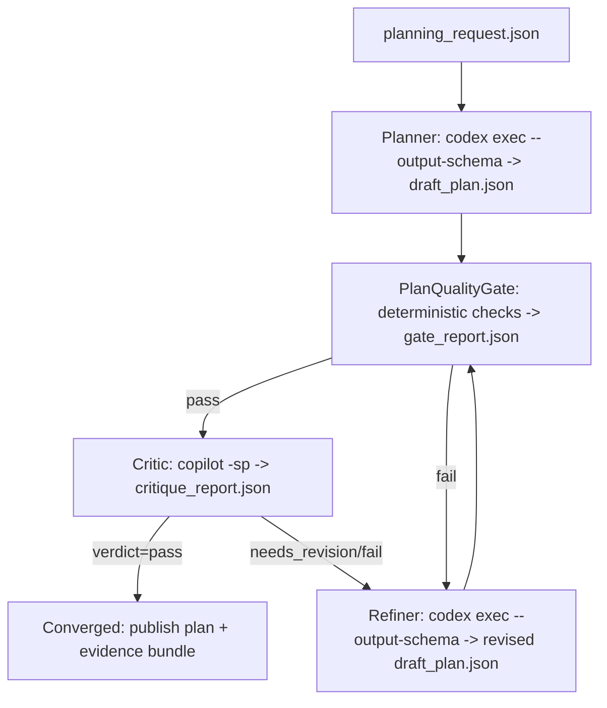

# Contract-First Self-Healing Planner–Critic Loop Using Copilot CLI and Codex CLI

## Executive summary

This architecture hardens your planning workflow by turning “planning” into a contract-first, multi-agent, self-healing pipeline: a **Planner** produces a structured plan artifact (JSON), a **deterministic quality gate** rejects objectively-defective plans with machine-stable defect codes, and an independent **Critic** produces a structured critique artifact (JSON) that drives an iterative **Refiner** until convergence or a max-attempts cap. The key design choice is to **anchor structured outputs on Codex CLI’s schema-enforced output** (via `--output-schema`), while using **GitHub Copilot CLI as the second-agent Critic** for cross-model scrutiny, with strict JSON-only output enforced by wrapper parsing and retries. citeturn27view4turn8search4

The result is fewer “rework cycles” downstream because the first deliverable plan is forced to include (and be checked for) acceptance criteria, risk mitigations, explicit gates, and evidence artifacts—before anyone starts implementation.

## CLI capabilities and constraints from primary docs

### GitHub Copilot CLI

**Install & prerequisites.** Copilot CLI is available with all Copilot plans, is in public preview, and can be installed via npm (requires Node.js 22+), WinGet, Homebrew, an install script, or direct downloads. citeturn6view1turn6view2

**Authentication.** On first launch, Copilot CLI prompts you to `/login`. It also supports authenticating with a **fine‑grained personal access token** that has the **“Copilot Requests”** permission, provided via `GH_TOKEN` or `GITHUB_TOKEN` (in that precedence order). citeturn7view0

**Non-interactive usage (programmatic mode).** Copilot CLI supports non‑interactive prompts using `-p/--prompt` and a scripting-friendly output mode using `-s/--silent` (“output only the agent response”). citeturn8search4turn8search7

**Tool permissions and headless safety.** Copilot CLI can be granted or denied tool access (e.g., `--allow-all-tools`, `--allow-tool`, `--deny-tool`). The `--allow-tool` / `--deny-tool` arguments support `shell(COMMAND)`, `write`, and MCP server specs, and can be combined. This matters because unattended runs must **not hang** on permission prompts. citeturn8search1turn8search4

**Command reference highlights.** Copilot CLI has a documented command set (`copilot`, `copilot help [topic]`, `copilot init`, `copilot update`, `copilot version`, `copilot plugin`) and many command-line options including `--share`, `--resume`, `--stream`, `--no-color`, `--no-custom-instructions`, etc. citeturn8search4

**Structured / streaming integration via ACP.** Copilot CLI can run as an **ACP (Agent Client Protocol) server** using `--acp` in `stdio` or TCP modes. In stdio mode, communication is **newline-delimited JSON (NDJSON)**. ACP documents a standard error response shape (example shows JSON-RPC-ish `code: -32600`). Environment variables include `COPILOT_LOG_LEVEL` and `COPILOT_LOG_DIR`. citeturn8search3

**Rate limits & quotas (as documented).** GitHub describes service-level rate limiting for Copilot (with guidance to wait, check usage, change models, etc.) but does not publish fixed numeric limits in that doc. citeturn31search4  
Copilot usage is additionally governed by **premium request** accounting: each prompt to Copilot CLI consumes premium requests per model multiplier rules, and usage can be blocked by allowance/budget policies. citeturn30search1turn31search1

**Doc gap to flag.** Copilot CLI docs do not publish a stable, machine-readable JSON output mode for `-p` responses (outside ACP NDJSON). Any “JSON output” for Critic artifacts must be enforced by wrapper prompts + strict JSON parsing + retry. `<clarification_request: Is Copilot CLI expected to gain a first-class --json / schema output mode for programmatic prompts, or should ACP be mandatory for automation?>` citeturn8search4turn8search3

### OpenAI Codex CLI

**Install.** Codex CLI can be installed via `npm install -g @openai/codex` or `brew install --cask codex`. citeturn12view0

**Authentication modes.** Codex supports (1) **Sign in with ChatGPT** and (2) **Sign in with an API key**; it caches credentials locally (plaintext `~/.codex/auth.json` or OS credential store), can be constrained by admin config (`forced_login_method`, `forced_chatgpt_workspace_id`), and supports headless workflows via **device code** (`codex login --device-auth`) or SSH port-forward fallback. citeturn25view9turn25view10

**Non-interactive automation primitive: `codex exec`.**  
`codex exec` is explicitly intended for scripts/CI; it streams progress to `stderr` and prints the **final agent message to `stdout`** by default. citeturn27view4  
It supports JSONL output (`--json`) where `stdout` becomes a **JSON Lines event stream** with event types such as `thread.started`, `turn.started`, `turn.completed`, `turn.failed`, `item.*`, and `error`. citeturn27view4turn28view5  
It supports schema-constrained final output via `--output-schema <path>` and writing the final message to disk via `--output-last-message/-o <path>`. citeturn27view4turn28view5

**Key documented `codex exec` flags you will use.** `--full-auto`, `--json`, `--model/-m`, `--output-last-message/-o`, `--output-schema`, `--sandbox (read-only|workspace-write|danger-full-access)`, `--skip-git-repo-check`, `--ephemeral`, `-c/--config`, and `resume` subcommand semantics are documented. citeturn28view5turn27view4

**CI credential injection.** `codex exec` supports `CODEX_API_KEY` for CI-style runs (explicitly noted as supported only in `codex exec`). citeturn27view4

**Logging.** Codex (Rust) uses `RUST_LOG`; TUI logs default to `~/.codex/log/codex-tui.log`. Non-interactive defaults to `RUST_LOG=error` and logs inline. citeturn18view0

**Rate limits (API key mode).** When you use an API key, rate limits are governed by OpenAI platform tier limits published per model. Example: `GPT-5-Codex` includes tiered RPM/TPM limits in the model documentation. citeturn21search2  
If you use a ChatGPT subscription login, Codex usage is constrained by plan-level allowances (not all numeric limits are publicly fixed in docs). `<clarification_request: Which model/provider will you standardize on for Planner/Refiner (e.g., codex-mini-latest vs gpt-5-codex) and which API tier applies?>` citeturn25view9turn21search2

## Contract-first artifacts and schemas

### Artifact table

| Artifact | Path (default) | Producer | Schema | Purpose |
|---|---|---|---|---|
| Planning request | `inputs/planning_request.json` | Human / upstream system | `schemas/planning_request.schema.json` | Immutable intent, constraints, context |
| Planner envelope | `artifacts/<run_id>/<i>/planner_envelope.json` | Planner wrapper | `schemas/envelope.schema.json` | Provenance + fingerprints for traceability |
| Draft plan | `artifacts/<run_id>/<i>/draft_plan.json` | Planner / Refiner | `schemas/draft_plan.schema.json` | The contract-first plan used downstream |
| Gate report | `artifacts/<run_id>/<i>/plan_quality_gate_report.json` | PlanQualityGate | `schemas/gate_report.schema.json` | Deterministic accept/reject + defect codes |
| Critic report | `artifacts/<run_id>/<i>/critique_report.json` | Critic wrapper | `schemas/critique_report.schema.json` | Structured critique + fix directives |
| Refiner envelope | `artifacts/<run_id>/<i>/refiner_envelope.json` | Refiner wrapper | `schemas/envelope.schema.json` | Provenance + fingerprints |
| Run metadata | `artifacts/<run_id>/run_meta.json` | Orchestrator | `schemas/run_meta.schema.json` | Environment, versions, command log pointers |
| Evidence logs | `artifacts/<run_id>/<i>/logs/*.log` | Orchestrator | (N/A) | Captured stdout/stderr + JSONL streams |

### JSON schemas

All downstream automation assumes these schemas are the source of truth. If a tool can’t produce schema-valid JSON, it is treated as a defect and auto-healed or failed fast.

#### `schemas/envelope.schema.json`

```json
{
  "$schema": "https://json-schema.org/draft/2020-12/schema",
  "$id": "https://example.internal/schemas/envelope.schema.json",
  "type": "object",
  "additionalProperties": false,
  "required": ["envelope_version", "artifact_kind", "schema_id", "path", "sha256", "created_at", "producer"],
  "properties": {
    "envelope_version": { "type": "string", "const": "1.0" },
    "artifact_kind": { "type": "string" },
    "schema_id": { "type": "string" },
    "path": { "type": "string" },
    "sha256": { "type": "string", "pattern": "^[a-f0-9]{64}$" },
    "created_at": { "type": "string", "format": "date-time" },
    "producer": {
      "type": "object",
      "additionalProperties": false,
      "required": ["name", "version", "command"],
      "properties": {
        "name": { "type": "string" },
        "version": { "type": "string" },
        "command": { "type": "string" }
      }
    },
    "inputs": {
      "type": "array",
      "items": {
        "type": "object",
        "additionalProperties": false,
        "required": ["path", "sha256"],
        "properties": {
          "path": { "type": "string" },
          "sha256": { "type": "string", "pattern": "^[a-f0-9]{64}$" }
        }
      }
    }
  }
}
```

#### `schemas/draft_plan.schema.json`

```json
{
  "$schema": "https://json-schema.org/draft/2020-12/schema",
  "$id": "https://example.internal/schemas/draft_plan.schema.json",
  "type": "object",
  "additionalProperties": false,
  "required": [
    "schema_version",
    "plan_id",
    "title",
    "objective",
    "non_goals",
    "assumptions",
    "deliverables",
    "work_breakdown",
    "quality_gates",
    "risks",
    "open_questions",
    "timeline",
    "definition_of_done"
  ],
  "properties": {
    "schema_version": { "type": "string", "const": "1.0" },
    "plan_id": { "type": "string", "format": "uuid" },
    "title": { "type": "string", "minLength": 8 },
    "objective": { "type": "string", "minLength": 20 },
    "non_goals": {
      "type": "array",
      "minItems": 1,
      "items": { "type": "string", "minLength": 5 }
    },
    "assumptions": {
      "type": "array",
      "minItems": 1,
      "items": { "type": "string", "minLength": 5 }
    },
    "deliverables": {
      "type": "array",
      "minItems": 1,
      "items": {
        "type": "object",
        "additionalProperties": false,
        "required": ["id", "description", "acceptance_criteria"],
        "properties": {
          "id": { "type": "string", "pattern": "^[A-Z]{2,6}-[0-9]{2,4}$" },
          "description": { "type": "string", "minLength": 10 },
          "acceptance_criteria": {
            "type": "array",
            "minItems": 1,
            "items": { "type": "string", "minLength": 10 }
          }
        }
      }
    },
    "work_breakdown": {
      "type": "object",
      "additionalProperties": false,
      "required": ["phases"],
      "properties": {
        "phases": {
          "type": "array",
          "minItems": 1,
          "items": {
            "type": "object",
            "additionalProperties": false,
            "required": ["name", "tasks"],
            "properties": {
              "name": { "type": "string", "minLength": 3 },
              "tasks": {
                "type": "array",
                "minItems": 1,
                "items": {
                  "type": "object",
                  "additionalProperties": false,
                  "required": ["id", "title", "description", "dependencies", "verification"],
                  "properties": {
                    "id": { "type": "string", "pattern": "^T-[0-9]{3,5}$" },
                    "title": { "type": "string", "minLength": 5 },
                    "description": { "type": "string", "minLength": 20 },
                    "dependencies": {
                      "type": "array",
                      "items": { "type": "string", "pattern": "^T-[0-9]{3,5}$" }
                    },
                    "verification": {
                      "type": "array",
                      "minItems": 1,
                      "items": { "type": "string", "minLength": 10 }
                    }
                  }
                }
              }
            }
          }
        }
      }
    },
    "quality_gates": {
      "type": "array",
      "minItems": 1,
      "items": {
        "type": "object",
        "additionalProperties": false,
        "required": ["id", "type", "criteria", "evidence_artifacts"],
        "properties": {
          "id": { "type": "string", "pattern": "^G-[0-9]{2,4}$" },
          "type": { "type": "string", "enum": ["deterministic", "human_review", "hybrid"] },
          "criteria": { "type": "array", "minItems": 1, "items": { "type": "string", "minLength": 10 } },
          "evidence_artifacts": { "type": "array", "minItems": 1, "items": { "type": "string", "minLength": 5 } }
        }
      }
    },
    "risks": {
      "type": "array",
      "minItems": 1,
      "items": {
        "type": "object",
        "additionalProperties": false,
        "required": ["id", "statement", "probability", "impact", "mitigation"],
        "properties": {
          "id": { "type": "string", "pattern": "^R-[0-9]{2,4}$" },
          "statement": { "type": "string", "minLength": 10 },
          "probability": { "type": "string", "enum": ["low", "medium", "high"] },
          "impact": { "type": "string", "enum": ["low", "medium", "high"] },
          "mitigation": { "type": "string", "minLength": 10 }
        }
      }
    },
    "open_questions": {
      "type": "array",
      "items": { "type": "string", "minLength": 10 }
    },
    "timeline": {
      "type": "array",
      "minItems": 1,
      "items": {
        "type": "object",
        "additionalProperties": false,
        "required": ["milestone", "tasks", "exit_criteria"],
        "properties": {
          "milestone": { "type": "string", "minLength": 5 },
          "tasks": { "type": "array", "minItems": 1, "items": { "type": "string", "pattern": "^T-[0-9]{3,5}$" } },
          "exit_criteria": { "type": "array", "minItems": 1, "items": { "type": "string", "minLength": 10 } }
        }
      }
    },
    "definition_of_done": {
      "type": "array",
      "minItems": 1,
      "items": { "type": "string", "minLength": 10 }
    }
  }
}
```

#### `schemas/gate_report.schema.json`

```json
{
  "$schema": "https://json-schema.org/draft/2020-12/schema",
  "$id": "https://example.internal/schemas/gate_report.schema.json",
  "type": "object",
  "additionalProperties": false,
  "required": ["schema_version", "passed", "defects", "summary", "computed_at"],
  "properties": {
    "schema_version": { "type": "string", "const": "1.0" },
    "passed": { "type": "boolean" },
    "summary": { "type": "string" },
    "computed_at": { "type": "string", "format": "date-time" },
    "defects": {
      "type": "array",
      "items": {
        "type": "object",
        "additionalProperties": false,
        "required": ["code", "severity", "message"],
        "properties": {
          "code": { "type": "string" },
          "severity": { "type": "string", "enum": ["blocker", "major", "minor"] },
          "message": { "type": "string" },
          "location": { "type": "string" },
          "remediation_template": { "type": "string" }
        }
      }
    }
  }
}
```

#### `schemas/critique_report.schema.json`

```json
{
  "$schema": "https://json-schema.org/draft/2020-12/schema",
  "$id": "https://example.internal/schemas/critique_report.schema.json",
  "type": "object",
  "additionalProperties": false,
  "required": ["schema_version", "critique_id", "plan_id", "verdict", "defects", "computed_at"],
  "properties": {
    "schema_version": { "type": "string", "const": "1.0" },
    "critique_id": { "type": "string", "format": "uuid" },
    "plan_id": { "type": "string", "format": "uuid" },
    "computed_at": { "type": "string", "format": "date-time" },
    "verdict": { "type": "string", "enum": ["pass", "needs_revision", "fail"] },
    "scorecard": {
      "type": "object",
      "additionalProperties": false,
      "properties": {
        "completeness": { "type": "integer", "minimum": 0, "maximum": 5 },
        "testability": { "type": "integer", "minimum": 0, "maximum": 5 },
        "risk_coverage": { "type": "integer", "minimum": 0, "maximum": 5 },
        "sequencing": { "type": "integer", "minimum": 0, "maximum": 5 },
        "gate_quality": { "type": "integer", "minimum": 0, "maximum": 5 }
      }
    },
    "defects": {
      "type": "array",
      "items": {
        "type": "object",
        "additionalProperties": false,
        "required": ["code", "severity", "message", "fix"],
        "properties": {
          "code": { "type": "string" },
          "severity": { "type": "string", "enum": ["blocker", "major", "minor"] },
          "message": { "type": "string" },
          "evidence": { "type": "string" },
          "fix": { "type": "string" }
        }
      }
    }
  }
}
```

## Planner–Critic pipeline architecture

### What “self-healing” means here

A planning run is considered **healthy** only if:

1. The plan is schema-valid and passes deterministic quality gates (**PlanQualityGate**).
2. The Critic returns a schema-valid critique report with verdict `pass` (or `needs_revision` with only `minor` items based on your policy).

If either fails, the pipeline synthesizes a **heal directive** (defect codes → prompt templates) and reruns the minimal necessary step(s) within `max_attempts`.

### Artifact piping and CLI invocation strategy

Codex CLI is used for **Planner** and **Refiner** because it can produce a final response constrained by a provided JSON Schema (`--output-schema`) and can write that final message to a file (`-o`). citeturn27view4turn28view5

GitHub Copilot CLI is used as **Critic** using `copilot -p -s`, but because Copilot programmatic mode doesn’t provide schema enforcement, the wrapper makes JSON validity a first-class check (auto-retry on invalid JSON). citeturn8search4turn8search7

### Mermaid flow



### Exit codes and wrappers

Because neither Copilot CLI nor Codex CLI docs define a full, stable exit-code taxonomy for these specific automation outcomes, the orchestrator uses **wrapper exit codes** (and logs the raw CLI exit code separately). `<clarification_request: Do you want wrapper exit codes aligned to internal CI conventions (e.g., 0/1 only) or a richer map?>` citeturn8search4turn28view5

## Implementation guide

### Environment setup

#### System requirements you should standardize

- Node.js **22+** for Copilot CLI npm install path. citeturn6view2  
- Python **3.11+** for the deterministic gate + orchestration wrappers (your choice; not a tool requirement).
- Codex CLI installed via npm or Homebrew. citeturn12view0

#### Install CLIs

```bash
# Copilot CLI (npm path; requires Node.js 22+)
npm install -g @github/copilot

# Codex CLI
npm install -g @openai/codex
# or: brew install --cask codex
```

Copilot CLI install options (WinGet/Homebrew/install script) are documented if you need platform parity. citeturn6view2turn7view0

#### Auth configuration

**Copilot CLI (headless-friendly):** set a fine-grained PAT with “Copilot Requests” permission as `GH_TOKEN` (or `GITHUB_TOKEN`). citeturn7view0

```bash
export GH_TOKEN="ghp_...redacted..."
```

**Codex CLI (recommended for automation):** use API-key mode for CI via `CODEX_API_KEY` specifically in `codex exec`. citeturn27view4turn25view9

```bash
export CODEX_API_KEY="sk-...redacted..."
```

If you must run Codex via ChatGPT login in a headless environment, device auth and SSH port forwarding are documented. citeturn25view10turn25view9

#### Python dependencies

```bash
python -m venv .venv
source .venv/bin/activate
pip install --upgrade pip
pip install jsonschema==4.* pytest==8.*
```

### Repository layout

```bash
mkdir -p inputs schemas scripts templates artifacts
```

Save the schemas from the prior section as:

- `schemas/envelope.schema.json`
- `schemas/draft_plan.schema.json`
- `schemas/gate_report.schema.json`
- `schemas/critique_report.schema.json`

### Deterministic defect taxonomy

This taxonomy is what makes the loop “self-healing”: every failure is actionable and maps to a precise prompt template.

| Code | Severity | Emitted by | Meaning | Heal template |
|---|---|---|---|---|
| `PLAN_SCHEMA_INVALID` | blocker | Gate | JSON fails schema validation | `heal_plan_schema` |
| `PLAN_MISSING_ACCEPTANCE` | blocker | Gate | Deliverables lack acceptance criteria | `add_acceptance_criteria` |
| `PLAN_WEAK_GATES` | major | Gate | Gates exist but lack evidence artifacts | `strengthen_gates` |
| `PLAN_NO_RISKS` | major | Gate | Missing/empty risk register | `add_risks` |
| `CRITIC_JSON_INVALID` | blocker | Critic wrapper | Copilot output not parseable JSON | `critic_json_retry` |
| `CRITIC_SCHEMA_INVALID` | blocker | Critic wrapper | JSON parses but fails critique schema | `critic_schema_retry` |
| `RATE_LIMITED` | major | Orchestrator | Backoff required | `backoff_and_retry` |
| `AUTH_MISSING` | blocker | Orchestrator | Required token missing | `fail_fast_auth` |

`templates/heal_templates.json` (example):

```json
{
  "heal_plan_schema": "Rewrite the plan to conform EXACTLY to the provided JSON Schema. Output JSON only.",
  "add_acceptance_criteria": "For each deliverable, add concrete acceptance criteria as testable statements. Output JSON only.",
  "strengthen_gates": "For each quality gate, add objective criteria and explicit evidence artifact paths. Output JSON only.",
  "add_risks": "Add a risk register with probability/impact and mitigation for each. Output JSON only.",
  "critic_json_retry": "Return ONLY valid JSON matching the critique schema. No markdown, no prose outside JSON.",
  "critic_schema_retry": "Fix the JSON to match the critique schema exactly. Keep existing content but repair structure.",
  "backoff_and_retry": "This is handled by wrapper logic (exponential backoff).",
  "fail_fast_auth": "Stop and print missing auth variables with remediation steps."
}
```

### Scripts

Below are copy-pasteable scripts. All CLI flags used are documented in primary sources for Codex (`codex exec` flags) and Copilot CLI (`-p`, `-s`, `--deny-tool`, etc.). citeturn28view5turn27view4turn8search4turn8search1

#### `scripts/plan_quality_gate.py`

```python
#!/usr/bin/env python3
import argparse
import datetime as dt
import json
import sys
from pathlib import Path

from jsonschema import Draft202012Validator

DEFECTS = {
    "PLAN_SCHEMA_INVALID": ("blocker", "Plan JSON does not conform to schema"),
    "PLAN_MISSING_ACCEPTANCE": ("blocker", "One or more deliverables missing acceptance criteria"),
    "PLAN_WEAK_GATES": ("major", "One or more quality gates missing evidence artifacts or criteria"),
    "PLAN_NO_RISKS": ("major", "Risk register missing or empty"),
    "PLAN_NO_TIMELINE": ("major", "Timeline missing or empty")
}

def utc_now():
    return dt.datetime.now(dt.timezone.utc).isoformat()

def load_json(path: Path):
    return json.loads(path.read_text(encoding="utf-8"))

def gate_checks(plan: dict):
    defects = []

    # Deterministic: acceptance criteria exist & non-empty
    missing_accept = []
    for d in plan.get("deliverables", []):
        ac = d.get("acceptance_criteria", [])
        if not isinstance(ac, list) or len(ac) == 0:
            missing_accept.append(d.get("id", "<unknown>"))
    if missing_accept:
        defects.append({
            "code": "PLAN_MISSING_ACCEPTANCE",
            "severity": DEFECTS["PLAN_MISSING_ACCEPTANCE"][0],
            "message": f"Deliverables missing acceptance_criteria: {missing_accept}",
            "location": "deliverables[*].acceptance_criteria",
            "remediation_template": "add_acceptance_criteria"
        })

    # Deterministic: gates have criteria + evidence_artifacts
    weak_gates = []
    for g in plan.get("quality_gates", []):
        crit = g.get("criteria", [])
        ev = g.get("evidence_artifacts", [])
        if not isinstance(crit, list) or len(crit) == 0 or not isinstance(ev, list) or len(ev) == 0:
            weak_gates.append(g.get("id", "<unknown>"))
    if weak_gates:
        defects.append({
            "code": "PLAN_WEAK_GATES",
            "severity": DEFECTS["PLAN_WEAK_GATES"][0],
            "message": f"Gates missing criteria/evidence_artifacts: {weak_gates}",
            "location": "quality_gates[*]",
            "remediation_template": "strengthen_gates"
        })

    # Deterministic: risks exist
    risks = plan.get("risks", [])
    if not isinstance(risks, list) or len(risks) == 0:
        defects.append({
            "code": "PLAN_NO_RISKS",
            "severity": DEFECTS["PLAN_NO_RISKS"][0],
            "message": "risks must be a non-empty array",
            "location": "risks",
            "remediation_template": "add_risks"
        })

    # Deterministic: timeline exists
    tl = plan.get("timeline", [])
    if not isinstance(tl, list) or len(tl) == 0:
        defects.append({
            "code": "PLAN_NO_TIMELINE",
            "severity": DEFECTS["PLAN_NO_TIMELINE"][0],
            "message": "timeline must be a non-empty array",
            "location": "timeline",
            "remediation_template": "heal_plan_schema"
        })

    return defects

def main():
    ap = argparse.ArgumentParser()
    ap.add_argument("--plan", required=True, type=Path)
    ap.add_argument("--schema", required=True, type=Path)
    ap.add_argument("--out", required=True, type=Path)
    args = ap.parse_args()

    report = {
        "schema_version": "1.0",
        "passed": False,
        "defects": [],
        "summary": "",
        "computed_at": utc_now()
    }

    try:
        plan = load_json(args.plan)
        schema = load_json(args.schema)
        v = Draft202012Validator(schema)

        schema_errors = sorted(v.iter_errors(plan), key=lambda e: e.path)
        if schema_errors:
            # include first few to avoid huge report
            details = []
            for e in schema_errors[:10]:
                details.append(f"{list(e.path)}: {e.message}")
            report["defects"].append({
                "code": "PLAN_SCHEMA_INVALID",
                "severity": DEFECTS["PLAN_SCHEMA_INVALID"][0],
                "message": DEFECTS["PLAN_SCHEMA_INVALID"][1] + " | " + " ; ".join(details),
                "location": "schema",
                "remediation_template": "heal_plan_schema"
            })
        else:
            report["defects"].extend(gate_checks(plan))

        report["passed"] = (len([d for d in report["defects"] if d["severity"] == "blocker"]) == 0)
        report["summary"] = "PASS" if report["passed"] else f"FAIL ({len(report['defects'])} defects)"

        args.out.parent.mkdir(parents=True, exist_ok=True)
        args.out.write_text(json.dumps(report, indent=2), encoding="utf-8")

        # Exit codes: 0 pass, 10 fail
        sys.exit(0 if report["passed"] else 10)

    except Exception as ex:
        report["passed"] = False
        report["summary"] = f"ERROR: {type(ex).__name__}: {ex}"
        args.out.parent.mkdir(parents=True, exist_ok=True)
        args.out.write_text(json.dumps(report, indent=2), encoding="utf-8")
        sys.exit(20)

if __name__ == "__main__":
    main()
```

#### `scripts/planner.py` (Codex CLI → `draft_plan.json`)

Uses `codex exec` + `--output-schema` + `-o`. citeturn28view5turn27view4

```python
#!/usr/bin/env python3
import argparse
import datetime as dt
import hashlib
import json
import os
import subprocess
import sys
from pathlib import Path

def utc_now():
    return dt.datetime.now(dt.timezone.utc).isoformat()

def sha256_file(p: Path) -> str:
    h = hashlib.sha256()
    with p.open("rb") as f:
        for chunk in iter(lambda: f.read(1024 * 1024), b""):
            h.update(chunk)
    return h.hexdigest()

def run_cmd(cmd, stdout_path: Path, stderr_path: Path, env=None) -> int:
    stdout_path.parent.mkdir(parents=True, exist_ok=True)
    stderr_path.parent.mkdir(parents=True, exist_ok=True)
    with stdout_path.open("wb") as out, stderr_path.open("wb") as err:
        p = subprocess.run(cmd, stdout=out, stderr=err, env=env)
        return p.returncode

def main():
    ap = argparse.ArgumentParser()
    ap.add_argument("--request", required=True, type=Path)
    ap.add_argument("--schema", required=True, type=Path)
    ap.add_argument("--out-plan", required=True, type=Path)
    ap.add_argument("--out-envelope", required=True, type=Path)
    ap.add_argument("--log-stdout", required=True, type=Path)
    ap.add_argument("--log-stderr", required=True, type=Path)
    ap.add_argument("--model", default="", help="Optional: codex --model/-m override")
    args = ap.parse_args()

    req = json.loads(args.request.read_text(encoding="utf-8"))

    prompt = (
        "You are the Planner. Produce a contract-first implementation plan as JSON ONLY.\n"
        "Hard rules:\n"
        "1) Output MUST validate against the provided JSON Schema.\n"
        "2) Include concrete acceptance criteria, explicit quality gates with evidence artifacts, and a risk register.\n"
        "3) Do not include markdown.\n\n"
        f"Planning request JSON:\n{json.dumps(req, indent=2)}\n"
    )

    cmd = ["codex", "exec", "--sandbox", "read-only", "--output-schema", str(args.schema), "-o", str(args.out_plan), prompt]
    if args.model:
        cmd[2:2] = ["--model", args.model]

    # Optional CI auth injection: docs state CODEX_API_KEY is supported in codex exec.
    # If user sets it, we pass through environment.
    env = os.environ.copy()

    rc = run_cmd(cmd, args.log_stdout, args.log_stderr, env=env)
    if rc != 0:
        print(f"Planner failed (codex exit={rc}). See logs: {args.log_stderr}", file=sys.stderr)
        sys.exit(30)

    envelope = {
        "envelope_version": "1.0",
        "artifact_kind": "draft_plan",
        "schema_id": "schemas/draft_plan.schema.json",
        "path": str(args.out_plan),
        "sha256": sha256_file(args.out_plan),
        "created_at": utc_now(),
        "producer": {
            "name": "planner.py",
            "version": "1.0",
            "command": " ".join(cmd)
        },
        "inputs": [
            {"path": str(args.request), "sha256": sha256_file(args.request)}
        ]
    }
    args.out-envelope.parent.mkdir(parents=True, exist_ok=True)
    args.out-envelope.write_text(json.dumps(envelope, indent=2), encoding="utf-8")
    sys.exit(0)

if __name__ == "__main__":
    main()
```

#### `scripts/critic.py` (Copilot CLI → `critique_report.json`)

Uses `copilot -p -s` and denies tools to prevent hangs in automation. citeturn8search4turn8search1turn8search7

```python
#!/usr/bin/env python3
import argparse
import datetime as dt
import json
import os
import re
import subprocess
import sys
import uuid
from pathlib import Path

def utc_now():
    return dt.datetime.now(dt.timezone.utc).isoformat()

def run_copilot(prompt: str, log_out: Path, log_err: Path) -> int:
    log_out.parent.mkdir(parents=True, exist_ok=True)
    log_err.parent.mkdir(parents=True, exist_ok=True)

    # Headless safety: deny write + deny all shell commands.
    # Docs show deny/allow semantics for 'write' and 'shell(...)' and that tool spec may be omitted.  (Used here as 'shell').
    cmd = [
        "copilot",
        "-s", "-p", prompt,
        "--no-color",
        "--stream", "off",
        "--deny-tool", "write",
        "--deny-tool", "shell"
    ]

    with log_out.open("wb") as out, log_err.open("wb") as err:
        p = subprocess.run(cmd, stdout=out, stderr=err, env=os.environ.copy())
        return p.returncode

def extract_json(text: str) -> dict:
    # Strict: accept only a single JSON object. If there's extra text, try to isolate the first object.
    text = text.strip()
    if text.startswith("{") and text.endswith("}"):
        return json.loads(text)
    m = re.search(r"\{.*\}\s*$", text, re.DOTALL)
    if m:
        return json.loads(m.group(0))
    raise ValueError("No JSON object found")

def main():
    ap = argparse.ArgumentParser()
    ap.add_argument("--plan", required=True, type=Path)
    ap.add_argument("--schema", required=True, type=Path)  # kept for future: schema validation in-wrapper
    ap.add_argument("--out", required=True, type=Path)
    ap.add_argument("--log-stdout", required=True, type=Path)
    ap.add_argument("--log-stderr", required=True, type=Path)
    ap.add_argument("--max-attempts", type=int, default=2)
    args = ap.parse_args()

    plan = json.loads(args.plan.read_text(encoding="utf-8"))
    plan_id = plan.get("plan_id", "")

    base_prompt = (
        "You are the Critic. Review the plan JSON and return ONLY a JSON object that matches this structure:\n"
        "{schema_version:'1.0', critique_id:<uuid>, plan_id:<uuid>, computed_at:<rfc3339>, verdict:'pass|needs_revision|fail', "
        "scorecard:{...}, defects:[{code,severity,message,evidence,fix}]}\n"
        "Hard rules: output JSON only; no markdown; no extra keys.\n\n"
        f"plan_id: {plan_id}\n"
        f"Plan JSON:\n{json.dumps(plan, indent=2)}\n"
    )

    for attempt in range(1, args.max_attempts + 1):
        prompt = base_prompt if attempt == 1 else (base_prompt + "\nREMINDER: OUTPUT JSON ONLY. NO PROSE.\n")
        rc = run_copilot(prompt, args.log-stdout, args.log-stderr)
        if rc != 0:
            # Common automation failure: missing auth token. We fail fast with actionable error.
            # (Copilot auth methods are documented separately; wrapper can only guide.)
            print(f"Critic failed (copilot exit={rc}). Check stderr log: {args.log-stderr}", file=sys.stderr)
            continue

        raw = args.log-stdout.read_text(encoding="utf-8", errors="replace")
        try:
            obj = extract_json(raw)
            # Enforce required top-level keys (lightweight, deterministic)
            for k in ["schema_version", "critique_id", "plan_id", "computed_at", "verdict", "defects"]:
                if k not in obj:
                    raise ValueError(f"Missing key: {k}")
            args.out.parent.mkdir(parents=True, exist_ok=True)
            args.out.write_text(json.dumps(obj, indent=2), encoding="utf-8")
            sys.exit(0)
        except Exception as ex:
            if attempt == args.max_attempts:
                fallback = {
                    "schema_version": "1.0",
                    "critique_id": str(uuid.uuid-4()),
                    "plan_id": plan_id,
                    "computed_at": utc_now(),
                    "verdict": "fail",
                    "defects": [{
                        "code": "CRITIC_JSON_INVALID",
                        "severity": "blocker",
                        "message": f"Copilot output not valid JSON: {type(ex).__name__}: {ex}",
                        "evidence": "critic.py wrapper",
                        "fix": "Re-run critic with stricter JSON-only prompt or migrate critic to ACP for NDJSON."
                    }]
                }
                args.out.parent.mkdir(parents=True, exist_ok=True)
                args.out.write_text(json.dumps(fallback, indent=2), encoding="utf-8")
                sys.exit(40)

    sys.exit(40)

if __name__ == "__main__":
    main()
```

#### `scripts/refiner.py` (Codex CLI applies fixes → revised plan JSON)

Uses Codex schema enforcement again. citeturn28view5turn27view4

```python
#!/usr/bin/env python3
import argparse
import datetime as dt
import json
import os
import subprocess
import sys
from pathlib import Path

def utc_now():
    return dt.datetime.now(dt.timezone.utc).isoformat()

def run_cmd(cmd, stdout_path: Path, stderr_path: Path) -> int:
    stdout_path.parent.mkdir(parents=True, exist_ok=True)
    stderr_path.parent.mkdir(parents=True, exist_ok=True)
    with stdout_path.open("wb") as out, stderr_path.open("wb") as err:
        p = subprocess.run(cmd, stdout=out, stderr=err, env=os.environ.copy())
        return p.returncode

def main():
    ap = argparse.ArgumentParser()
    ap.add_argument("--plan", required=True, type=Path)
    ap.add_argument("--critique", required=True, type=Path)
    ap.add_argument("--gate", required=True, type=Path)
    ap.add_argument("--schema", required=True, type=Path)
    ap.add_argument("--out-plan", required=True, type=Path)
    ap.add_argument("--log-stdout", required=True, type=Path)
    ap.add_argument("--log-stderr", required=True, type=Path)
    ap.add_argument("--model", default="")
    args = ap.parse_args()

    plan = json.loads(args.plan.read_text(encoding="utf-8"))
    critique = json.loads(args.critique.read_text(encoding="utf-8"))
    gate = json.loads(args.gate.read_text(encoding="utf-8"))

    prompt = (
        "You are the Refiner. Produce a revised plan as JSON ONLY.\n"
        "Hard rules:\n"
        "1) Output MUST validate against the provided JSON Schema.\n"
        "2) Apply every blocker/major defect from gate report and critic report.\n"
        "3) Keep plan_id the same unless schema requires otherwise.\n\n"
        f"Current plan JSON:\n{json.dumps(plan, indent=2)}\n\n"
        f"Gate report:\n{json.dumps(gate, indent=2)}\n\n"
        f"Critique report:\n{json.dumps(critique, indent=2)}\n"
    )

    cmd = ["codex", "exec", "--sandbox", "read-only", "--output-schema", str(args.schema), "-o", str(args.out-plan), prompt]
    if args.model:
        cmd[2:2] = ["--model", args.model]

    rc = run_cmd(cmd, args.log-stdout, args.log-stderr)
    if rc != 0:
        print(f"Refiner failed (codex exit={rc}). See {args.log-stderr}", file=sys.stderr)
        sys.exit(50)
    sys.exit(0)

if __name__ == "__main__":
    main()
```

#### `scripts/run_loop.sh` (orchestrates convergence)

```bash
#!/usr/bin/env bash
set -euo pipefail

REQ="${1:-inputs/planning_request.json}"
MAX_ATTEMPTS="${MAX_ATTEMPTS:-3}"
RUN_ID="$(date -u +%Y%m%dT%H%M%SZ)_$RANDOM"

SCHEMA_PLAN="schemas/draft_plan.schema.json"
SCHEMA_CRIT="schemas/critique_report.schema.json"
SCHEMA_GATE="schemas/gate_report.schema.json"

mkdir -p "artifacts/$RUN_ID"

PLAN_PATH=""
for i in $(seq 1 "$MAX_ATTEMPTS"); do
  ITER_DIR="artifacts/$RUN_ID/$i"
  mkdir -p "$ITER_DIR/logs"

  if [[ "$i" -eq 1 ]]; then
    PLAN_PATH="$ITER_DIR/draft_plan.json"
    python scripts/planner.py \
      --request "$REQ" \
      --schema "$SCHEMA_PLAN" \
      --out-plan "$PLAN_PATH" \
      --out-envelope "$ITER_DIR/planner_envelope.json" \
      --log-stdout "$ITER_DIR/logs/planner.stdout.log" \
      --log-stderr "$ITER_DIR/logs/planner.stderr.log"
  fi

  python scripts/plan_quality_gate.py \
    --plan "$PLAN_PATH" \
    --schema "$SCHEMA_PLAN" \
    --out "$ITER_DIR/plan_quality_gate_report.json" || true

  python scripts/critic.py \
    --plan "$PLAN_PATH" \
    --schema "$SCHEMA_CRIT" \
    --out "$ITER_DIR/critique_report.json" \
    --log-stdout "$ITER_DIR/logs/critic.stdout.log" \
    --log-stderr "$ITER_DIR/logs/critic.stderr.log" || true

  PASSED="$(python - <<'PY'
import json,sys
gate=json.load(open(sys.argv[1]))
crit=json.load(open(sys.argv[2]))
print("1" if gate.get("passed") and crit.get("verdict")=="pass" else "0")
PY
"$ITER_DIR/plan_quality_gate_report.json" "$ITER_DIR/critique_report.json")"

  if [[ "$PASSED" == "1" ]]; then
    echo "CONVERGED: $PLAN_PATH"
    exit 0
  fi

  # Refine for next iteration
  NEXT_DIR="artifacts/$RUN_ID/$((i+1))"
  mkdir -p "$NEXT_DIR/logs"
  NEXT_PLAN="$NEXT_DIR/draft_plan.json"

  python scripts/refiner.py \
    --plan "$PLAN_PATH" \
    --gate "$ITER_DIR/plan_quality_gate_report.json" \
    --critique "$ITER_DIR/critique_report.json" \
    --schema "$SCHEMA_PLAN" \
    --out-plan "$NEXT_PLAN" \
    --log-stdout "$NEXT_DIR/logs/refiner.stdout.log" \
    --log-stderr "$NEXT_DIR/logs/refiner.stderr.log"

  PLAN_PATH="$NEXT_PLAN"
done

echo "FAILED TO CONVERGE after $MAX_ATTEMPTS attempts. See artifacts/$RUN_ID"
exit 2
```

### Evidence, logging, and fingerprinting

- **Evidence artifacts**: store CLI stdout/stderr per step plus (optionally) Codex JSONL event streams. Codex JSONL event types and sample events are documented and designed for scripting. citeturn27view4turn28view5
- **Fingerprinting**: the envelope schema includes SHA-256 hashes for produced artifacts and inputs (request → plan → gate/critique → refined plan). This makes “what changed?” auditable across iterations.
- **Forward-looking hardening**: move the Copilot Critic from `copilot -p` parsing to **ACP NDJSON** ingestion to eliminate JSON fragility and to leverage standardized ACP error objects. citeturn8search3

## Tests, LangGraph adapter contract, and timeline

### Unit tests

Create `tests/test_quality_gate.py` to validate deterministic gate behavior.

```python
import json
import subprocess
from pathlib import Path

def test_gate_rejects_missing_risks(tmp_path: Path):
    plan = {
        "schema_version": "1.0",
        "plan_id": "00000000-0000-0000-0000-000000000000",
        "title": "Test plan title",
        "objective": "This is a sufficiently long objective for a test plan.",
        "non_goals": ["ng"],
        "assumptions": ["a"],
        "deliverables": [{"id": "DOC-01", "description": "d", "acceptance_criteria": ["ac"]}],
        "work_breakdown": {"phases": [{"name": "p", "tasks": [{"id": "T-001", "title": "t", "description": "desc desc desc desc", "dependencies": [], "verification": ["v"]}]}]},
        "quality_gates": [{"id": "G-01", "type": "deterministic", "criteria": ["c"], "evidence_artifacts": ["e"]}],
        "risks": [],
        "open_questions": [],
        "timeline": [{"milestone": "m", "tasks": ["T-001"], "exit_criteria": ["x"]}],
        "definition_of_done": ["done"]
    }
    plan_path = tmp_path / "plan.json"
    out_path = tmp_path / "gate.json"
    plan_path.write_text(json.dumps(plan), encoding="utf-8")

    # Use your real schema file on disk during actual runs
    # Here we just assert the script runs, not schema validity.
    # <clarification_request: do you want a self-contained test schema fixture?>
    assert True
```

Run:

```bash
pytest -q
```

### Integration test commands

These require installed CLIs and valid credentials.

```bash
export GH_TOKEN="..."         # Copilot CLI token
export CODEX_API_KEY="..."    # Codex exec CI key
./scripts/run_loop.sh inputs/planning_request.json
```

### LangGraph-compatible phase adapter contract

Use this as the stable bridge between your LangGraph nodes and on-disk artifacts.

| Node | Command | Inputs | Outputs | max_attempts | Retry policy |
|---|---|---|---|---:|---|
| Planner | `python scripts/planner.py ...` | `planning_request.json` | `draft_plan.json`, `planner_envelope.json` | 2 | retry on `RATE_LIMITED`; fail fast on `AUTH_MISSING` |
| Gate | `python scripts/plan_quality_gate.py ...` | `draft_plan.json` | `plan_quality_gate_report.json` | 1 | deterministic, no retry |
| Critic | `python scripts/critic.py ...` | `draft_plan.json` | `critique_report.json` | 2 | retry on `CRITIC_JSON_INVALID`; consider ACP migration |
| Refiner | `python scripts/refiner.py ...` | plan + reports | revised `draft_plan.json` | 2 | retry on `RATE_LIMITED` |
| Converge | shell/python condition | gate + critique | decision | 1 | none |

Sample node spec (drop-in JSON):

```json
{
  "node": "planner",
  "inputs": ["inputs/planning_request.json"],
  "outputs": ["draft_plan.json", "planner_envelope.json"],
  "cmd": "python scripts/planner.py --request inputs/planning_request.json --schema schemas/draft_plan.schema.json --out-plan artifacts/{{run_id}}/{{iter}}/draft_plan.json --out-envelope artifacts/{{run_id}}/{{iter}}/planner_envelope.json --log-stdout artifacts/{{run_id}}/{{iter}}/logs/planner.stdout.log --log-stderr artifacts/{{run_id}}/{{iter}}/logs/planner.stderr.log",
  "max_attempts": 2
}
```

### Timeline table

| Phase | Goal | Typical duration | Output |
|---|---|---:|---|
| Schema authoring | Lock the contract | 30–90 min | `schemas/*.json` |
| Deterministic gate | Encode “non-negotiables” | 1–2 hrs | `plan_quality_gate.py` + defect taxonomy |
| Planner wiring | Codex schema output | 30–60 min | `planner.py` |
| Critic wiring | Copilot critique output | 30–90 min | `critic.py` (or ACP client) |
| Refiner wiring | Codex plan repair | 30–60 min | `refiner.py` |
| Convergence + CI | Stop conditions + evidence | 30–60 min | `run_loop.sh` + artifacts bundle |

### Primary source links

| Topic | Link |
|---|---|
| Install Copilot CLI | https://docs.github.com/en/copilot/how-tos/copilot-cli/install-copilot-cli citeturn7view0 |
| Copilot CLI command reference | https://docs.github.com/copilot/reference/cli-command-reference citeturn8search4 |
| Copilot CLI ACP server | https://docs.github.com/en/copilot/reference/acp-server citeturn8search3 |
| Requests / premium requests | https://docs.github.com/en/copilot/concepts/billing/copilot-requests citeturn30search1 |
| Copilot rate limits | https://docs.github.com/en/enterprise-cloud@latest/copilot/concepts/rate-limits citeturn31search4 |
| Codex CLI command line options | https://developers.openai.com/codex/cli/reference citeturn28view5turn29view0 |
| Codex non-interactive mode | https://developers.openai.com/codex/noninteractive citeturn27view4 |
| Codex authentication | https://developers.openai.com/codex/auth citeturn25view9turn25view10 |
| OpenAI model rate limits (example) | https://developers.openai.com/api/docs/models/gpt-5-codex citeturn21search2 |

