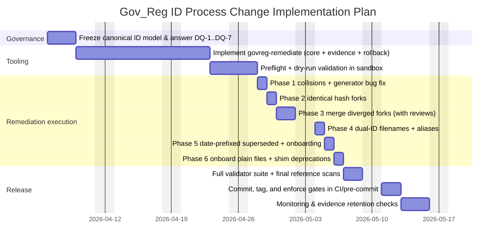

# Implementing ID Process Changes for Gov_Reg

## Executive summary

The attachments describe a deterministic file + directory identity governance system whose intended behavior is enforced by a “contract bundle” (config + schemas + prefix policy + write policy + gate catalog), but the repository’s current state has drifted into conflicting naming schemes, collisions, duplicate/forked implementations, and inconsistent tooling behavior. fileciteturn11file15 fileciteturn11file19

Two big conclusions follow.

First, the **target ID process** is clear at the contract level: governed zones, `.dir_id` anchors for directories, **20‑digit numeric IDs**, `P_` as the Python filename wrapper, immutable identity fields, and **patch-only** registry mutation via RFC‑6902, with blocking gates to prevent invalid state. fileciteturn8file0 fileciteturn10file15

Second, the **required change set** is also clearly specified: implement (or adopt) a remediation tool (`govreg-remediate`) that performs a six‑phase cleanup across 163 files, resolving 30 actionable items (collisions, forks, dual-ID filenames, superseded dated files, ungoverned plain files) with evidence chain, gates, and rollback. fileciteturn9file10 fileciteturn11file1

If you do *only* one thing first: **freeze the canonical ID model and resolve the design questions** (DQ‑1…DQ‑7), because several current artifacts and docs point in competing directions (20‑digit file_id vs 22‑digit allocator behavior; `doc_id = P_{file_id}` vs other derivations). fileciteturn11file13 fileciteturn9file6

## Current ID process overview

### What the “current process” is supposed to be

The contract bundle describes an identity control plane with these core elements:

- **Governance boundary and exclusions**: configuration defines what is governed vs excluded (e.g., `.git`, `.venv`, `__pycache__`, `.state`, `.idpkg`), plus naming behavior (`separator: "__"`, Python prefix `P_`), registry location, and allocator counter store outside the repo with a lock timeout. fileciteturn8file0  
- **Naming and ID representation**: the prefix policy states Python files in governed zones must use `P_` before a numeric ID; other file types use the numeric ID without a letter prefix. fileciteturn8file0  
- **Ingest event intake**: the ingest envelope schema defines what a filesystem event looks like (trigger, entity kind, observed time, project root, relative path, depth, zone) and allows a `desired_action` such as `register`, `ignore`, `promote`, `update`, or `tombstone`. fileciteturn8file0  
- **Write/mutation policy**: identity is immutable once assigned; `.dir_id` anchor files may be created but not modified/deleted except by explicit migration tooling; excluded paths must not receive IDs or registry records; registry writes must be **patch-only** (RFC‑6902) rather than direct rewrites. fileciteturn8file0  
- **Gate enforcement**: the gate catalog defines blocking checks, including allocator store location/reachability/lockability, patch-only registry mutation enforcement, and file/directory gates such as `.dir_id` presence, 20‑digit validity, uniqueness, registry presence, and file `owning_dir_id` alignment. fileciteturn10file7  

The contract model itself (as summarized in the decision matrix) is:

- `file_id`: **20-digit numeric string**
- `doc_id`: `P_` + 20-digit `file_id`
- `dir_id`: 20-digit numeric string stored in `.dir_id` JSON  
…and `P_` exists because Python modules cannot begin with digits. fileciteturn10file15

### Actors, systems, inputs, outputs, and decision points

**Actors**

- **Repository maintainer / ID governance owner**: decides unresolved policy questions and which contract interpretation is binding (especially when sources conflict). fileciteturn11file1  
- **Tool operator**: runs `govreg-remediate` phases, reviews merge plans, resolves gate failures, and owns operational checkpoints. fileciteturn8file1  
- **Automation and enforcement tooling**: watchers, allocators, handlers, validators, pre-commit hooks, and CI-like gates are part of the architecture and operational discipline described in the source review and contract mapping. fileciteturn10file5 fileciteturn6file3  
- **Developers**: create/rename files and directories, but must not manually remove ID prefixes in governed zones (write policy constraint). fileciteturn8file0  

**Systems (functional components implied or identified in attachments)**

The contract bundle explicitly maps candidate implementation areas: filesystem watcher(s), ID allocator (+ facade), `.dir_id` handler/resolver, file renamers, RFC‑6902 patch builders, gate enforcement, and a patch applier. fileciteturn6file3  
A concrete RFC‑6902 patch applier is identified (`P_01260207201000000834_apply_patch.py`) and is described as applying patches with backups and evidence outputs, aligning with “patch-only” policy intent. fileciteturn6file4 fileciteturn7file1

**Inputs**

- Filesystem events shaped by the ingest envelope schema. fileciteturn8file0  
- Configuration + contract artifacts: config, prefix policy, write policy, gate catalog. fileciteturn8file0  
- Allocator counter store (external to repo) and registry JSON file. fileciteturn8file0  
- Repository content: filenames, embedded body metadata (`file_id`, `doc_id`), `.dir_id` anchors. fileciteturn6file0  

**Outputs**

- Renamed files and created `.dir_id` anchors (where missing) in governed zones. fileciteturn10file7  
- RFC‑6902 patches and patch-application evidence (snapshots, diff summaries, hashes). fileciteturn7file1  
- Evidence artifacts with SHA‑256 sidecars and an operations log that records every mutation. fileciteturn8file2  

**Key decision points**

- **Zone classification**: staging vs governed vs excluded, based on config depth and exclusions. fileciteturn8file0  
- **Naming scheme enforcement**: whether a target must be `P_{id}_…` vs `{id}_…` vs DOC-namespaced vs ignored. fileciteturn8file0  
- **Identity resolution precedence**: when multiple IDs appear (dual-ID filename, mismatch with body), whether body metadata or registry presence wins, and whether aliases are preserved. fileciteturn7file6  
- **Mutation authorization semantics**: tool-only vs user writes, immutability, and patch-only registry enforcement. fileciteturn8file0 fileciteturn6file10  

### Where the current state is broken

The consolidated issues report and remediation specification show the process is not consistently enforced today:

- Confirmed **hard collision**: two different files share the same 20‑digit `P_` ID (`01999000042260125106`), which violates the uniqueness rule. fileciteturn7file15  
- Confirmed **DOC-slot collisions**: multiple DOC-SCRIPT numbers assigned to multiple files, plus broader DOC collision surface if numeric slots are treated numerically. fileciteturn7file15 fileciteturn10file18  
- **Dual-ID composite filenames** exist (4 files) and “fall outside normal scanner expectations” unless explicitly supported; at least one of these files is also parse-invalid. fileciteturn9file1 fileciteturn11file19  
- **Version layering drift**: dated files include normal operational prefixes and 2099 “sentinel-style” files with naming/header drift or ambiguous status. fileciteturn9file13  
- **Toolchain fragmentation**: the “reusable ID assignment pipeline” is not self-consistent (missing dependencies, mismatched config paths, scanners that don’t recognize current formats, tools that rename but do not update registry state). fileciteturn7file2  

## Change inventory

### Required changes explicitly specified in attachments

The attachments specify a concrete remediation and hardening scope.

**Repository remediation scope (must-fix items)**

- Implement/run a six-phase remediation across **163 files**, addressing **30 files requiring action**, including:
  - 4 collision pairs (3 DOC-SCRIPT + 1 P_)
  - 4 identical hash forks to delete
  - 3 diverged hash forks to merge then delete
  - 4 dual-ID filenames to resolve
  - 4 superseded versions to archive
  - 10 date-prefixed files to onboard
  - 8 ungoverned files to onboard
  - 1 generator bug to patch fileciteturn9file10  

**Evidence, rollback, and verification requirements**

- Every phase must produce a rollback manifest *before* changes, maintain an operations log, attach SHA‑256 sidecars to evidence JSON, and run validation gates (uniqueness, sync, syntax, registry coherence, reference scans). fileciteturn11file0 fileciteturn8file2 fileciteturn8file3  
- Tooling must support `status`, `preflight`, per-phase execution (with `--dry-run`), exit codes, and explicit rollback semantics. fileciteturn8file1 fileciteturn11file2  

**Contract and governance alignment**
- Enforce the contract bundle’s constraints: naming policy, `.dir_id` anchor handling, patch-only registry writes, immutability, exclusion rules, and blocking gates. fileciteturn8file0 fileciteturn10file7  

### Plausible change types not specified in attachments

The user asked to enumerate plausible change types when unspecified. Based on the provided materials, the following categories are **not concretely specified** (so they are assumptions rather than requirements):

- **UI changes** (no UI artifacts are provided).
- **Authentication/authorization changes** beyond “tool vs user mutation semantics” implied by write policy (no identity provider or auth stack described in attachments). fileciteturn6file10  
- **External integrations** beyond filesystem + registry + local automation (no external systems contract attached).
- **Reporting/dashboard requirements** beyond evidence outputs and scanner/healthcheck references (some reporting surface is implied, but not specified as a business requirement). fileciteturn6file18  

### Current vs proposed process comparison

The “current vs proposed” comparison below is grounded in the governance contract and the remediation specification, plus the issue inventory showing current drift. fileciteturn8file0 fileciteturn9file10 fileciteturn7file15

| Dimension | Current observed state | Proposed state after changes |
|---|---|---|
| ID model | Conflicting/ambiguous in artifacts: 20-digit `file_id` contract exists, but drift includes mixed schemes and conflicts | Freeze contract model: 20‑digit `file_id` / `dir_id`, `doc_id = P_{file_id}`, with explicit handling for any 22‑digit IDs as non-`file_id` (if retained) fileciteturn10file15 fileciteturn9file6 |
| Naming schemes | Multiple schemes: `P_`, `DOC-*`, date-prefixed, ungoverned plain, hash-suffixed forks; dual-ID filenames exist | Canonical naming with remediation to eliminate collisions, normalize/retire legacy forms, onboard strays, and explicitly treat remaining exceptions |
| Uniqueness | Confirmed collisions (P_ collision and DOC collisions) | No duplicate IDs across filenames/body metadata (enforced by gates) fileciteturn8file3 |
| Registry mutation | Inconsistent; some tools show “write without backup/lock” risk markers; contract demands patch-only | Registry changes via RFC‑6902 patch-only path; backups/evidence standard; enforce via gates and tooling rules fileciteturn8file0 fileciteturn7file1 |
| Rollback | Uneven (risk markers and missing rollback support in parts) | Deterministic rollback per phase using manifest + registry snapshots; explicit rollback command fileciteturn11file0 |
| Enforcement | Split across multiple validators/gates; not one single “universal” gate runner is clearly dominant | Standardized execution path for gate checks + CI/pre-commit integration; remediation phases include gates after each phase fileciteturn6file4 fileciteturn8file3 |
| Operational evidence | Partial / inconsistent | Evidence chain with required fields, SHA-256 sidecars, operations log, completion reports fileciteturn8file2 |

## Implementation detail playbooks

This section is organized as **change packages**, each providing: implementation steps, roles/stakeholders, dependencies, estimates, testing, rollback, compliance/security, and deployment/monitoring.

### Change package for contract freeze and design decisions

This is the prerequisite for safe execution. The remediation tool spec explicitly requires policy-level decisions (DQ‑1…DQ‑7). fileciteturn9file10

**Implementation steps**
1. **Freeze the canonical identity contract** used by tools:
   - Confirm whether canonical file identity is strictly **20-digit `file_id`** and `doc_id = P_{file_id}` (as the contract model indicates), and explicitly forbid “calling 22-digit values `file_id`” if 22-digit IDs exist as a separate type. fileciteturn10file15 fileciteturn11file13  
2. **Answer remediation design questions (DQ‑1…DQ‑7)** in a single owner-approved decision record (e.g., a `.govreg-remediate.json` config with the locked decisions block). fileciteturn5file17  
3. **Define canonicality rules for exceptions** (date-prefixed older versions, 2099 sentinel files, shim files): decide whether each is “onboard to P_”, “DOC-*”, “archive”, or “formal exception.” fileciteturn9file0 fileciteturn9file13  
4. **Lock registry shape facts** needed by remediation logic (records/files keys, doc vs documents keys) if refactoring is in-scope; otherwise explicitly defer and require adapters. This is flagged as a major drift risk in the source review. fileciteturn6file9  

**Roles and stakeholders**
- Governance owner (final decision authority). fileciteturn11file1  
- Maintainers of registry schema and allocator behavior (must confirm canonical outputs). fileciteturn9file6  
- Tooling engineer (implements decisions in remediation config and code). fileciteturn5file17  

**Dependencies and prerequisites**
- Access to canonical contract sources (decision matrix references a newer identity contract not included in attachments; treat as a dependency if truly authoritative). fileciteturn10file15 fileciteturn10file13  
- Registry access, allocator counter store access, and ability to run gating tools. fileciteturn8file5  

**Estimated effort and timeline (assumption)**
- 1–3 working days for decision workshops + sign-off, depending on how contested the 20-vs-22 and doc_id derivation decisions are. (Unspecified in attachments; estimate.)

**Testing and validation plan**
- Dry-run `govreg-remediate` phases with decisions locked and review the printed plans, especially Phase 3 merge plans and Phase 4 dual-ID survival decisions. fileciteturn8file1  

**Rollback and contingency**
- No repo changes yet; rollback is “don’t proceed.” The key contingency is postponing remediation until contract disputes are resolved.

**Compliance/security considerations**
- Decision record should be treated as a governance artifact (auditable), because the tool spec treats some outcomes as maintainer-only policy. fileciteturn9file1  

**Deployment checklist and monitoring**
- Decision record published; remediation config file checked into repo (or stored in controlled environment) before Phase 1 begins. fileciteturn8file5  

### Change package for collisions and generator bug

This package corresponds to **Phase 1** remediation and includes a recurrence-prevention patch to the validator ID generator. fileciteturn11file1

**Implementation steps**
1. Run `govreg-remediate preflight` to verify registry, allocator counter store lock, evidence dir writability, and inventory match. fileciteturn8file5  
2. Run `govreg-remediate phase1-collisions --dry-run`:
   - Review collision reassignment plan and confirm DQ‑3 and DQ‑4 decisions. fileciteturn8file2  
3. Run `govreg-remediate phase1-collisions`:
   - Pre-check collisions still exist.
   - Allocate new IDs for the file being reassigned (DOC-SCRIPT minted number; P_ allocator output).
   - Update body metadata.
   - Rename the file to new ID prefix.
   - Update registry atomically: old entry status becomes `REASSIGNED`, new entry created with `active`.
   - Patch the generator bug: add pre-emit check for existing DOC-SCRIPT assignments to avoid collisions.
   - Grep references and emit evidence. fileciteturn11file3  

**Roles and stakeholders**
- Tool operator (runs the phase, validates results). fileciteturn8file2  
- Maintainer (approves which side keeps a collided ID). fileciteturn9file16  
- QA/test owner (runs tests after phase). fileciteturn8file1  

**Dependencies and prerequisites**
- Registry must be reachable; allocator must be functional; evidence directory writable; collisions must exist or the tool exits cleanly as already resolved. fileciteturn8file5 fileciteturn11file1  

**Estimated effort and timeline**
- **Engineering build** (if tool not implemented): 2–5 days (assumption; depends on existing codebase).  
- **Operational execution**: Phase 1 runtime is part of the overall 30–60 minute remediation execution estimate, but Phase 1 is “CRITICAL risk” and may require review pauses. fileciteturn9file10  

**Testing and validation plan**
- Use built-in phase gates: uniqueness, sync, syntax parse, registry coherence, and reference scan gates. fileciteturn8file3  
- Run repo tests after Phase 1 if present (manual checkpoint is explicitly required later in the checklist for Phase 3; apply similarly once IDs move). fileciteturn8file2  

**Rollback and contingency**
- Use `rollback_manifest.json` + registry snapshot restore; rollback reverses operations in reverse sequence and restores the registry snapshot for the phase. fileciteturn11file0  
- Contingency: if collisions involve files referenced by tooling/config, treat reference scan hits as blocking until fixed. fileciteturn11file3  

**Compliance/security considerations**
- Generator bug fix is a control to prevent recurrence of collisions caused by emitting IDs without checking existing assignments. fileciteturn9file10  
- Evidence artifacts must include operator identity and SHA-256 sidecars to enable audit/tamper detection. fileciteturn8file2  

**Deployment checklist and monitoring**
- After Phase 1, confirm Phase 1 status is COMPLETE and gate results are stored; monitor `phase1_reference_scan.json` for remaining references. fileciteturn8file2 fileciteturn8file3  

### Change package for hash-suffixed forks cleanup

This package corresponds to **Phase 2 (delete identical forks)** and **Phase 3 (merge diverged forks)**. fileciteturn5file8

**Implementation steps**
1. Phase 2 dry-run: verify “identical” fork pairs are still byte-identical; otherwise escalate to Phase 3. fileciteturn8file2  
2. Phase 2 execution:
   - Compute SHA-256 of both files, store fork content in rollback manifest, delete fork, scan for references, emit evidence. fileciteturn5file8  
3. Phase 3 dry-run:
   - Generate merge plan patches for each diverged fork, requiring careful review. fileciteturn8file1 fileciteturn5file17  
4. Phase 3 execution:
   - Snapshot canonical files for rollback, show merge plan and require interactive confirmation unless forced, apply merge, validate syntax (`ast.parse`) and optionally import, delete fork, emit evidence. fileciteturn5file8 fileciteturn7file7  

**Roles and stakeholders**
- Tool operator (execution + confirmations). fileciteturn5file8  
- Code owners for reconciler/resolver/dedup modules (review merge plans; accept behavioral changes). fileciteturn5file17  

**Dependencies and prerequisites**
- Phase 3 blocked by Phase 2 (sequential gating). fileciteturn6file15  
- `python` runtime sufficient for syntax checks; tool spec also calls out Python 3.10+ for match statements in merge patch generation. fileciteturn8file5  

**Estimated effort and timeline**
- Engineering build: 3–7 days (assumption; merging safely takes time).  
- Operational execution: part of the 30–60 minute estimate overall, but Phase 3 is “HIGH risk” and includes review pauses. fileciteturn9file10 fileciteturn5file8  

**Testing and validation plan**
- Phase gates apply, especially syntax gate and reference scan. fileciteturn8file3  
- Run unit/integration tests after Phase 3 (explicitly called out as a manual checkpoint). fileciteturn8file2  

**Rollback and contingency**
- Use per-phase rollback manifests and backups directory created before merge. fileciteturn5file8 fileciteturn11file0  
- If merge changes return type shapes (explicitly flagged in merge-plan risk notes), treat dependent callers as downstream impacts and address before proceeding. fileciteturn7file12  

**Compliance/security considerations**
- Phase 3 must not be “automated AST splicing”; merge patches are designed for human review and controlled change. fileciteturn5file8  
- Evidence chain requirements + SHA-256 sidecars are critical for auditability when deleting content. fileciteturn8file2  

**Deployment checklist and monitoring**
- After Phase 2 and Phase 3, confirm fork deletions and merges do not leave orphaned imports; rely on gate `GATE-REFS` and reference scans. fileciteturn8file3  

### Change package for dual-ID filenames and alias preservation

This package corresponds to **Phase 4** and also implies necessary **parser hardening** because the current `get_file_id_from_name()` behavior drops the second ID silently. fileciteturn9file1

**Implementation steps**
1. Phase 4 dry-run to generate a resolution plan per file (surviving ID selection): body metadata > registry match > first ID fallback. fileciteturn7file6  
2. Phase 4 execution:
   - Extract both IDs using the specified regex.
   - Lookup both IDs in registry; read body metadata.
   - Rename file to `P_{surviving_id}_{base_name}.py`.
   - Insert or update body `file_id` header to match surviving ID.
   - Create ALIAS registry entry mapping `dropped_id → surviving_id`.
   - Grep-and-replace old references (filenames and dropped IDs) to prevent broken imports.
   - Emit evidence. fileciteturn7file6  

**Roles and stakeholders**
- Maintainer (must accept ID survival rule and alias policy). fileciteturn9file16  
- Tool operator (executes rename + rewrites and monitors gate results). fileciteturn8file2  

**Dependencies and prerequisites**
- Registry must be readable for “choose surviving ID by registry presence” option. fileciteturn9file16  
- If the repo includes additional dual-ID modules referenced in imports, Phase 4 must discover and include them dynamically (explicitly flagged in the phase spec). fileciteturn7file6  

**Estimated effort and timeline**
- Engineering build/parser hardening: 1–3 days (assumption).  
- Operational execution: relatively small file count (4 primary targets), but high risk due to import-chain breakage. fileciteturn7file6  

**Testing and validation plan**
- Must pass syntax gate (`ast.parse`) across modified files; note the issue inventory explicitly flags at least one dual-ID file as parse-invalid today, so this gate is not optional. fileciteturn8file3 fileciteturn11file19  
- “Grep for old filenames/IDs returns zero error-level hits” gate should be treated as a release blocker when imports are involved. fileciteturn8file3  

**Rollback and contingency**
- Use rollback manifest and registry snapshot. fileciteturn11file0  
- Contingency: if import rewrites cannot be automated (dynamic imports, string-based loaders), treat those as manual fixes and require re-running reference scans. The spec explicitly anticipates this failure mode. fileciteturn7file12  

**Compliance/security considerations**
- Keeping an alias mapping is an integrity control to avoid silently breaking historical references and registry links. fileciteturn7file6  
- All renames and registry mutations must be logged in the operations log for audit. fileciteturn8file2  

**Deployment checklist and monitoring**
- After Phase 4, verify `govreg-remediate status` shows Phase 4 complete and that `GATE-REGISTRY` passes (no orphaned entries). fileciteturn8file3 fileciteturn8file10  

### Change package for date-prefixed versions and sentinel normalization

This package corresponds to **Phase 5** (superseded date-prefixed versions) and covers the 2099 sentinel drift identified in the issue inventory. fileciteturn7file17 fileciteturn7file6

**Implementation steps**
1. Phase 5 dry-run:
   - Confirm which “later” versions are kept and how each file is classified (onboard into `P_` vs `DOC-*`), which is explicitly a decision question outcome (DQ‑5). fileciteturn8file2  
2. Phase 5 execution:
   - Archive superseded earlier versions to the archive directory.
   - Onboard later versions into the canonical naming scheme.
   - Onboard standalone date-prefixed files using the specified target scheme table (e.g., some become DOC-SCRIPT, some become P_). fileciteturn9file0 fileciteturn7file6  
3. Treat 2099 sentinel-style files explicitly:
   - Either normalize them into canonical naming (preferred if they are operational) or document them as sanctioned exceptions with clear status. The issue inventory treats them as semantically ambiguous today. fileciteturn7file17  

**Roles and stakeholders**
- Maintainer (approves canonical version decisions and whether sentinel artifacts remain). fileciteturn7file17  
- Tool operator (executes the phase and reviews results). fileciteturn8file2  

**Dependencies and prerequisites**
- None of Phases 1–4 block Phase 5 in the tool, but Phase 6 depends on Phase 5 due to shim rewrites. fileciteturn6file15  

**Estimated effort and timeline**
- Engineering build: 1–3 days (assumption).  
- Operational phase: medium risk; changes affect validators and identity tooling. fileciteturn7file6  

**Testing and validation plan**
- Gate `GATE-SYNC` applies (filename ID matches body `file_id`/`doc_id`), plus syntax, registry, and reference scans. fileciteturn8file3  

**Rollback and contingency**
- Phase rollback supported via manifest + registry snapshot. fileciteturn11file0  
- Contingency for “stale analysis”: if file inventory has changed since analysis JSON, preflight reports additions/removals/renames and the phase plan must be regenerated. fileciteturn8file5  

**Compliance/security considerations**
- Normalizing sentinel files reduces ambiguity and prevents “special-case drift” from undermining gate enforcement. fileciteturn7file17  

**Deployment checklist and monitoring**
- Confirm archived files are not imported anywhere (reference scan must show no error-level hits). fileciteturn8file3  

### Change package for onboarding ungoverned plain files and shims

This package corresponds to **Phase 6** and addresses the “plain-file governance gap” and shim behavior called out in the issue inventory. fileciteturn7file17

**Implementation steps**
1. Phase 6 dry-run:
   - Verify shim import targets will be updated to Phase 5 renamed canonical targets. fileciteturn8file2  
2. Phase 6 execution (per spec):
   - For non-shim plain files: if body already contains `file_id` use it; else allocate new P_ ID; rename to `P_{file_id}_{base_name}.py`; insert header if missing; create registry entry `active`.
   - For shim files: allocate P_ ID; rename to `P_{file_id}_{base_name}.py`; update the shim’s `spec_from_file_location` import target to point at the Phase 5 renamed canonical; create registry entry `DEPRECATED`; log deprecation notice.
   - Run reference scan and emit evidence. fileciteturn11file0  

**Roles and stakeholders**
- Tool operator (phase execution + validation). fileciteturn8file2  
- Maintainer (approves “DEPRECATED shim” policy and whether shims should remain or be removed). fileciteturn11file0  

**Dependencies and prerequisites**
- Phase 6 is blocked by Phase 5 in the tool spec. fileciteturn6file15  
- Allocator counter store must be accessible and writable for new IDs. fileciteturn8file5  

**Estimated effort and timeline**
- Engineering build: 1–3 days (assumption).  
- Operational execution: medium; 8 files onboarded, including critical identity-chain components that currently operate outside governance. fileciteturn9file0 fileciteturn11file0  

**Testing and validation plan**
- Gate `GATE-SYNC` should pass for all onboarded/renamed files (body header alignment). fileciteturn8file3  
- Pay special attention to the priority note: process `file_id_resolver.py` first because it is “production infrastructure operating outside governance” with fail-closed behavior. fileciteturn11file0  

**Rollback and contingency**
- Phase rollback via manifest + restore registry snapshot. fileciteturn11file0  
- If shim rewrites break due to dynamic load paths, treat as contingency and require manual correction prior to phase completion, since the phase produces updated targets. fileciteturn11file0  

**Compliance/security considerations**
- Bringing plain files under governance reduces privileged “out-of-band” behavior and aligns them with write policy and gate enforcement. fileciteturn8file0 fileciteturn11file0  
- Shim deprecation should be surfaced to avoid silent reliance on indirect loading. fileciteturn11file0  

**Deployment checklist and monitoring**
- Confirm `govreg-remediate status` reaches “6/6 phases complete, 0 files requiring action,” then run full validator suite and commit. fileciteturn8file2 fileciteturn8file10  

### Change package for evidence chain, gates, and patch-only registry discipline

This is cross-cutting: it hardens the ID process so remediation results remain stable and auditable.

**Implementation steps**
1. Implement the evidence chain requirements:
   - Evidence files include `tool_version`, `executed_at`, `phase`, `operator` and have detached `.sha256` sidecars.
   - Maintain `operations_log.jsonl` with every filesystem and registry mutation. fileciteturn8file2  
2. Enforce per-phase validation gates:
   - `GATE-UNIQUE`, `GATE-SYNC`, `GATE-SYNTAX`, `GATE-REGISTRY`, `GATE-REFS`, with clear pass/warn/fail semantics and controlled `--force` behavior. fileciteturn8file3  
3. Enforce rollback protocol:
   - Write rollback manifest before mutations; reverse operations in reverse order; restore registry snapshot; do not cascade rollbacks automatically. fileciteturn11file0 fileciteturn11file2  
4. Align all registry mutation tooling to “patch-only” intent:
   - Prefer using the patch applier behavior (backs up registry, applies JSON patches, produces snapshots/diff summaries/evidence), and deprecate direct-rewrite tools flagged as “write without backup/lock.” fileciteturn8file0 fileciteturn7file1 fileciteturn8file4  

**Roles and stakeholders**
- Tooling engineer (evidence chain implementation).
- Security/compliance owner (approves auditability and tamper detection posture). fileciteturn8file2  
- Maintainer (approves force-override policy and operational tolerances). fileciteturn8file3  

**Dependencies and prerequisites**
- Write permissions to `.state/evidence/...` paths; registry reachable; `git` available if reference scans depend on it. fileciteturn8file5  

**Estimated effort and timeline (assumption)**
- 3–6 days engineering if evidence chain and gates are not already implemented in code.

**Testing and validation plan**
- Unit test evidence writers: verify `.sha256` matches content and required fields present.
- Chaos testing: interrupt mid-phase and confirm “resume from operations log” behavior works as specified. fileciteturn7file12  

**Rollback and contingency**
- Rollback tool itself can fail (exit code 5 if manifest missing/corrupt); mitigate by ensuring rollback manifest is the first artifact written and verified prior to mutations. fileciteturn8file5 fileciteturn11file0  

**Compliance/security considerations**
- Patch-only registry mutation and immutable IDs reduce unauthorized tampering opportunities and simplify audit reasoning. fileciteturn8file0  
- SHA‑256 sidecars provide tamper detection of evidence artifacts, aligning with audit requirements. fileciteturn8file2  

**Deployment checklist and monitoring**
- Before proceeding, confirm `preflight` is clean and no prior phases are left IN PROGRESS. fileciteturn8file5  
- Monitor for concurrency conflicts: the spec explicitly warns about registry concurrent modification between snapshot and commit (phase should abort registry write and require re-run). fileciteturn7file12  

## Master implementation plan and timeline

### Milestones, owners, and acceptance criteria

| Milestone | Primary owner (role) | Acceptance criteria |
|---|---|---|
| Governance decision freeze | ID governance owner | DQ‑1…DQ‑7 resolved and recorded; canonical ID model frozen; exception rules documented fileciteturn5file17 fileciteturn10file15 |
| Tool readiness | Tooling engineer + operator | `govreg-remediate preflight` succeeds; `status` detects expected targets; evidence dir is writable fileciteturn8file5 fileciteturn8file10 |
| Collision remediation complete | Operator + maintainer | Phase 1 COMPLETE; no collisions; generator bug patched; reference scans reviewed fileciteturn11file3 |
| Fork cleanup complete | Operator + code owners | Phase 2 COMPLETE; Phase 3 COMPLETE; merge plans reviewed; tests run; no orphaned refs fileciteturn8file2 fileciteturn5file8 |
| Dual-ID resolution complete | Operator + maintainer | Phase 4 COMPLETE; aliases created; imports updated; syntax gate passes across modified files fileciteturn7file6 fileciteturn8file3 |
| Date-prefixed and plain-file onboarding complete | Operator + maintainer | Phase 5 COMPLETE; Phase 6 COMPLETE; shims updated + marked DEPRECATED; `status` shows 6/6 phases complete, 0 files requiring action fileciteturn11file0 fileciteturn8file10 |
| Release and steady-state enforcement | Maintainer + CI owner | Full validator suite executed; changes committed; gates enforced in pre-commit/CI; monitoring/evidence retention in place fileciteturn8file2 fileciteturn10file7 |

### Task breakdown with estimates

Effort ranges below are planning estimates (assumptions) unless directly specified.

| Workstream | Key tasks | Effort (person-days) | Dependencies |
|---|---|---:|---|
| Governance and contract | Resolve DQ‑1…DQ‑7; freeze canonical ID model; define exception/canonicality policy | 1–3 | None (but blocks safe remediation) fileciteturn11file1 |
| Tool implementation | Implement `govreg-remediate` command set, phases, evidence chain, exit codes, rollback | 7–15 | Governance decisions; registry + allocator access fileciteturn8file5 fileciteturn11file2 |
| Phase execution | Run phases 1–6 with dry-runs, manual checkpoints, tests, and commits | 1–3 (operator time) | Tool readiness; approvals fileciteturn8file2 |
| Post-remediation hardening | Align registry tooling to patch-only; deprecate risky direct-writers; standardize gate runner | 3–8 | Tooling inventory; adoption plan fileciteturn8file0 fileciteturn8file4 |
| Documentation updates | Update operational docs to reflect canonical process, onboarding procedure, exception handling | 2–5 | Contract freeze outcome fileciteturn10file15 |

### Timeline Gantt

The remediation spec provides an operational checklist and estimates runtime execution at 30–60 minutes once the tool and decisions are ready; the schedule below is an implementation and rollout plan (assumption-based), starting the next business week after the current date. fileciteturn9file10 fileciteturn8file2

## Testing, deployment, and post-deployment monitoring

### Testing and validation strategy

**Phase-level validation (required by spec)**  
After each phase, gates determine whether the phase is COMPLETE, COMPLETE with warnings, FAILED, or forced with acknowledged risk. The gates are: uniqueness, sync, syntax parse, registry correctness, and reference scan. fileciteturn8file3

**Additional validations strongly recommended**
- **Import validation** for renamed modules: Phase 3 explicitly calls for `ast.parse()` and import checks “if import path resolvable”; extend this to other rename-heavy phases. fileciteturn7file7  
- **Regression run** of any existing test suite after Phase 3 merges and after Phase 6 onboarding, since behavior and import paths may change. fileciteturn8file2  
- **Registry integrity checks**: ensure patch-only writes and backups are used consistently (align with write policy). fileciteturn8file0 fileciteturn7file1  

### Deployment checklist

This is the minimal “release checklist” consistent with the remediation spec and contract intent:

1. Run `govreg-remediate status` and confirm targets detected. fileciteturn8file2  
2. Run `preflight` and confirm registry, allocator store lock, evidence directory, and inventory match. fileciteturn8file5  
3. Execute phases in order with `--dry-run` before each phase and the required manual checkpoints (especially Phase 3 merge plan review). fileciteturn8file2  
4. After Phase 6, run `status` and confirm “6/6 phases complete, 0 files requiring action.” fileciteturn8file2 fileciteturn8file10  
5. Run the full validator suite against the remediated codebase, then commit with the recommended message. fileciteturn8file2  

### Rollback and contingencies

Rollback is explicit and phase-scoped:
- Each phase writes `rollback_manifest.json` before changes and stores a registry snapshot.
- Rollback reverses operations in reverse order and restores the registry snapshot.
- Rollback does not cascade automatically; downstream phases must be rolled back first if dependent. fileciteturn11file0 fileciteturn11file2  

Contingencies explicitly called out in the spec include:
- Interrupted execution resumes using operations log state.
- Locked files are retried, then skipped with warnings unless they are collision targets.
- Registry concurrent modification aborts registry write and requires operator re-run. fileciteturn7file12  

### Post-deployment monitoring

Monitoring in this system is evidence-driven:

- Confirm ongoing evidence artifacts are created for healthchecks, watcher events, and transactions (these evidence directories are referenced in the repo audit fingerprints). fileciteturn11file5  
- Treat reference scans as a persistent monitoring control after renames: “old filename/ID references = breakage risk.” fileciteturn8file3  
- Enforce gate catalog checks continually (pre-commit/CI) so the repo cannot drift back into collisions and noncompliant naming. fileciteturn10file7  

## Risks, assumptions, and open decisions

### Material risks

- **Semantic drift risk**: the source review is blunt that the biggest risk is inconsistent semantics between contracts, workflows, and tools, not missing features. fileciteturn9file8  
- **Contract conflicts**: unresolved decisions exist around allocator output (20-digit vs 22-digit semantics) and `doc_id` derivation (contract vs conflicting older branches). fileciteturn9file6 fileciteturn10file9  
- **Pipeline self-inconsistency**: tools that rename without updating registry state, missing dependencies, and mixed legacy validator logic mean remediation alone may not fully stabilize steady-state operations unless the underlying toolchain is consolidated. fileciteturn7file2  
- **High-risk merge operations**: Phase 3 changes code behavior and return shapes; improper merges will create runtime regressions. fileciteturn7file12  

### Key assumptions

- The `govreg-remediate` tool described is **not yet implemented** and must be built (the attachment is explicitly an instruction/specification document). fileciteturn9file1  
- Several files referenced as “current authoritative” in the decision matrix (e.g., `ID_FILE_CLASSIFICATION.md`, `ID_SCRIPT_INVENTORY.jsonl`, newer identity contract version) are **not included** in the uploaded attachments, so this report cannot quote or validate their full contents; they should be treated as required inputs for an implementation effort if they exist and are authoritative. fileciteturn10file15 fileciteturn10file13  
- Effort and timeline estimates are planning assumptions (not specified in attachments), except the remediation spec’s stated operational execution time (30–60 minutes) once tool and decisions exist. fileciteturn9file10  

### Open decisions that must be closed before implementation starts

These are explicitly required by the remediation spec and/or called out as structural conflicts:

- DQ‑1/DQ‑2: surviving ID selection and alias handling for dual-ID filenames. fileciteturn9file1 fileciteturn7file6  
- DQ‑3/DQ‑4: which file keeps collided IDs for P_ collision and DOC-SCRIPT collisions. fileciteturn9file16 fileciteturn11file1  
- DQ‑5/DQ‑6: how date-prefixed and shim files are onboarded (`P_` vs `DOC-*`, DEPRECATED policy). fileciteturn9file0 fileciteturn11file0  
- Canonical contract resolution: decide whether 22-digit allocator behavior exists and, if so, ensure it does not override the canonical 20-digit `file_id` model (or explicitly change the model and update every tool accordingly). fileciteturn9file6 fileciteturn10file15