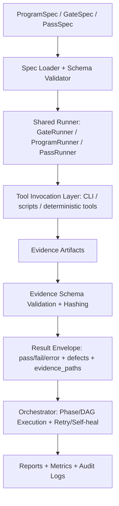
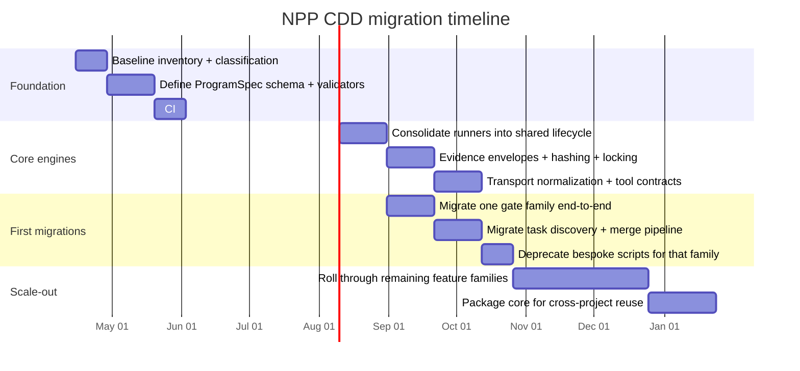

# Applying CDD File Reuse to the NPP System

## Executive summary

Your NPP materials already contain most of the “CDD kernel”: **data-only specs**, **shared runners**, **strict schemas**, **evidence artifacts**, and **deterministic execution constraints**. The gating model explicitly separates “gate-specific data” from reusable execution logic, and your multi-pass task discovery design already treats each pass as a manifest producer followed by normalization/merge/conflict detection. fileciteturn5file2 fileciteturn2file1

CDD in NPP should therefore be approached as **tightening and generalizing what you already have**, not inventing something new: turn “a new feature” into “a new spec that plugs into existing runners,” and enforce that rule in CI so it can’t drift back into bespoke scripts. That core premise (feature adds data, not machinery) is exactly what your CDD rationale argues—and it includes concrete ranges you can use for planning: non-CDD features often land roughly **15–35 new files** (and large features can go beyond that), while mature CDD can often keep comparable work to roughly **4–12 new files**, sometimes as low as **1–6** when the change is mainly a new gate/pass/policy spec. fileciteturn3file4

If you implement CDD “for real” (schemas + runners + enforcement), the most likely payoff in NPP is not just lower file counts; it’s fewer one-off executors, wrappers, merge scripts, ad hoc validators, and drift-prone orchestration layers. fileciteturn3file3

Key actions that will make or break this:

- **Make ProgramSpec the only way to add automation behavior**, and validate it in CI using JSON Schema (you already do this pattern for tools/gates). fileciteturn4file6 fileciteturn2file0  
- **Standardize result/evidence envelopes** so orchestration, reporting, and audit tools can remain generic across features and even across projects. fileciteturn5file1  
- **Institutionalize “no task without acceptance tests”** for task discovery manifests to prevent planning drift and “uncheckable work.” fileciteturn2file1  
- Expect a **temporary file-count spike** during framework extraction (runners, registries, schemas, envelopes), then measure per-feature deltas after stabilization. fileciteturn3file2

## CDD model tailored to NPP

CDD here is best understood as three “hard boundaries” that everything in NPP must respect.

**Component-driven**: shared engines live in stable libraries  
Your gate framework already demonstrates this: the shared GateRunner executes all gates; only GateSpec changes per gate. fileciteturn5file2 The same “component boundary” should exist for:

- pass orchestration engine  
- task merge/conflict engine  
- evidence validation and bundling  
- lock/fingerprint utilities  
- transport wrappers (CLI/tool invocation surface)

**Configuration-driven**: behavior variations live in declarative specs  
You already do this in three places:

- GateSpec is “data-only” and declares inputs, commands, evidence contracts, fingerprint fields, and pass criteria. fileciteturn5file2  
- Multi-pass discovery emits task manifests with stable schema, then merges them deterministically. fileciteturn2file1  
- Your tool SSOT defines deterministic tools with strict input/output schemas and default evidence paths, plus global invariants like repo-root confinement and evidence required. fileciteturn2file0  

CDD’s next step for NPP is to **unify these into a single spec taxonomy** (ProgramSpec as the superset; GateSpec as a constrained subtype; PassSpec/DiscoverySpec and MergeSpec as siblings).

**Contract-driven**: schemas define the “narrow waist,” and CI enforces them  
The official model to lean on is: schema validation is not documentation—it is the boundary that keeps drift from happening. Your artifacts already align with this stance (schema-driven validation and “no hidden code in config”). fileciteturn4file9

For schema formats: JSON Schema 2020-12 is widely used and formally specified. citeturn0search8  
For spec and contract language: keep requirement words aligned to established conventions so you can write conformance rules unambiguously. citeturn2search1

**External analogs validate the approach**: declarative, desired-state configuration systems scale precisely because you keep “what you want” in config and keep “how it runs” in reusable controllers/runners. citeturn0search2turn3search1

### Target architecture sketch



This is intentionally a “narrow waist” design: the runner and envelopes are stable; most change happens in specs and schemas.

## Repository mapping and file-inventory model you can use immediately

You asked for a mapping of “current NPP repo file types” to CDD categories, but the repo inventory is unspecified. So the right deliverable is:

- a **template table** (fill with real globs + counts), and  
- an **example** filled with plausible counts consistent with your artifacts (GateSpec, schemas, task manifests, tool contracts, guardrails).

### Template mapping table to fill

| Repo path / glob | What it does | CDD category | Scope target | Contract anchor | Current count | Drift risk if left as-is | Action to move toward CDD |
|---|---|---|---|---|---:|---|---|
| `runners/**` | Executes specs (locks, run, validate, emit envelopes) | Runner / component | Cross-project shared | Runner behavioral contract + result schema |  | High if per-feature runners exist | Consolidate into 1–3 runners; forbid new runners without design review |
| `specs/**/*.spec.{json,yaml}` | Declares behavior (inputs, commands, evidence, criteria) | Specs / configuration | Per-project + per-feature | Spec schema (JSON Schema) |  | Medium | Validate in CI; add registries/catalog files |
| `schemas/**/*.schema.json` | Defines allowed structure of specs/evidence/results | Schemas / contracts | Cross-project shared | JSON Schema meta-schema |  | High | Enforce schema validation; version schemas; disallow undeclared fields |
| `prompts/**` | Versioned prompt assets used by discovery or review | Prompts / configuration | Per-project | Prompt contract (inputs/outputs) |  | Medium | Treat prompts as immutable versioned assets + tests |
| `validators/**` | Semantic checks beyond schema | Validators / component | Cross-project shared | Validator input/output schemas |  | High | Consolidate; bind validators via spec IDs |
| `merge/**` | Normalize/dedupe/conflict detect | Merge engine / component | Cross-project shared | Task manifest schemas |  | High | Replace one-off merge scripts with one library + spec’d rules |
| `transport/**` | CLI calls, stdio/jsonl envelopes, adapters | Transport / component | Cross-project shared | Tool contracts + envelope schema |  | Medium | Standardize on one envelope format; add contract tests |
| `.state/evidence/**` or `evidence/**` | Evidence artifacts emitted by runs | Evidence / data | Generated (not authored) | Evidence schemas + hashing |  | High | Make generated-only; validate + hash; never hand-edit |
| `tests/**` | Verifies runners/specs/validators | Tests | Shared + per-project | Test harness contracts |  | Medium | Require tests for spec changes; golden tests for schemas |
| `docs/**` | Human docs derived from canonical specs | Docs | Generated or curated | Documentation build contract |  | Low/Med | Prefer generated docs from specs; keep docs minimal |

### Example mapping with plausible counts

This is **illustrative**—replace counts with your measured inventory.

| Category | Example path globs | Plausible current count | What “good” looks like under CDD |
|---|---|---:|---|
| Specs | `gates/*.spec.json`, `programs/*.spec.json`, `passes/*.spec.json` | 35 | Growth happens mostly here |
| Schemas | `schemas/*.schema.json` | 45 | Low churn; versioned; reused |
| Shared runners | `scripts/*runner*`, `runners/**` | 6 | Converge to ~2–4 core runners |
| Validators | `validators/**` | 12 | Shared; mapped from spec IDs |
| Orchestration wiring | `orchestration/**`, `scripts/pipelines/**` | 18 | Shrink: orchestration becomes specs + runner |
| Prompt assets | `prompts/**` | 25 | Versioned; tested; referenced by spec IDs |
| Merge & conflict | `merge/**`, `tasks/merged/**` | 8 | One deterministic merge engine + rule specs |
| Evidence | `.state/evidence/**`, `results/**` | 100+ generated | Generated-only; schema-validated; hashed |
| Tests | `tests/**` | 120 | Focused tests around runners + schema conformance |
| Docs | `docs/**` | 30 | Prefer generated docs from schemas/specs |

### Before/after file-count projections

You asked for a model using the ranges in your CDD rationale. Here is a concrete way to use them.

**Per-feature file additions (control-plane heavy features)**  
- Non-CDD: many medium features land around 15–35 new files. fileciteturn3file4  
- CDD (mature framework): many comparable features land around 4–12 new files, sometimes 1–6 when it’s mostly spec/policy additions. fileciteturn3file2  

Below is an ASCII bar chart using the midpoints of those ranges as an example “average.”

```text
Average new files per feature (illustrative midpoints)

Medium feature:
  Non-CDD  ~25  █████████████████████
  CDD      ~ 8  ████████

Large feature (illustrative, using 20–50 vs 8–20 midpoints):
  Non-CDD  ~35  ███████████████████████████
  CDD      ~14  ██████████████
```

**Per-project annual growth model (example inputs)**  
Assume (example): 20 medium features + 6 large features per year in one NPP-like repo.

- Non-CDD (feature growth only): **420–1000** files/year (avg ~710).  
- CDD (feature growth only): **128–360** files/year (avg ~244).  
- CDD year 1 with framework build spike (example +120 framework files): **248–480** files/year (avg ~364). fileciteturn3file2

```text
Avg new files / project-year (example)

Non-CDD avg                 ~710  ████████████████████████████████████
CDD avg (framework mature)  ~244  ████████████
CDD avg (year1 + framework) ~364  ██████████████████
```

**Cross-project aggregation (why this matters more than raw file count)**  
Your rationale is right: cross-project reuse dominates. fileciteturn3file4  
Example: 3 projects, same workload each.

- Non-CDD avg: ~2130 new files/year total across 3 projects (mostly repeated control-plane machinery).  
- CDD avg year 1: ~942 new files/year total across 3 projects (single shared framework + per-project policy/spec layers).  

This is the practical “finance case” for extracting reusable runners, envelopes, and merge engines early.

## Reusable components to extract first with effort, risk, and ROI

This list is ordered for maximum leverage in NPP specifically (gates, multi-pass discovery, orchestration, evidence). It is also aligned with what your existing artifacts already imply (GateSpec-only customization; deterministic tool contracts; acceptance-test required tasks; guardrails/invariants). fileciteturn5file2 fileciteturn2file0 fileciteturn2file1

| Priority component | What to extract or harden | Why it’s first | Effort | Risk | ROI | “Done” definition |
|---|---|---|---|---|---|---|
| ProgramSpec + schema + loader | Define ProgramSpec as superset of GateSpec; implement `load → validate → execute` path | Converts “feature work” into “spec work” | Medium | Medium | Very high | CI rejects invalid specs; runner executes specs without per-feature code fileciteturn4file6 |
| One shared execution lifecycle | Consolidate runners into a small set: GateRunner, PassRunner, ProgramRunner | Kills bespoke orchestration scripts | Medium | Medium | Very high | New gates/passes can be added with no new runner code fileciteturn5file9 |
| Result + evidence envelopes | Standardize ToolResult/GateResult-like envelopes everywhere | Enables generic orchestration/reporting/audit | Low/Med | Low | High | All executions emit stable `status + defects + evidence_paths + hashes` fileciteturn2file0 |
| Fingerprinting + locking library | Hash inputs/evidence; enforce repo-root confinement; lock writes | Determinism + reruns + caching | Medium | Medium | High | Same inputs produce same fingerprint; reruns are cacheable; concurrent runs safe fileciteturn2file0 |
| Task manifest schema + merge engine | Make multi-pass discovery deterministic and consumable | Prevents task-list explosion and drift | Medium | Medium | High | `TASKLIST.* → TASKS.MERGED.* → TASKS.FINAL.adj.json` fully automated with schema gates fileciteturn2file1 |
| Transport envelope standard | Standardize stdio/json/jsonl tool calling; normalize errors | Makes tool surfaces reusable across projects | Medium | Medium | High | Tool contracts are validated and testable; integration failures become contract test failures fileciteturn2file0 |
| Governance/guardrails as code | Enforce “no patternless work,” protected paths, audit trail | Stops regression back to bespoke scripts | Medium | Medium | High | Enforcement in CI + runtime; violations halt/rollback fileciteturn5file11 |

If you want a single “first extraction milestone” that changes behavior quickly: ship **ProgramSpec + schema validation + runner consolidation + CI enforcement** together. Anything less tends to become a style guide, not a control system. fileciteturn4file9

## Migration strategy and phased refactor plan

This plan is designed to let you migrate without stalling delivery and without letting file count explode uncontrollably.

### Phased plan with milestones, metrics, and rollback criteria



### Metrics to track (explicitly)

You should track metrics that measure **control-plane reuse**, not just “how many files exist.”

1. **New files per feature**, split by category (specs vs new engines). Your rationale already defines the target ranges and staged expectations. fileciteturn3file2  
2. **% of features delivered as spec-only changes** (no new runners/orchestration scripts).  
3. **Schema compliance rate** for specs/evidence/results (CI fail rate; time-to-fix). fileciteturn5file11  
4. **Drift indicators**: number of bespoke scripts added outside sanctioned locations; number of “special-case” error formats discovered.  
5. **Rerun determinism**: same run inputs → same fingerprint (except timestamps), consistent with your tool invariants. fileciteturn2file0  

### Rollback criteria (so the migration is safe)

If any of these happen, you pause expansion and revert the last migration slice:

- Runner consolidation causes repeated “unknown failure mode” or irreproducible outcomes.  
- Spec validation blocks delivery because schemas are unstable or under-specified for the current reality.  
- The “framework spike” grows without bound because the core is not converging (you keep adding new mini-runners). fileciteturn3file2  

### Handling the temporary file-count spike

Don’t fight it—contain it.

- **Isolate new CDD core** under a dedicated directory (or package) so it’s obvious which files are “framework” vs “project policy/spec.”  
- Add a tracking label to PRs: `CDD-core` vs `CDD-spec-only`.  
- Treat the spike as a planned capital expense with an explicit stop condition: e.g., “no new core submodules after milestone C1 unless approved.”

## Spec formats, folder layout, and CI/CD enforcement

### Recommended schema/spec formats

Your current artifacts already use JSON Schema draft 2020-12 in at least one major contract file, which is the right backbone for contract-driven development. fileciteturn2file0 citeturn0search8

**Practical recommendation for NPP**:

- Author specs in **YAML** for human ergonomics, but validate as **JSON Schema** (YAML 1.2 is aligned to JSON as a subset, which simplifies tooling assumptions). citeturn5search0  
- If you later need stronger composition and constraint logic, consider **CUE** as a schema-and-policy layer that can validate YAML directly. citeturn5search1  
- Use **SemVer** for spec and schema versions (`spec_version`, `schema_version`) so compatibility rules are predictable. citeturn2search0  
- When writing normative spec text (docs), use RFC-style requirement keywords consistently (MUST/SHOULD/MAY). citeturn2search1  

For transport/API-style contracts (if NPP exposes services or stable tool APIs), prefer established contract formats:

- HTTP APIs: OpenAPI (contract-first description). citeturn0search5  
- Evented APIs: AsyncAPI. citeturn4search0  

### Folder layout that enforces separation

The goal is to make “wrong placement” obvious and enforceable.

```text
npp/
  core/                         # cross-project reusable components
    runners/
    validators/
    merge/
    transport/
    hashing/
    schemas/                    # schemas for specs/evidence/results (versioned)
  project/                      # NPP-specific policy and configuration
    specs/
      programs/
      gates/
      passes/
      merges/
    policy/
    prompts/
    catalogs/
      gate_catalog.json
      dependencies.json
  generated/                    # derived (generated-only) artifacts
    evidence/
    results/
    reports/
  tests/
    unit/
    integration/
  docs/
```

Tie this to your “data-only spec” principle explicitly: specs accept only data and references, not embedded code. fileciteturn4file9

### CI/CD changes to enforce CDD boundaries

If you’re using entity["company","GitHub","code hosting company"] and Actions, the structural point is: workflows are defined via YAML, and that’s a natural place to enforce “spec validation first.” citeturn2search2

Minimum CI gates that enforce CDD:

1. **Spec schema validation gate**  
   - Validate all `*.spec.yaml|json` against their JSON Schemas.  
   - Fail closed on unknown fields (prevents “config becoming code”). fileciteturn5file1  

2. **Evidence/result envelope validation gate**  
   - Any generated evidence/result committed or uploaded must validate.  
   - Enforce evidence-required invariants (already in your tool contracts). fileciteturn2file0  

3. **No bespoke orchestration gate**  
   - Reject new files matching patterns like `scripts/*_runner_*` outside `core/runners/`.  
   - Require design review label for any new runner-like file.  

4. **Acceptance-test completeness gate for task manifests**  
   - Reject task manifests where tasks lack `acceptance_tests` (you already called this out as the drift-killer). fileciteturn2file1  

5. **Governance guardrails gate**  
   - Enforce protected paths and audit trail requirements (your invariants already specify what “MUST” be true). fileciteturn5file11  

Policy as code can strengthen this further (especially for structural repo rules). entity["organization","Open Policy Agent","policy engine project"] is a common choice for expressing and evaluating such policies over structured data. citeturn1search0

### Tests, validation, and governance to prevent drift

NPP’s problem space (automation + orchestration + multi-pass discovery) is drift-prone unless your governance is executable.

Practical governance practices that align with what you already wrote:

- **Pattern-only execution**: forbid “patternless work” so nobody can slip in ad hoc logic paths during crunch time. fileciteturn5file11  
- **Full audit trail**: store one line per execution with inputs/outputs/violations; this is critical if you want deterministic reruns and accountability. fileciteturn5file7  
- **Schema compliance as a hard gate**: if any structured artifact is invalid, halt (don’t “try to continue”). fileciteturn5file11  
- **Consumer-driven contract testing for any stable producer/consumer boundary**: if NPP has separate modules that exchange envelopes, contract testing reduces integration failures by making the contract executable. citeturn0search3turn6search0  

## Sample ProgramSpec and task discovery manifest examples

These examples are intentionally aligned with your existing NPP patterns: deterministic execution, evidence required, repo-root confinement, and schema-validated envelopes. fileciteturn2file0

### Example ProgramSpec

```yaml
spec_id: NPP_PROGRAM_VALIDATE_PHASE_ADVANCE
spec_version: 1.0.0
kind: ProgramSpec
category: gate_or_phase

invariants:
  repo_root_confinement: true
  determinism: same_input_same_output_except_timestamps
  evidence_required: true
  mutation_policy: read_only_except_evidence_and_emitted_artifacts

inputs:
  - name: plan_path
    type: file
    must_exist: true
    schema_ref: schemas/npp_plan.schema.json

commands:
  - id: run_validator
    exec: python
    args:
      - core/validators/phase_advance_evaluator.py
      - --plan
      - "{{inputs.plan_path}}"
    timeout_s: 300

evidence_contract:
  - artifact_id: phase_advance_report
    path: generated/evidence/{{run_id}}/phase_advance_report.json
    schema_ref: schemas/phase_advance_report.schema.json

pass_criteria:
  mode: binary
  rule: "phase_advance_report.verdict == 'advance_allowed'"

fingerprint_contract:
  - input.plan_path.hash
  - validator.version
  - policy.version

result_envelope:
  schema_ref: schemas/tool_result_envelope.schema.json
  write_path: generated/results/{{run_id}}/ProgramResult.json
```

Why this is “CDD aligned”:
- All variation is in declarative fields (inputs/commands/evidence/pass criteria).  
- Shared runners interpret the spec, enforce invariants, validate evidence, and emit result envelopes.

### Example task discovery pass request and output

**Pass request** (either a PassSpec or a CLI input):

```yaml
pass_id: PASS_SECURITY_001
scope:
  repo_root: .
  include_paths: ["src/", "scripts/"]
  exclude_globs: ["**/tests/**", "generated/**", ".git/**"]
error_patterns:
  - hardcoded_secrets
  - unsafe_shell
output_contract:
  tasklist_schema_ref: schemas/tasklist.schema.json
prompt_asset_ref: prompts/task_discovery/security_pass_v1.md
```

**TaskList output** (schema-validated JSON):

```json
{
  "pass_id": "PASS_SECURITY_001",
  "scope": {
    "repo_root": ".",
    "include_paths": ["src/", "scripts/"],
    "exclude_globs": ["**/tests/**", "generated/**", ".git/**"]
  },
  "tasks": [
    {
      "task_id": "T_SECURITY_0001",
      "title": "Replace hardcoded secret with injected secret source",
      "type": "code_change",
      "priority": "P0",
      "confidence": 0.78,
      "targets": [{"path": "src/auth/config.py", "symbol": "API_KEY"}],
      "instructions": [
        "Remove literal secret values from source.",
        "Load from environment or injected secret provider.",
        "Add startup validation for missing secrets."
      ],
      "acceptance_tests": [
        "No secrets detected by scanner under src/auth/",
        "App fails fast with clear error if secret missing"
      ],
      "depends_on": [],
      "conflicts_with": []
    }
  ]
}
```

This is directly consistent with your multi-pass design and the “no acceptance tests → task excluded” enforcement rule. fileciteturn2file1

### Example merge result and adjacent DAG file

```json
{
  "plan_id": "PLAN_20260413_001",
  "nodes": [
    {
      "node_id": "N1",
      "task_id": "T_SECURITY_0001",
      "run_after": [],
      "touch_set": ["src/auth/config.py"],
      "acceptance_tests": ["No secrets detected by scanner under src/auth/"]
    }
  ],
  "task_index": {
    "T_SECURITY_0001": {
      "title": "Replace hardcoded secret with injected secret source",
      "priority": "P0"
    }
  }
}
```

This matches your “final adjacent file is immediately executable by a task runner” requirement. fileciteturn2file1

## Pitfalls, decision checklist, and sources to prioritize

### Common pitfalls in CDD migrations

1. **“Config becomes code”**: specs accumulate embedded logic, unreviewable templates, or hidden execution behavior. Your own guidance calls this out: specs should be data-only and any arbitrary code belongs in shared libraries. fileciteturn4file9  
2. **Schema sprawl without version discipline**: if you can’t tell which version of a schema a spec targets, you will get silent incompatibilities. Use semantic versioning and treat breaking changes as MAJOR. citeturn2search0  
3. **Runner fragmentation**: teams add “just one more runner” for a special case. That’s exactly how non-CDD file counts explode. fileciteturn3file1  
4. **Merge engine becomes an AI-shaped blob**: if merge/conflict logic is non-deterministic, you lose auditability and rerun determinism. Keep merge rules deterministic; only use AI assistance as an explicit, logged conflict-resolution step. fileciteturn2file1  
5. **Governance is prose, not a gate**: if guardrails aren’t enforced by CI/runtime, they won’t survive schedule pressure. Your invariants model is already the correct direction. fileciteturn5file11  

### Decision checklist for when not to refactor

Your own rationale is blunt and correct. Use this as a go/no-go gate:

- Refactor toward CDD when new features repeatedly create support files (orchestration glue, validators, merge logic, retry logic) and when workflow duplication is the main maintenance cost. fileciteturn3file4  
- Don’t do a full refactor when most new files are genuine domain logic and each feature is truly one-off with little cross-project reuse potential. fileciteturn3file4  

### Sources and references to prioritize

These are the “primary/official backbone” sources that map directly to CDD’s three pillars (configuration, contracts, reusable controllers/runners):

- JSON Schema specification (validation backbone). citeturn0search8  
- YAML 1.2 specification (if you author specs in YAML). citeturn5search0  
- CUE docs for validating YAML/JSON with stronger constraint composition (optional). citeturn5search1turn5search5  
- OpenAPI specification (contract-first HTTP APIs). citeturn0search5  
- AsyncAPI specification (contract-first evented interfaces). citeturn4search0  
- CloudEvents specification (standard event envelope model). entity["organization","Cloud Native Computing Foundation","linux foundation"] citeturn1search14  
- in-toto + SLSA provenance (standardized attestation/evidence envelope patterns you can borrow for “evidence bundles”). entity["organization","OpenSSF","open source security foundation"] citeturn1search1turn1search2  
- Open Policy Agent and the Rego policy language (policy-as-code enforcement). citeturn1search0  
- Declarative configuration exemplars: Kubernetes declarative object management and Terraform declarative IaC (proof that “desired state in config + controller/runners in code” scales). entity["organization","Kubernetes","container orchestration project"] entity["company","HashiCorp","terraform vendor"] citeturn0search2turn3search1  
- GitHub Actions workflow syntax (if CI/CD is implemented there). citeturn2search2  
- Semantic Versioning 2.0.0 (for spec/schema compatibility rules). citeturn2search0  
- RFC 2119 (requirement keywords for spec conformance). entity["organization","Internet Engineering Task Force","standards org"] citeturn2search1  
- RFC 8259 (JSON definition, if you treat JSON as canonical artifact format). citeturn4search3  
- Consumer-driven contracts and DSL guidance (useful framing for “contract-driven” + “spec as executable boundary”). entity["people","Martin Fowler","software author"] citeturn6search0turn6search1  
- Ports-and-adapters framing to keep spec runners isolated from tool implementations (helps prevent “runner creep”). entity["people","Alistair Cockburn","software architect"] citeturn6search2