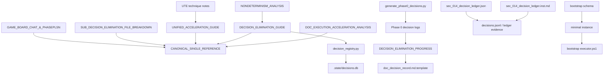

# Decision Governance Manifest

## Executive Summary

The uploaded corpus is clearly related, but it is not one clean single source of truth. It is a layered decision/governance stack with four strata: hard-authority decisions, required operational contracts, implementation artifacts, and evidence/reference material. The strongest active authorities in the set are the canonical decision-elimination consolidator, the gate-SSOT decision, the SCOPE/counter-key decision, and the SEC-014 decision-ledger contract. Most of the other files are either proposed design decisions, implementation support, or superseded/reference guidance. (Sources: `DOC-CANONICAL-SUB_DECISION_ELIMINATION-000__CANONICAL_SINGLE_REFERENCE (1).md`, `DECISION-GATE-SSOT-001.md`, `SCOPE_AND_COUNTER_KEY_DECISION.md`, `01260207233100000484_sec_014_decision_ledger.json`, `01260207201000000968_sec_014_decision_ledger.inst.md`)

The real problem is not missing documentation. It is competing documentation. Two conflicts matter most. First, the identity model splits between a structured `DOC-<SYSTEM>-<DOMAIN>-<KIND>-<SEQ>` document-ID regime and a newer numeric `file_id` / `P_ + 20-digit file_id` regime. Second, decision storage had split between an append-only JSONL ledger path, now resolved to `.state/evidence/decisions/decision_log.jsonl`, and a SQLite-backed `DecisionRegistry` at `.state/decisions.db`. On top of that, there are duplicate files, generator/output naming drift, and several ad hoc evidence formats that do not cleanly conform to the declared ledger spec. (Sources: `DOC-ID-DECISION-RECORD-001__DECISION_RECORD_STRUCTURED_DOC_ID.md`, `DECISION_RECORD_STRUCTURED_DOC_ID.MD`, `id_doc_decision_matrix.json`, `SCOPE_AND_COUNTER_KEY_DECISION.md`, `01260207233100000484_sec_014_decision_ledger.json`, `DOC-PATTERNS-DECISION-REGISTRY-001__decision_registry.py`, `generate_phase0_decisions.py`)

The set also divides into two substantive domains. One domain is identity and governance control: document IDs, gate authority, SCOPE/counter keys, and decision ledgers. The other is decision elimination: deterministic execution, templates, pattern-driven acceleration, and the headless CLI supervision design decisions. The canonical single-reference file successfully consolidates most of the decision-elimination side, but nothing equivalent fully reconciles the ID/storage splits yet. (Sources: `DOC-CANONICAL-SUB_DECISION_ELIMINATION-000__CANONICAL_SINGLE_REFERENCE (1).md`, `DECISION-GATE-SSOT-001.md`, `SCOPE_AND_COUNTER_KEY_DECISION.md`, `id_doc_decision_matrix.json`, `DECISION_ELIMINATION_GUIDE.md`, `NONDETERMINISM_ANALYSIS.md`, `UNIFIED_ACCELERATION_GUIDE.md`)

## Scope and Method

This manifest covers every decision/governance-related file that was uploaded in this conversation, including duplicates and case variants where they change perceived authority or create ambiguity. Primary weight is given to canonical references, binding decisions, required schemas/instructions, and executable code. Files whose bodies were not fully visible in the available excerpts are marked conservatively as low-confidence and should be verified directly in-repo before they are treated as enforceable artifacts. The main low-visibility artifacts are `decisions.jsonl`, `DOC-PAT-DECISION-ELIMINATION-BOOTSTRAP-DECISION-ELIMINATION-BOOTSTRAP-EXECUTOR-001__decision_elimination_bootstrap_executor.ps1`, `doc_decision_record.md.template`, and `DOC-PAT-EXAMPLE-DECISION-067__example_decision.yaml`.

## Authority and Conflict Map

Authority in this corpus is explicit when a file marks itself `CANONICAL`, `APPROVED`, `DECIDED`, `Binding: YES`, `required: true`, or an equivalent status. Everything else should be read as either operational support, evidence, or reference. The corpus already knows this in places: the canonical single-reference file explicitly supersedes earlier decision-elimination sources; the gate decision explicitly names one authoritative technical spec; the SCOPE/counter-key decision explicitly resolves competing values; and SEC-014 explicitly requires a decision ledger. (Sources: `DOC-CANONICAL-SUB_DECISION_ELIMINATION-000__CANONICAL_SINGLE_REFERENCE (1).md`, `DECISION-GATE-SSOT-001.md`, `SCOPE_AND_COUNTER_KEY_DECISION.md`, `01260207233100000484_sec_014_decision_ledger.json`)

### Conflicting ID Models

| Model | Primary source files | Encoded rule | Practical use | Current standing | Conflict |
|---|---|---|---|---|---|
| Structured document-ID model | `DOC-ID-DECISION-RECORD-001__DECISION_RECORD_STRUCTURED_DOC_ID.md`, `DECISION_RECORD_STRUCTURED_DOC_ID.MD` | `doc_id = DOC-<SYSTEM>-<DOMAIN>-<KIND>-<SEQ>`; ULID-based universal IDs rejected | Human/AI-readable document identity | High historical authority inside the older doc-ID regime; both files present it as the approved/constitutional choice | Conflicts with the newer numeric contract in `id_doc_decision_matrix.json` |
| Numeric/P_-prefixed runtime contract | `id_doc_decision_matrix.json` | `file_id = 20-digit numeric`, `doc_id = P_ + file_id`, `dir_id = 20-digit numeric in .dir_id JSON` | Routing, triage, current contract framing for tooling | Operationally current in the triage matrix, but the same file also cautions that it is a classification aid rather than the semantic contract | Conflicts with pure structured `DOC-*` identity as the sole model |
| SCOPE/counter-key allocator layer | `SCOPE_AND_COUNTER_KEY_DECISION.md` | `SCOPE = 260118`; `counter_key = {SCOPE}:{NS}:{TYPE}` | Sequence allocation, config alignment, registry migration | Critical authority for allocator semantics | Compatible with the numeric allocator world; no explicit bridge is defined to reconcile it with the “pure DOC-*” model |

The decision-storage layer is also split. SEC-014 now defines an append-only JSONL ledger at `.state/evidence/decisions/decision_log.jsonl` with required fields such as `decision_id`, `category`, `timestamp`, `context`, `options`, `selected_option`, `rationale`, `owner`, `impact`, `reversible`, and `validation`. By contrast, `decision_registry.py` implements a SQLite `DecisionRegistry` at `.state/decisions.db` with a different shape centered on a `Decision` dataclass and database schema. Meanwhile, several evidence files use still other structures. That means the corpus currently has at least three decision-record formats, not one. (Sources: `01260207233100000484_sec_014_decision_ledger.json`, `01260207201000000968_sec_014_decision_ledger.inst.md`, `DOC-PATTERNS-DECISION-REGISTRY-001__decision_registry.py`, `01260207201000000353_DECISIONS.json`, `01260207233100000445_decision_ledger.json`, `routing_decisions.json`)

### Conflicting Decision-Storage Models

| Storage model | Primary files | Encoded format | Strength | Main gap |
|---|---|---|---|---|
| Required JSONL ledger | `01260207233100000484_sec_014_decision_ledger.json`, `01260207201000000968_sec_014_decision_ledger.inst.md`, `decisions.jsonl` | Append-only JSONL at `.state/evidence/decisions/decision_log.jsonl` | Strongest declared recording contract | **Storage path conflict (resolved):** SEC-014 previously declared `.state/decisions.jsonl`, while `NEWPHASEPLANPROCESS_AUTONOMOUS_DELIVERY_TEMPLATE_V3_3.json` declares `.state/evidence/decisions/decision_log.jsonl` and the technical spec registers `decision_logging_policy` as the governing mechanism. SEC-014 and its aggregate files have been corrected to `.state/evidence/decisions/decision_log.jsonl`. |
| SQLite registry | `DOC-PATTERNS-DECISION-REGISTRY-001__decision_registry.py` | SQLite DB at `.state/decisions.db` | Strong implementation artifact | Storage and schema differ from SEC-014 |
| Ad hoc JSON / Markdown decision records | `01260207201000000353_DECISIONS.json`, `01260207233100000445_decision_ledger.json`, `routing_decisions.json`, phase-0 decision logs | Arrays, single JSON objects, or Markdown decision memos | Useful evidence | No normalized compliance story |

One conflict looks structural rather than editorial. The bootstrap schema shows a `doc_id` property constrained to `DOC-PAT-DECISION-ELIMINATION-BOOTSTRAP-SCHEMA-001`, while the provided minimal instance uses `DOC-PAT-DECISION-ELIMINATION-BOOTSTRAP-INSTANCE-MIN-001`. Unless the unseen remainder of the schema changes that rule, the example instance appears non-conformant as written. (Sources: `DOC-PAT-DECISION-ELIMINATION-BOOTSTRAP-SCHEMA-001__decision_elimination_bootstrap.schema.json`, `DOC-PAT-DECISION-ELIMINATION-BOOTSTRAP-INSTANCE-MIN-001__instance_minimal.json`)

There is also naming drift in the phase-0 generator chain. `generate_phase0_decisions.py` says it generates `DESIGN_APPROVAL_DECISION_INTERFACE.md` and `DESIGN_TOOL_RESUME_STRATEGY.md`, but the uploaded downstream files are named `DECISION_LOG_APPROVAL_DECISION_INTERFACE.md` and `DECISION_LOG_TOOL_RESUME_STRATEGY.md`. That is a small issue operationally, but it is exactly the kind of drift that later causes registry and automation mismatches. (Sources: `generate_phase0_decisions.py`, `01260207201000000738_DECISION_LOG_APPROVAL_DECISION_INTERFACE.md`, `01260207201000000741_DECISION_LOG_TOOL_RESUME_STRATEGY.md`)

The artifact flow implied by the corpus is coherent even though the authorities are not fully reconciled. The decision-elimination analyses and technique notes feed practical guides; those guides are then consolidated into the canonical single reference. In parallel, the phase-0 generator emits concrete decision logs, the progress report reports partial implementation, and the schema/template/code artifacts provide execution support. SEC-014 defines a separate formal ledger track for planning/execution records. (Sources: `UTE_Decision Elimination Through Pattern Recognition6.md`, `NONDETERMINISM_ANALYSIS.md`, `DECISION_ELIMINATION_GUIDE.md`, `UNIFIED_ACCELERATION_GUIDE.md`, `DOC_EXECUTION_ACCELERATION_ANALYSIS.md`, `DOC-CANONICAL-SUB_DECISION_ELIMINATION-000__CANONICAL_SINGLE_REFERENCE (1).md`, `generate_phase0_decisions.py`, `01260207201000000737_DECISION_ELIMINATION_PROGRESS.md`, `01260207233100000484_sec_014_decision_ledger.json`)

## Manifest of Canonical and Operational Files

### Canonical and Binding Governance

| File | Type | Short description | Detailed purpose and key elements | Deliverables / effects | Authority | Related files and conflicts |
|---|---|---|---|---|---|---|
| `DOC-CANONICAL-SUB_DECISION_ELIMINATION-000__CANONICAL_SINGLE_REFERENCE (1).md` | md | Canonical consolidator for the `SUB_DECISION_ELIMINATION` module. It replaces several earlier guides with one reference. | Front matter marks `status: CANONICAL` and lists a `supersedes` set; sections include decommission notice, source inventory, canonical navigation, a one-line definition of decision elimination, and consolidated source content. | Sets default read order and deprecation boundary for the decision-elimination subsystem. | canonical | Supersedes `DECISION_ELIMINATION_GUIDE.md`, `NONDETERMINISM_ANALYSIS.md`, `UNIFIED_ACCELERATION_GUIDE.md`, `DOC_EXECUTION_ACCELERATION_ANALYSIS.md`, `SUB_DECISION_ELIMINATION_FILE_BREAKDOWN.MD`, `GAME_BOARD_CHAT_&_PHASEPLSN.md`; risk is stale duplicate guidance if source docs remain active. |
| `DECISION-GATE-SSOT-001.md` | md | Binding decision record that resolves gate-definition conflicts. | Encodes the explicit decision that `NEWPHASEPLANPROCESS_TECHNICAL_SPECIFICATION_V3_3.json` is the authoritative source for gate definitions; explains conflicts around `GATE-003`, `GATE-004`, and mutation-path patterns. | Forces templates, MCP contracts, and scripts to align to the technical spec. | canonical | The technical spec `NEWPHASEPLANPROCESS_TECHNICAL_SPECIFICATION_V3_3.json` is present in the repo (`document_metadata.status: "AUTHORITATIVE"`). **Note:** DECISION-GATE-SSOT-001 itself names the stale filename `V3.json` (amended 2026-04-26 to correct to `V3_3.json`). |
| `SCOPE_AND_COUNTER_KEY_DECISION.md` | md | Critical system decision fixing SCOPE and counter-key semantics. | Declares `SCOPE=260118`, `counter_key={SCOPE}:{NS}:{TYPE}`, explains competing SCOPE values (`260118`, `260119`, `720066`, others), and says migration is complete. | Normalizes registries/configs and allocator semantics. | canonical | Depends on/mentions `SEQ_ALLOCATOR_SPEC.md`, registries, and config files outside this upload set; conflicts with prior SCOPE values and any docs still using them. |
| `01260207233100000484_sec_014_decision_ledger.json` | json | Required decision-ledger section spec. | Defines `section_id=sec_014_decision_ledger`; requires append-only JSONL storage at `.state/evidence/decisions/decision_log.jsonl`; lists the full decision object shape including `owner`, `impact`, `reversible`, and `validation`. | Enforces the formal contract for planning/execution decision capture. | operational | Directly linked to `01260207201000000968_sec_014_decision_ledger.inst.md`; conflicts with `decision_registry.py` and nonconforming evidence files. |
| `01260207201000000968_sec_014_decision_ledger.inst.md` | md | Human/agent instructions for SEC-014. | Provides example JSON and directions to log planning decisions; operationalizes the SEC-014 schema with required fields and example validation commands. | Tells planners/executors exactly how to populate the ledger. | operational | Companion to `01260207233100000484_sec_014_decision_ledger.json`; conflicts with evidence artifacts that use different field names or omit required fields. |
| `id_doc_decision_matrix.json` | json | Machine-readable triage matrix for ID/governance documents. | Encodes `current_contract_model` (`20-digit file_id`, `P_ + file_id` doc IDs, numeric `dir_id`) and per-file routing decisions such as `load_first`, `reference_only`, and `block_as_current_authority`; also says it is a classification aid, not the semantic contract. | Drives AI/tool routing, triage, and current-vs-legacy handling. | operational | References external files like `id_contract.yaml`, `ID_FILE_CLASSIFICATION.md`, and `ID_SCRIPT_INVENTORY.jsonl`; conflicts with both structured-ID decision-record files. |
| `DOC-ID-DECISION-RECORD-001__DECISION_RECORD_STRUCTURED_DOC_ID.md` | md | High-authority historical decision record for structured document IDs. | Front matter marks it `active`, `authority: constitutional`; decision section approves pure structured `doc_id` and rejects ULID-based universal IDs; analysis includes scoring and rationale. | Provides historical governing rationale for the structured-ID regime. | legacy/conflict | Supersedes earlier rollout plans, but conflicts with `id_doc_decision_matrix.json`'s numeric/P_-based current contract. |
| `DECISION_RECORD_STRUCTURED_DOC_ID.MD` | md | Apparent duplicate or alternate copy of the same structured-ID decision. | The available excerpt indicates the same decision posture as the prefixed file: structured `DOC-*` IDs approved; ULID rejected. | Preserves or duplicates the older document-ID decision. | legacy/conflict | Near-duplicate of `DOC-ID-DECISION-RECORD-001__DECISION_RECORD_STRUCTURED_DOC_ID.md`; same model conflict with `id_doc_decision_matrix.json`. |

### Operational Schemas, Generators, and Templates

| File | Type | Short description | Detailed purpose and key elements | Deliverables / effects | Authority | Related files and conflicts |
|---|---|---|---|---|---|---|
| `generate_phase0_decisions.py` | py | Batch generator for phase-0 decision documents. | Uses a `DECISIONS` specification list and `jinja2.Template` to generate decision docs for database strategy, supervisor deployment, approval interface, and tool resume strategy. | Produces the human-readable phase-0 decision logs. | operational | Related to the four `0126020720100000073x/741` decision logs; generator comments show naming drift versus actual uploaded output names. |
| `DOC-PATTERNS-DECISION-REGISTRY-001__decision_registry.py` | py | SQLite-backed implementation of decision capture/query. | Defines a `Decision` dataclass with `decision_id`, `timestamp`, `category`, `context`, `options`, `selected_option`, `rationale`, and `metadata`; `DecisionRegistry` defaults to `.state/decisions.db` and initializes a SQL table. | Adds an executable registry for system decisions and filtering/querying. | operational | Strong implementation artifact, but it conflicts with the SEC-014 JSONL storage contract and omits some SEC-014 fields unless they are packed into `metadata`. |
| `DOC-PAT-DECISION-ELIMINATION-BOOTSTRAP-SCHEMA-001__decision_elimination_bootstrap.schema.json` | json schema | Schema for the decision-elimination bootstrap pattern. | Declares a JSON Schema with `metadata`, `doc_id`, `outputs`, `inputs.instance_path`, and `pattern_id`; requires `doc_id`, `pattern_id`, and `inputs`. | Validates bootstrap instances and anchors pattern structure. | operational | Related to the minimal instance and executor script; appears to conflict with the provided minimal instance because the visible `doc_id` constraint points to the schema file's own ID. |
| `DOC-PAT-DECISION-ELIMINATION-BOOTSTRAP-INSTANCE-MIN-001__instance_minimal.json` | json | Minimal example bootstrap instance. | Contains `metadata`, `doc_id`, `inputs.instance_path`, and `pattern_id=PAT-DECISION-ELIMINATION-BOOTSTRAP-001`. | Demonstrates the minimum instance shape expected for bootstrap execution. | evidence | Related to the bootstrap schema and executor; likely fails the visible schema `doc_id` rule unless that rule is changed elsewhere. |
| `DOC-PAT-DECISION-ELIMINATION-BOOTSTRAP-DECISION-ELIMINATION-BOOTSTRAP-EXECUTOR-001__decision_elimination_bootstrap_executor.ps1` | ps1 | Likely executor for the bootstrap pattern, but the body was not directly visible in the excerpts. | Inferred from filename and neighboring artifacts: likely reads an instance, validates it, and runs bootstrap automation. | Executes or orchestrates the bootstrap pattern. | operational | Related to the bootstrap schema and minimal instance; verify directly before relying on it. |
| `doc_decision_record.md.template` | md template | Template for drafting decision records; body not directly visible, but referenced by the progress report. | The progress report says a `decision_record.md.template` was created “with ROI tracking,” which strongly suggests this file standardizes headings, reasoning, and impact/ROI capture. | Produces repeatable decision-record documents. | operational | Related to `01260207201000000737_DECISION_ELIMINATION_PROGRESS.md`; should be aligned with SEC-014 and any example decision YAML. |
| `DOC-PAT-EXAMPLE-DECISION-067__example_decision.yaml` | yaml | Likely example serialized decision artifact; body not directly visible in the excerpts. | Inferred from filename: probably a worked example showing how a single decision should be encoded. | Supports testing, onboarding, or template validation. | evidence | Related to the decision-record template and bootstrap/schema artifacts; schema compatibility should be checked explicitly. |

## Manifest of Decision Logs and Supporting Files

### Decision Logs and Evidence Artifacts

| File | Type | Short description | Detailed purpose and key elements | Deliverables / effects | Authority | Related files and conflicts |
|---|---|---|---|---|---|---|
| `decisions.jsonl` | jsonl | Append-only decision-log artifact; full body was not directly visible in the excerpts. | Based on filename and the SEC-014 contract, it is likely the raw planning/execution ledger sink. | Preserves machine-auditable decision history. | evidence | Related to SEC-014 schema/instructions; conflicts with `decision_registry.py` if both are treated as the operational SSOT. |
| `01260207201000000353_DECISIONS.json` | json | Concrete set of discrete governance decisions in JSON form. | Visible entries cover schema-v4 introduction, naming normalization scope, and handling of `doc_id` in legacy docs; fields include `decision_id`, `question`, `options`, `decision`, `rationale`, `impacts`, and `timestamp_utc`. | Captures specific repo/governance choices as evidence. | evidence | Useful precedent, but it does not match the exact SEC-014 field names and is therefore ad hoc relative to the formal ledger contract. |
| `01260207233100000445_decision_ledger.json` | json | Single decision record classifying project complexity. | Fields include `timestamp`, `context`, `options`, `selected_option`, `category`, `decision_id`, `rationale`, and `file_id`; selected value is `complex`. | Provides evidence of a specific classification decision. | evidence | Similar to ledger data, but still not fully SEC-014-complete because several required governance fields are not visible. |
| `routing_decisions.json` | json | Small worked example of tool-routing decisions. | Encodes `run_id` and a `decisions` array where each task is mapped to a chosen tool and rationale. | Demonstrates routing-decision capture. | evidence | Useful example, but structurally farther from SEC-014 than the formal ledger schema. |
| `01260207201000000738_DECISION_LOG_APPROVAL_DECISION_INTERFACE.md` | md | Proposed design decision for approval/rejection UX in headless tool workflows. | Compares TUI, CLI commands, and HTTP API; the visible recommendations make TUI and CLI must-haves for MVP contexts while HTTP API is deferred. | Defines the intended approval interface direction for the headless CLI supervision feature. | evidence | Related to the generator script and the duplicate `01260207201000000611...` file; still `status: proposed`, so not binding. |
| `01260207201000000611_DECISION_LOG_APPROVAL_DECISION_INTERFACE.md` | md | Near-duplicate of the same approval-interface decision. | Shares the same `decision_id` and topic as the `00738` file; likely a registry-tracked or alternate-copy variant. | Duplicates or preserves the approval-interface design decision. | evidence | Conflicts by duplication with `01260207201000000738_DECISION_LOG_APPROVAL_DECISION_INTERFACE.md`; one of them should be designated primary. |
| `01260207201000000739_DECISION_LOG_DATABASE_STRATEGY.md` | md | Proposed database-unification decision for headless CLI supervision. | Describes two existing databases, the need for `tool_runs` and `approvals`, and compares `unified_db`, `dual_db_with_sync`, and `supervisor_writes_both`, with `unified_db` recommended. | Sets intended database direction for the supervision feature. | evidence | Strong design input, but still only proposed; should be reconciled with actual storage decisions elsewhere. |
| `01260207201000000740_DECISION_LOG_SUPERVISOR_DEPLOYMENT.md` | md | Proposed deployment-mode decision for the CLI supervisor. | Compares `embedded_in_orchestrator`, `separate_daemon`, and on-demand patterns; the visible recommendation marks embedded mode as MVP-appropriate. | Defines intended runtime-topology direction for the supervisor. | evidence | Related to database strategy and resume strategy; nonbinding until promoted out of `proposed`. |
| `01260207201000000741_DECISION_LOG_TOOL_RESUME_STRATEGY.md` | md | Proposed post-approval resume strategy for paused tools. | Compares `polling_worker`, event-driven, and keep-tool-running approaches; `polling_worker` is recommended for MVP in the visible excerpt. | Defines intended post-approval execution behavior. | evidence | Related to approval-interface and supervisor-deployment decisions; nonbinding until adopted. |
| `01260207201000000737_DECISION_ELIMINATION_PROGRESS.md` | md | Progress report showing actual implementation against the decision-elimination agenda. | Reports deterministic-execution work complete and decision infrastructure partial; visible items include scheduler sorting, deterministic router changes, `FileBackedStateStore`, `deterministic_mode`, and creation of four templates including `decision_record.md.template`. | Converts guide-level intent into observed implementation evidence. | evidence | Important bridge between guides and code; should be cross-checked against `decision_registry.py`, templates, and current codebase state. |

### Supporting Guides, Analyses, and Reference Files

| File | Type | Short description | Detailed purpose and key elements | Deliverables / effects | Authority | Related files and conflicts |
|---|---|---|---|---|---|---|
| `DECISION_ELIMINATION_GUIDE.MD` | md | Guide for deterministic execution, decision tracking, and pattern templates. | Covers deterministic mode, sequential IDs, fixed timestamps, sorted task selection, deterministic routing, testing, troubleshooting, and best practices. | Provides operational know-how for reproducibility and decision elimination. | legacy | Apparent case-variant duplicate of `DECISION_ELIMINATION_GUIDE.md`; superseded at module level by the canonical single reference. |
| `DECISION_ELIMINATION_GUIDE.md` | md | Same guide content in another filename variant. | Same subject matter: deterministic execution, decision tracking, templates, testing, and best practices. | Same as above. | legacy | Case-variant duplicate of `DECISION_ELIMINATION_GUIDE.MD`; superseded by `DOC-CANONICAL-SUB_DECISION_ELIMINATION-000__CANONICAL_SINGLE_REFERENCE (1).md`. |
| `NONDETERMINISM_ANALYSIS.md` | md | Concrete hotspot inventory of nondeterministic behaviors. | Visible findings include scheduler dict-order issues, router round-robin state, UUID/ULID generation, timestamp-based decisions, and unordered parallel execution. | Supplies the problem list that deterministic-mode work is meant to fix. | legacy | Consolidated into the canonical single reference; pairs naturally with `DECISION_ELIMINATION_GUIDE.md` and the progress report. |
| `UNIFIED_ACCELERATION_GUIDE.md` | md | Decision-elimination and speed-optimization playbook. | Provides a quick-reference matrix and a three-phase framework: pattern recognition, template refinement, and batch production. | Provides tactics for scaling similar work quickly and consistently. | legacy | Consolidated into the canonical single reference; conceptually downstream of the UTE technique notes. |
| `DOC_EXECUTION_ACCELERATION_ANALYSIS.md` | md | Quantified case study for execution acceleration. | Contrasts a 240–320 hour traditional estimate with 25 hours actual and attributes the gain to templates, anti-pattern guards, and decision elimination. | Supplies ROI and justification evidence for the acceleration approach. | evidence | Consolidated into the canonical single reference; best treated as supporting analysis, not policy. |
| `GAME_BOARD_CHAT_&_PHASEPLSN.md` | md | Transcript-like planning/context artifact. | Shows an explanation of five core specification files and their roles in a game-board / phase-plan framing. | Preserves planning rationale and interpretation context. | evidence | Consolidated into the canonical single reference; should not be treated as standalone SSOT. |
| `SUB_DECISION_ELIMINATION_FILE_BREAKDOWN.MD` | md | Inventory page for the decision-elimination module. | Lists module root documents such as the guide, acceleration analysis, game-board chat, nondeterminism analysis, README, and unified acceleration guide. | Helps discover the file set and module boundaries. | legacy | Explicitly superseded by the canonical single reference. |
| `UTE_Decision Elimination Through Pattern Recognition6.md` | md | First-principles technique note on batching and pattern extraction. | Describes what actually worked: hybrid sequential-plus-parallel creation, template convergence, and measured time savings. | Supplies origin-story evidence for the acceleration approach. | evidence | Conceptually upstream of `UNIFIED_ACCELERATION_GUIDE.md` and `DOC_EXECUTION_ACCELERATION_ANALYSIS.md`; advisory, not binding. |
| `CONSOLIDATION_DECISION_FRAMEWORK.MD` | md | Framework for choosing a codebase-consolidation approach. | Compares documentation-first, original protocol, improved protocol, and hybrid approaches using speed/accuracy/risk/manual-effort criteria. | Helps decide how to approach consolidation work. | evidence | Appears duplicated by `CONSOLIDATION_DECISION_FRAMEWORK.md`; adjacent to the decision corpus but not core to the governance SSOT. |
| `CONSOLIDATION_DECISION_FRAMEWORK.md` | md | Case-variant duplicate of the consolidation framework. | Same quick-decision-tree and four-approach comparison as the `.MD` variant. | Same as above. | evidence | Duplicate of `CONSOLIDATION_DECISION_FRAMEWORK.MD`; one should be archived or marked canonical. |

## Authority Ranking and Recommended Actions

### Authority-Ranked Table of All Files

| Rank tier | Files | Why they sit here |
|---|---|---|
| Highest current authority | `DOC-CANONICAL-SUB_DECISION_ELIMINATION-000__CANONICAL_SINGLE_REFERENCE (1).md`; `DECISION-GATE-SSOT-001.md`; `SCOPE_AND_COUNTER_KEY_DECISION.md` | These are the clearest hard-authority artifacts because they explicitly mark themselves canonical, approved/binding, or decided/critical. |
| Required operational contract | `01260207233100000484_sec_014_decision_ledger.json`; `01260207201000000968_sec_014_decision_ledger.inst.md`; `id_doc_decision_matrix.json` | These files define or route current operating rules, but they are not all equal: SEC-014 is a direct required contract, while the ID matrix is operational triage and explicitly not the semantic contract itself. |
| Operational implementation artifacts | `generate_phase0_decisions.py`; `DOC-PATTERNS-DECISION-REGISTRY-001__decision_registry.py`; `DOC-PAT-DECISION-ELIMINATION-BOOTSTRAP-SCHEMA-001__decision_elimination_bootstrap.schema.json`; `DOC-PAT-DECISION-ELIMINATION-BOOTSTRAP-DECISION-ELIMINATION-BOOTSTRAP-EXECUTOR-001__decision_elimination_bootstrap_executor.ps1`; `doc_decision_record.md.template`; `DOC-PAT-DECISION-ELIMINATION-BOOTSTRAP-INSTANCE-MIN-001__instance_minimal.json`; `DOC-PAT-EXAMPLE-DECISION-067__example_decision.yaml` | These are code, template, schema, or execution-support artifacts that operationalize the system, but they are only safe after their conflicts with the declared contracts are resolved. |
| Evidence and proposed decisions | `decisions.jsonl`; `01260207201000000353_DECISIONS.json`; `01260207233100000445_decision_ledger.json`; `routing_decisions.json`; `01260207201000000738_DECISION_LOG_APPROVAL_DECISION_INTERFACE.md`; `01260207201000000611_DECISION_LOG_APPROVAL_DECISION_INTERFACE.md`; `01260207201000000739_DECISION_LOG_DATABASE_STRATEGY.md`; `01260207201000000740_DECISION_LOG_SUPERVISOR_DEPLOYMENT.md`; `01260207201000000741_DECISION_LOG_TOOL_RESUME_STRATEGY.md`; `01260207201000000737_DECISION_ELIMINATION_PROGRESS.md` | These files are valuable because they show observed or proposed decisions, but most are not binding. Several are `proposed`, some are examples, and many use ad hoc schemas. |
| Reference and superseded guidance | `DECISION_ELIMINATION_GUIDE.MD`; `DECISION_ELIMINATION_GUIDE.md`; `NONDETERMINISM_ANALYSIS.md`; `UNIFIED_ACCELERATION_GUIDE.md`; `DOC_EXECUTION_ACCELERATION_ANALYSIS.md`; `GAME_BOARD_CHAT_&_PHASEPLSN.md`; `SUB_DECISION_ELIMINATION_FILE_BREAKDOWN.MD`; `UTE_Decision Elimination Through Pattern Recognition6.md`; `CONSOLIDATION_DECISION_FRAMEWORK.MD`; `CONSOLIDATION_DECISION_FRAMEWORK.md` | These are useful for understanding intent, rationale, and operating tactics, but they are either superseded, advisory, duplicate, or not direct governing contracts. |
| Legacy/conflict authority | `DOC-ID-DECISION-RECORD-001__DECISION_RECORD_STRUCTURED_DOC_ID.md`; `DECISION_RECORD_STRUCTURED_DOC_ID.MD` | These files still matter because they claim strong historical authority, but they directly conflict with the currently routed numeric/P_-based ID contract. They cannot safely be treated as active SSOT without a reconciliation decision. |

### Recommended Next Steps

| Priority | Action | Why now | Effort | Owner |
|---|---|---|---|---|
| Highest | Publish one explicit repository-wide ID authority memo that reconciles `DOC-*` structured IDs, `P_ + 20-digit` IDs, and the SCOPE/counter-key allocator, including a mapping table and deprecation plan. | This is the largest unresolved governance split in the corpus. Right now there is no safe assumption about whether structured IDs are primary, historical, or alias-only. | High | architect |
| High | Decide and document one decision-storage SSOT: JSONL ledger, SQLite registry, or a deliberately dual model with an adapter and field-mapping spec. | The corpus currently defines three decision-record shapes. That will break audits, tooling, and validation if it stays ambiguous. | High | architect |
| High | Validate and fix the bootstrap chain: schema, minimal instance, executor, example YAML, and template. Start with the visible `doc_id` mismatch between the schema and the minimal instance. | This looks like an implementation-level incompatibility, not just naming noise. | Medium | engineer |
| High | Normalize all evidence artifacts against SEC-014 or explicitly label them as examples/nonconforming evidence. | `DECISIONS.json`, `decision_ledger.json`, `routing_decisions.json`, and the phase-0 Markdown logs all diverge from the required ledger contract in different ways. | Medium | engineer |
| Medium | Resolve duplicate files and case variants, and mark one canonical filename for each logical artifact. | `DECISION_ELIMINATION_GUIDE.*`, `CONSOLIDATION_DECISION_FRAMEWORK.*`, the two structured-ID decision records, and the two approval-interface decision logs all create unnecessary ambiguity. | Low | PM |
| Medium | Fix generator/output naming drift in `generate_phase0_decisions.py` and update the generated phase-0 logs from `proposed` to a final disposition (`approved`, `rejected`, or `archived`) once implementation decisions are actually made. | The current generator comments and file names already diverge, and the design logs are still not promotted into real policy. | Medium | engineer |
| Medium | Import or register external dependencies that current authority files point to but that were not uploaded here, especially `SEQ_ALLOCATOR_SPEC.md` and the current ID semantic contract. (`NEWPHASEPLANPROCESS_TECHNICAL_SPECIFICATION_V3_3.json` is present in the repo and confirmed AUTHORITATIVE — no import needed.) | Several “authoritative” decisions currently rely on files outside this decision bundle. That weakens auditability. | Medium | architect |
| Lower | Archive advisory/reference docs as reference-only after the canonical and operational decisions are reconciled. | Once the real SSOTs are settled, the supporting guides should remain discoverable but no longer compete for authority. | Low | PM |

The short version is blunt: keep the canonical single reference for decision elimination, keep the gate and SCOPE decisions as hard authority, keep SEC-014 as the decision-ledger contract, and treat almost everything else as either implementation support or evidence until the ID-model and storage-model conflicts are deliberately resolved. Right now, the corpus is rich enough to act, but not clean enough to enforce without first choosing which competing truths are actually current. (Sources: `DOC-CANONICAL-SUB_DECISION_ELIMINATION-000__CANONICAL_SINGLE_REFERENCE (1).md`, `DECISION-GATE-SSOT-001.md`, `SCOPE_AND_COUNTER_KEY_DECISION.md`, `01260207233100000484_sec_014_decision_ledger.json`, `id_doc_decision_matrix.json`, `DOC-ID-DECISION-RECORD-001__DECISION_RECORD_STRUCTURED_DOC_ID.md`, `DOC-PATTERNS-DECISION-REGISTRY-001__decision_registry.py`)
