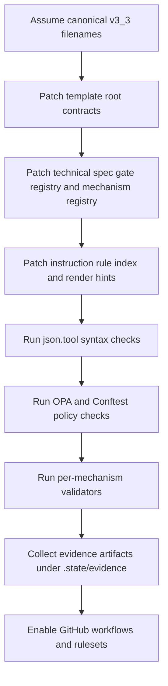

# Deterministic insertion plan for NPP v3.3

## Executive summary

Assumption: the canonical target files are `NEWPHASEPLANPROCESS_AUTONOMOUS_DELIVERY_TEMPLATE_V3_3.json`, `NEWPHASEPLANPROCESS_TECHNICAL_SPECIFICATION_V3_3.json`, and `NEWPHASEPLANPROCESS_INSTRUCTION_DOCUMENT_V3_3.json`, because the live JSON files themselves were not attached. Under that constraint, the least brittle insertion strategy is:

- make the **template** the owner of runtime defaults and evidence-bearing execution contracts;
- make the **technical specification** the owner of validator/gate registration and cross-document mechanism indexing;
- make the **instruction document** the owner of human/agent-readable rule text and render hints.

That split is not arbitrary. It follows the same division of responsibility recommended by the strongest primary sources behind your framework goals: constitution-first governance from the entity["company","GitHub","software company"] Spec Kit workflow, hermetic execution from Bazel, durable checkpoint/resume behavior from entity["company","Temporal","workflow platform"], policy-as-code from entity["organization","Open Policy Agent","policy engine project"] and Conftest, and merge enforcement through GitHub reusable workflows and rulesets. citeturn10search1turn10search3turn2search0turn3search0turn11search3turn11search1turn1search1turn9search8

Because the three live JSON documents were not available, I deliberately avoided brittle array-index edits except where one stable parent path is already known from your uploaded modification notes: `/architecture/system_layers/layer_2_validation/components/1/gate_registry/-` in the technical spec. Everywhere else, I used additive, deterministic insertions at root-level keys that are semantically appropriate for each document. Where the live file shape is still unknown, I call that out explicitly as **unspecified**. I also generated and JSON-validated three downloadable RFC-6902 patch files in this session.

## Evidence base and assumptions

The strongest **verified external patterns** are straightforward. Bazel defines hermeticity as producing the same output from the same source/configuration while isolating the build from host-machine drift, and it highlights isolation plus source identity as the two core requirements. That directly supports adding a `hermetic_step_contract`, `path_resolution_policy`, and `command_object_schema` to the execution-facing document. citeturn2search0

Temporal’s official documentation and site both emphasize durable execution as persisting workflow state so work resumes exactly where it left off after failures, with recovery, replay, and long-running workflow semantics built in. That directly supports a `durable_execution_contract`, checkpoint policy, and decision/evidence state paths in the template, with validator registration in the technical spec. citeturn3search0turn8search0

OPA’s official docs say policy decision-making should be decoupled from enforcement and evaluated against structured input such as JSON, while Conftest is explicitly designed to test structured configuration data, including JSON, and emit CI-friendly output formats such as JSON, GitHub, and JUnit. That is why `policy_as_code` belongs in the hard-validation layer, not only in prose guidance. citeturn11search3turn11search4turn11search1turn11search0turn11search2

Spec Kit’s official documentation puts a project constitution and governing principles before later spec/plan/task stages, and GitHub’s official workflow docs require reusable workflows to be declared with `workflow_call` in `.github/workflows`, while rulesets can require workflows and status checks before merging. That strongly supports a split between `governance_precedence` in the template, human-readable reinforcement in the instruction document, and `github_enforcement_mapping` in the technical specification. citeturn10search1turn10search3turn1search1turn9search1turn9search8

The main **non-web assumption** is structural: your uploaded modification plan indicates that the NPP template already tolerates new top-level governance sections, the technical spec has a stable gate-registry append path, and the instruction document is likely markdown-backed and currently manipulated by heading-targeted operations. Because the actual files were not attached, I treated `validation_gates`, `execution_patterns`, `template.metadata`, and raw markdown body text as **schema-unverified** insertion surfaces, and I did not rely on them for the downloadable patches.

## Insertion points by document

### Template file

The best primary insertion point for the template is **root-level contract ownership**. The template is where deterministic defaults should live, because it governs execution-time behavior: conflict resolution, executor choice, hermetic IO boundaries, fallback rules, provenance, archival, and affected-only execution. Those are not “reference notes”; they are defaults the executor must obey. That is exactly the same logic behind constitution-first spec systems, hermetic build systems, and durable workflow runtimes. citeturn10search1turn10search3turn2search0turn3search0

I therefore inserted these mechanisms directly at root-level JSON Pointer paths such as `/situational_determinism_contract`, `/governance_precedence`, `/executor_routing_policy`, `/hermetic_step_contract`, and the rest of the requested mechanisms. This avoids fabricating unknown parent objects and avoids replacing a possibly pre-existing `/x_npp_extensions` object wholesale.

The only surface I intentionally **did not** patch in the template is `/validation_gates/-`. The reason is simple: the live gate object schema was not attached. I know that a gate list exists, but I do not know which fields are mandatory in that specific file. Rather than guessing a malformed gate shape, I placed each mechanism’s `validator_ref` and `evidence_path` directly in the root-level contract objects and registered execution gates in the technical specification, where one stable append path is already known.

### Technical specification file

The technical specification has one high-confidence stable insertion point: `/architecture/system_layers/layer_2_validation/components/1/gate_registry/-`. That makes it the right place to register validators and enforcement gates, because OPA/Conftest-style policy evaluation and GitHub merge rules both belong in the validation architecture, not in a descriptive template. citeturn11search3turn11search1turn9search1turn9search8

I used that exact array-end pointer to append one gate per mechanism. I then added `/mechanism_registry` and `/validator_inventory` at the root of the technical spec. The effect is:

- the template owns behavioral defaults;
- the technical spec owns cross-document authoritative pointers, gate IDs, validator scripts, and evidence paths.

This is the cleanest place for `policy_as_code`, `github_enforcement_mapping`, and `tool_context_generation` to become enforceable rather than merely advisory.

### Instruction document file

The instruction document is the most brittle target because it appears to be a JSON wrapper around markdown-like content. Direct in-string content mutation is the wrong choice when the live string body was not attached. So I did **not** pretend to know byte offsets or exact prose fragments.

Instead, I inserted three structured root-level objects:

- `/instruction_rule_index`
- `/render_hints`
- `/cross_document_pointers`

That keeps the instruction document faithful to its role: it remains the human/agent-readable explanation layer, but it gains machine-readable rule anchoring, heading preferences, and cross-links back to the template and technical spec.

The one remaining **unspecified** insertion point is any direct markdown-body pointer such as `/content` or a heading-specific patch target. If your live instruction doc has a closed top-level schema that forbids these new root keys, then the unchanged payloads from this patch should be re-based under `/x_npp_extensions/` instead. That is the only part I would call unresolved without the actual file in hand.

## Mechanism crosswalk

The table below maps every requested mechanism to the exact insertion paths used in the patch family, the reason for that placement, and the evidence artifact it should emit. The path convention is intentionally consistent across all three documents: template root key, technical-spec registry key, and instruction-rule key.

| Mechanism | Exact JSON Pointer path(s) | Rationale | Evidence file path |
|---|---|---|---|
| `situational_determinism_contract` | `/situational_determinism_contract`; `/mechanism_registry/situational_determinism_contract`; `/instruction_rule_index/situational_determinism_contract` | Single situational path, fail-closed branching, and deterministic resolution order. | `.state/evidence/determinism/situational_determinism_contract.json` |
| `governance_precedence` | `/governance_precedence`; `/mechanism_registry/governance_precedence`; `/instruction_rule_index/governance_precedence` | Removes rule conflicts by declaring precedence from invariants through step contracts. | `.state/evidence/governance/governance_precedence.json` |
| `executor_routing_policy` | `/executor_routing_policy`; `/mechanism_registry/executor_routing_policy`; `/instruction_rule_index/executor_routing_policy` | Turns model/tool selection into a deterministic, auditable routing contract. | `.state/evidence/routing/executor_routing_policy.json` |
| `hermetic_step_contract` | `/hermetic_step_contract`; `/mechanism_registry/hermetic_step_contract`; `/instruction_rule_index/hermetic_step_contract` | Makes execution reproducible by declaring inputs, outputs, environment, and hashes. | `.state/evidence/hermeticity/hermetic_step_contract.json` |
| `policy_as_code` | `/policy_as_code`; `/mechanism_registry/policy_as_code`; `/instruction_rule_index/policy_as_code` | Moves acceptance rules into machine-evaluable policies over JSON inputs. | `.state/evidence/policy_as_code/validation.json` |
| `decision_logging_policy` | `/decision_logging_policy`; `/mechanism_registry/decision_logging_policy`; `/instruction_rule_index/decision_logging_policy` | Logs every consequential branch for audit, replay, and debugging. | `.state/evidence/decisions/decision_logging_policy.json` |
| `durable_execution_contract` | `/durable_execution_contract`; `/mechanism_registry/durable_execution_contract`; `/instruction_rule_index/durable_execution_contract` | Makes runs resumable and replayable from verified checkpoints. | `.state/evidence/durable_execution/contract.json` |
| `array_mutation_policy` | `/array_mutation_policy`; `/mechanism_registry/array_mutation_policy`; `/instruction_rule_index/array_mutation_policy` | Bans brittle array-index edits and requires identity-key mutation rules. | `.state/evidence/array_mutation/policy.json` |
| `path_resolution_policy` | `/path_resolution_policy`; `/mechanism_registry/path_resolution_policy`; `/instruction_rule_index/path_resolution_policy` | Forces governed paths through a resolver and blocks undeclared literals. | `.state/evidence/path_resolution/policy.json` |
| `canonical_document_resolution` | `/canonical_document_resolution`; `/mechanism_registry/canonical_document_resolution`; `/instruction_rule_index/canonical_document_resolution` | Defines which `v3_3` file names are authoritative and how legacy aliases behave. | `.state/evidence/document_resolution/validation.json` |
| `command_object_schema` | `/command_object_schema`; `/mechanism_registry/command_object_schema`; `/instruction_rule_index/command_object_schema` | Standardizes executable commands with shell, cwd, timeout, failure mode, and evidence. | `.state/evidence/commands/command_object_schema.json` |
| `pattern_resolution_policy` | `/pattern_resolution_policy`; `/mechanism_registry/pattern_resolution_policy`; `/instruction_rule_index/pattern_resolution_policy` | Prevents improvised execution when no approved pattern exists. | `.state/evidence/pattern_resolution/policy.json` |
| `fallback_policy` | `/fallback_policy`; `/mechanism_registry/fallback_policy`; `/instruction_rule_index/fallback_policy` | Restricts fallback behavior to predeclared, authorized outcomes. | `.state/evidence/fallback/policy.json` |
| `permission_tiers` | `/permission_tiers`; `/mechanism_registry/permission_tiers`; `/instruction_rule_index/permission_tiers` | Separates read-only, safe-edit, trusted, and destructive capabilities. | `.state/evidence/permissions/tiers.json` |
| `provenance_contract` | `/provenance_contract`; `/mechanism_registry/provenance_contract`; `/instruction_rule_index/provenance_contract` | Requires traceable output hashes and producer metadata. | `.state/evidence/provenance/contract.json` |
| `change_archival_policy` | `/change_archival_policy`; `/mechanism_registry/change_archival_policy`; `/instruction_rule_index/change_archival_policy` | Preserves plan, evidence, and decisions for rollback and audit. | `.state/evidence/archive/change_archival_policy.json` |
| `github_enforcement_mapping` | `/github_enforcement_mapping`; `/mechanism_registry/github_enforcement_mapping`; `/instruction_rule_index/github_enforcement_mapping` | Binds NPP validation to required workflows, checks, and merge protection. | `.state/evidence/github/github_enforcement_mapping.json` |
| `tool_context_generation` | `/tool_context_generation`; `/mechanism_registry/tool_context_generation`; `/instruction_rule_index/tool_context_generation` | Generates `AGENTS.md`, `CLAUDE.md`, and tool configs from the NPP source of truth. | `.state/evidence/tool_context/tool_context_generation.json` |
| `affected_execution_policy` | `/affected_execution_policy`; `/mechanism_registry/affected_execution_policy`; `/instruction_rule_index/affected_execution_policy` | Runs only affected gates when the dependency graph is trustworthy. | `.state/evidence/affected_execution/policy.json` |

This cross-document arrangement is consistent with Bazel-style hermetic IO, Temporal-style checkpoint/resume, OPA-style policy evaluation on JSON, and GitHub’s workflow/ruleset enforcement model. citeturn2search0turn3search0turn11search3turn11search1turn1search1turn9search8

## Patch files

I generated three downloadable RFC-6902 JSON patch files:

- [Template patch JSON](sandbox:/mnt/data/NEWPHASEPLANPROCESS_AUTONOMOUS_DELIVERY_TEMPLATE_V3_3.patch.json)
- [Technical specification patch JSON](sandbox:/mnt/data/NEWPHASEPLANPROCESS_TECHNICAL_SPECIFICATION_V3_3.patch.json)
- [Instruction document patch JSON](sandbox:/mnt/data/NEWPHASEPLANPROCESS_INSTRUCTION_DOCUMENT_V3_3.patch.json)

The patches are **additive-only** on purpose. I did not fabricate `test` values for unknown live parents, because a bad guard is worse than no guard. The technical spec patch uses the one stable array-end pointer already indicated by your uploaded notes:

- `/architecture/system_layers/layer_2_validation/components/1/gate_registry/-`

That is the only array insertion in the downloadable patch family, and it obeys your rule against positional array-index edits by using `/-` append semantics.

The insertion workflow is:



## Validation commands

The commands below reflect the documented behavior of OPA, Conftest, GitHub reusable workflows, and rulesets: JSON is a valid structured input for policy evaluation, Conftest is designed for CI use and JSON outputs, reusable workflows use `workflow_call`, and rulesets can require workflows/status checks before merge. citeturn11search3turn11search4turn11search1turn11search0turn1search1turn9search1turn9search8

```bash
# Validate the generated PATCH FILES parse as JSON
python -m json.tool /mnt/data/NEWPHASEPLANPROCESS_AUTONOMOUS_DELIVERY_TEMPLATE_V3_3.patch.json > /dev/null
python -m json.tool /mnt/data/NEWPHASEPLANPROCESS_TECHNICAL_SPECIFICATION_V3_3.patch.json > /dev/null
python -m json.tool /mnt/data/NEWPHASEPLANPROCESS_INSTRUCTION_DOCUMENT_V3_3.patch.json > /dev/null

# Validate the TARGET NPP FILES parse as JSON after patch application
python -m json.tool NEWPHASEPLANPROCESS_AUTONOMOUS_DELIVERY_TEMPLATE_V3_3.json > /dev/null
python -m json.tool NEWPHASEPLANPROCESS_TECHNICAL_SPECIFICATION_V3_3.json > /dev/null
python -m json.tool NEWPHASEPLANPROCESS_INSTRUCTION_DOCUMENT_V3_3.json > /dev/null

# OPA policy-as-code checks against each target file
opa eval \
  --data policies/npp \
  --input NEWPHASEPLANPROCESS_AUTONOMOUS_DELIVERY_TEMPLATE_V3_3.json \
  'data.npp.deny'

opa eval \
  --data policies/npp \
  --input NEWPHASEPLANPROCESS_TECHNICAL_SPECIFICATION_V3_3.json \
  'data.npp.deny'

opa eval \
  --data policies/npp \
  --input NEWPHASEPLANPROCESS_INSTRUCTION_DOCUMENT_V3_3.json \
  'data.npp.deny'

# Conftest checks with CI-friendly JSON output
conftest test --policy policies/npp --output json \
  NEWPHASEPLANPROCESS_AUTONOMOUS_DELIVERY_TEMPLATE_V3_3.json

conftest test --policy policies/npp --output json \
  NEWPHASEPLANPROCESS_TECHNICAL_SPECIFICATION_V3_3.json

conftest test --policy policies/npp --output json \
  NEWPHASEPLANPROCESS_INSTRUCTION_DOCUMENT_V3_3.json

# Verify the policy unit tests themselves
conftest verify --policy policies/npp

# Example per-mechanism validators
python 01260207201000001225_scripts/P_01999000042260130021_validate_situational_determinism_contract.py \
  --plan-file NEWPHASEPLANPROCESS_AUTONOMOUS_DELIVERY_TEMPLATE_V3_3.json

python 01260207201000001225_scripts/P_01999000042260130022_validate_governance_precedence.py \
  --plan-file NEWPHASEPLANPROCESS_AUTONOMOUS_DELIVERY_TEMPLATE_V3_3.json

python 01260207201000001225_scripts/P_01999000042260130023_validate_executor_routing_policy.py \
  --plan-file NEWPHASEPLANPROCESS_AUTONOMOUS_DELIVERY_TEMPLATE_V3_3.json

python 01260207201000001225_scripts/P_01999000042260130024_validate_hermetic_step_contract.py \
  --plan-file NEWPHASEPLANPROCESS_AUTONOMOUS_DELIVERY_TEMPLATE_V3_3.json

python 01260207201000001225_scripts/P_01999000042260130025_validate_policy_as_code.py \
  --plan-file NEWPHASEPLANPROCESS_TECHNICAL_SPECIFICATION_V3_3.json

python 01260207201000001225_scripts/P_01999000042260130026_validate_decision_logging_policy.py \
  --plan-file NEWPHASEPLANPROCESS_AUTONOMOUS_DELIVERY_TEMPLATE_V3_3.json

python 01260207201000001225_scripts/P_01999000042260130027_validate_durable_execution_contract.py \
  --plan-file NEWPHASEPLANPROCESS_AUTONOMOUS_DELIVERY_TEMPLATE_V3_3.json

python 01260207201000001225_scripts/P_01999000042260130028_validate_array_mutation_policy.py \
  --plan-file NEWPHASEPLANPROCESS_AUTONOMOUS_DELIVERY_TEMPLATE_V3_3.json

python 01260207201000001225_scripts/P_01999000042260130029_validate_path_resolution_policy.py \
  --plan-file NEWPHASEPLANPROCESS_AUTONOMOUS_DELIVERY_TEMPLATE_V3_3.json

python 01260207201000001225_scripts/P_01999000042260130030_validate_canonical_document_resolution.py \
  --plan-file NEWPHASEPLANPROCESS_AUTONOMOUS_DELIVERY_TEMPLATE_V3_3.json

python 01260207201000001225_scripts/P_01999000042260130031_validate_command_object_schema.py \
  --plan-file NEWPHASEPLANPROCESS_AUTONOMOUS_DELIVERY_TEMPLATE_V3_3.json

python 01260207201000001225_scripts/P_01999000042260130032_validate_pattern_resolution_policy.py \
  --plan-file NEWPHASEPLANPROCESS_AUTONOMOUS_DELIVERY_TEMPLATE_V3_3.json

python 01260207201000001225_scripts/P_01999000042260130033_validate_fallback_policy.py \
  --plan-file NEWPHASEPLANPROCESS_AUTONOMOUS_DELIVERY_TEMPLATE_V3_3.json

python 01260207201000001225_scripts/P_01999000042260130034_validate_permission_tiers.py \
  --plan-file NEWPHASEPLANPROCESS_AUTONOMOUS_DELIVERY_TEMPLATE_V3_3.json

python 01260207201000001225_scripts/P_01999000042260130035_validate_provenance_contract.py \
  --plan-file NEWPHASEPLANPROCESS_AUTONOMOUS_DELIVERY_TEMPLATE_V3_3.json

python 01260207201000001225_scripts/P_01999000042260130036_validate_change_archival_policy.py \
  --plan-file NEWPHASEPLANPROCESS_AUTONOMOUS_DELIVERY_TEMPLATE_V3_3.json

python 01260207201000001225_scripts/P_01999000042260130037_validate_github_enforcement_mapping.py \
  --plan-file NEWPHASEPLANPROCESS_TECHNICAL_SPECIFICATION_V3_3.json

python 01260207201000001225_scripts/P_01999000042260130038_validate_tool_context_generation.py \
  --plan-file NEWPHASEPLANPROCESS_TECHNICAL_SPECIFICATION_V3_3.json

python 01260207201000001225_scripts/P_01999000042260130039_validate_affected_execution_policy.py \
  --plan-file NEWPHASEPLANPROCESS_AUTONOMOUS_DELIVERY_TEMPLATE_V3_3.json
```

The short version is this: the template should own deterministic runtime defaults, the technical spec should own validators and enforcement metadata, and the instruction document should own structured rule text. With the actual three JSON files attached, the next pass would be to replace the remaining assumption-based root inserts with strict `test`-guarded patches against live parent values; until then, these are the safest exact insertion points I can justify without inventing structure.